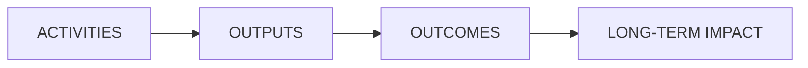
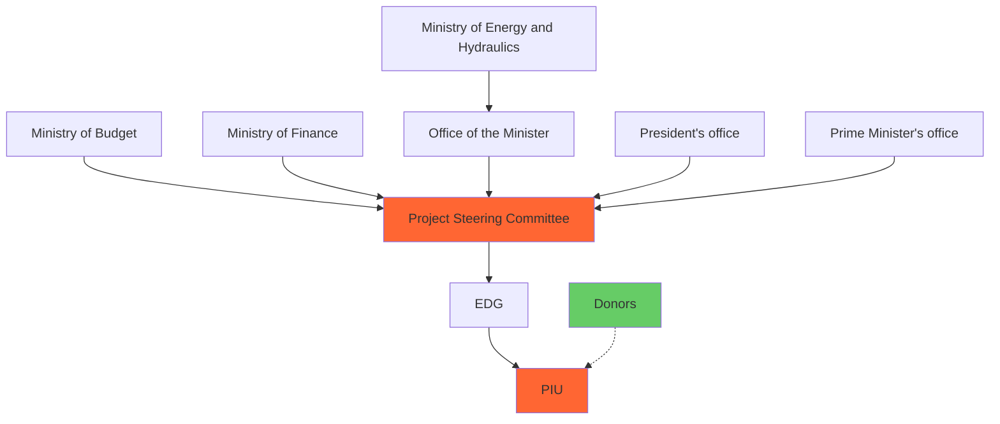

THE WORLD BANK
IBRD • IDA | WORLD BANK GROUP
FOR OFFICIAL USE ONLY

Report No: PADHI01230

INTERNATIONAL DEVELOPMENT ASSOCIATION

PROJECT APPRAISAL DOCUMENT

ON A

PROPOSED CREDIT

IN THE AMOUNT OF US$132.3 MILLION
OF WHICH EUR 92.9 MILLION (US$105.2 MILLION EQUIVALENT) FROM THE SCALE-UP WINDOW
AND US$24.0 MILLION FROM THE SCALE-UP WINDOW-SHORTER MATURITY LOAN

TO THE

REPUBLIC OF GUINEA

FOR A

GUINEA ELECTRICITY ACCESS SCALE UP PROJECT-PHASE 2

JUNE 6, 2025

Energy and Extractives Global Practice
Western and Central Africa Region

This document has a restricted distribution and may be used by recipients only in the performance of their official duties. Its contents may not otherwise be disclosed without World Bank authorization.

---

# CURRENCY EQUIVALENTS

(Exchange Rate Effective May 31, 2025)

<table>
  <tbody>
    <tr>
        <td>Currency Units =</td>
<td>GUINEAN FRANC (GNF), EURO (EUR)</td>
    </tr>
<tr>
        <td>US$1.00 =</td>
<td>GNF 8,864.760</td>
    </tr>
<tr>
        <td>US$1.00 =</td>
<td>EUR 0.883</td>
    </tr>
  </tbody>
</table>

FISCAL YEAR
January 1 - December 31

<table>
  <tbody>
    <tr>
        <td>Regional Vice President:</td>
<td>Ousmane Diagana</td>
    </tr>
<tr>
        <td>Regional Practice Director:</td>
<td>Franz R. Drees-Gross</td>
    </tr>
<tr>
        <td>Division Director:</td>
<td>Marie-Chantal Uwanyiligira</td>
    </tr>
<tr>
        <td>Practice Manager:</td>
<td>Kwawu Mensan Gaba</td>
    </tr>
<tr>
        <td>Task Team Leaders:</td>
<td>Djamali Ibrahime, Madina Tall, Matteo Malacarne</td>
    </tr>
  </tbody>
</table>

---

# ABBREVIATIONS AND ACRONYMS

<table>
    <tr>
        <td>AFD</td>
<td>Agence Française de Développement (French Development Agency)</td>
    </tr>
<tr>
        <td>AfDB</td>
<td>African Development Bank</td>
    </tr>
<tr>
        <td>AGEE</td>
<td>Agence Guinéenne d'Evaluations Environnementales (Guinean Agency for Environmental Assessment)</td>
    </tr>
<tr>
        <td>AGER</td>
<td>Agence Guinéenne d’Electrification Rurale (Guinea Rural Electrification Agency)</td>
    </tr>
<tr>
        <td>AM</td>
<td>Accountability Mechanism</td>
    </tr>
<tr>
        <td>ANAFIC</td>
<td>Agence Nationale de Financement des Collectivités (National Agency for Local Government Financing)</td>
    </tr>
<tr>
        <td>AREE</td>
<td>Autorité de Régulation d'Electricité et de l’Eau (Electricity and Water Regulatory Authority)</td>
    </tr>
<tr>
        <td>AWPB</td>
<td>Annual Work Plan and Budget</td>
    </tr>
<tr>
        <td>BOT</td>
<td>Build-Operate-Transfer</td>
    </tr>
<tr>
        <td>CAPEX</td>
<td>Capital Expenditure</td>
    </tr>
<tr>
        <td>CLSG</td>
<td>Côte d’Ivoire, Liberia, Sierra Leone, Guinea Interconnector Project</td>
    </tr>
<tr>
        <td>CPF</td>
<td>Country Partnership Framework</td>
    </tr>
<tr>
        <td>CRI</td>
<td>Corporate Result Indicator</td>
    </tr>
<tr>
        <td>DA</td>
<td>Designated Account</td>
    </tr>
<tr>
        <td>DFIL</td>
<td>Disbursement and Financial Information Letter</td>
    </tr>
<tr>
        <td>DPF</td>
<td>Development Policy Financing</td>
    </tr>
<tr>
        <td>E&S</td>
<td>Environmental and Social</td>
    </tr>
<tr>
        <td>EBITDA</td>
<td>Earnings before Interest, Taxes, Depreciation, and Amortization</td>
    </tr>
<tr>
        <td>EDG</td>
<td>Electricité de Guinée (National Power Utility)</td>
    </tr>
<tr>
        <td>EIB</td>
<td>European Investment Bank</td>
    </tr>
<tr>
        <td>ERR</td>
<td>Economic Rate of Return</td>
    </tr>
<tr>
        <td>ESF</td>
<td>Environmental and Social Framework</td>
    </tr>
<tr>
        <td>ESIA</td>
<td>Environmental and Social impact Assessment</td>
    </tr>
<tr>
        <td>ESS</td>
<td>Environmental and Social Standards</td>
    </tr>
<tr>
        <td>EU</td>
<td>European Union</td>
    </tr>
<tr>
        <td>EUR</td>
<td>Euro</td>
    </tr>
<tr>
        <td>FIRR</td>
<td>Financial Internal Rate of Return</td>
    </tr>
<tr>
        <td>FM</td>
<td>Financial Management</td>
    </tr>
<tr>
        <td>ForWE</td>
<td>Forum of Women in Energy</td>
    </tr>
<tr>
        <td>FY</td>
<td>Fiscal Year</td>
    </tr>
<tr>
        <td>GDP</td>
<td>Gross Domestic Product</td>
    </tr>
<tr>
        <td>GHG</td>
<td>Greenhouse Gas</td>
    </tr>
<tr>
        <td>GNEAP</td>
<td>Guinea Electricity Access Scale Up Project-Phase 1 (GNEAP-1) and -Phase 2 (GNEAP-2)</td>
    </tr>
<tr>
        <td>GNF</td>
<td>Guinean Francs</td>
    </tr>
<tr>
        <td>GRM</td>
<td>Grievance Redress Mechanism</td>
    </tr>
<tr>
        <td>GRS</td>
<td>Grievance Redress Service</td>
    </tr>
<tr>
        <td>GWh</td>
<td>Gigawatt Hour</td>
    </tr>
<tr>
        <td>HEIS</td>
<td>Hands-on Expanded Implementation Support</td>
    </tr>
<tr>
        <td>HFO</td>
<td>Heavy Fuel Oil</td>
    </tr>
<tr>
        <td>IDA</td>
<td>International Development Association</td>
    </tr>
<tr>
        <td>IFC</td>
<td>International Finance Corporation</td>
    </tr>
<tr>
        <td>IFR</td>
<td>Interim Financial Report</td>
    </tr>
<tr>
        <td>IPF</td>
<td>Investment Project Financing</td>
    </tr>
<tr>
        <td>IPP</td>
<td>Independent Power Producer</td>
    </tr>
<tr>
        <td>ISA</td>
<td>International Standards on Auditing</td>
    </tr>
<tr>
        <td>IsDB</td>
<td>Islamic Development Bank</td>
    </tr>
<tr>
        <td>IVA</td>
<td>Independent Verification Agent</td>
    </tr>
</table>

---

<table>
    <tr>
        <td>km</td>
<td>Kilometers</td>
    </tr>
<tr>
        <td>KPI</td>
<td>Key Performance Indicator</td>
    </tr>
<tr>
        <td>kV</td>
<td>Kilovolts</td>
    </tr>
<tr>
        <td>kW</td>
<td>Kilowatt</td>
    </tr>
<tr>
        <td>kWh</td>
<td>Kilowatt-Hour</td>
    </tr>
<tr>
        <td>LV</td>
<td>Low Voltage</td>
    </tr>
<tr>
        <td>M&E</td>
<td>Monitoring and Evaluation</td>
    </tr>
<tr>
        <td>M300</td>
<td>Mission 300 Initiative</td>
    </tr>
<tr>
        <td>MEHH</td>
<td>Ministère de l’Energie, de l’Hydraulique et des Hydrocarbures (Ministry of Energy, Hydraulics, and
Hydrocarbons)</td>
    </tr>
<tr>
        <td>MEF</td>
<td>Ministère de l’Economie et des Finances (Ministry of Economy and Finance)</td>
    </tr>
<tr>
        <td>MIS</td>
<td>Management Information System</td>
    </tr>
<tr>
        <td>MV</td>
<td>Medium Voltage</td>
    </tr>
<tr>
        <td>MW</td>
<td>Megawatt</td>
    </tr>
<tr>
        <td>NDC</td>
<td>Nationally Determined Contribution</td>
    </tr>
<tr>
        <td>NLCEAP</td>
<td>National Least Cost Electricity Access Scale Up Program</td>
    </tr>
<tr>
        <td>NO</td>
<td>No Objection</td>
    </tr>
<tr>
        <td>NPV</td>
<td>Net Present Value</td>
    </tr>
<tr>
        <td>O&M</td>
<td>Operations and Maintenance</td>
    </tr>
<tr>
        <td>OHS</td>
<td>Occupational Health and Safety</td>
    </tr>
<tr>
        <td>OMVG</td>
<td>Organisation pour la Mise en Valeur du Fleuve Gambie (Gambia River Basin Development Organization)</td>
    </tr>
<tr>
        <td>OPEX</td>
<td>Operating Expenditure</td>
    </tr>
<tr>
        <td>PBC</td>
<td>Performance-Based Condition</td>
    </tr>
<tr>
        <td>PCM</td>
<td>Private Capital Mobilized</td>
    </tr>
<tr>
        <td>PDO</td>
<td>Project Development Objective</td>
    </tr>
<tr>
        <td>PERD</td>
<td>Projet d’Electrification Rurale Décentralisée (Decentralized Rural Electrification Project)</td>
    </tr>
<tr>
        <td>PIM</td>
<td>Project Implementation Manual</td>
    </tr>
<tr>
        <td>PIU</td>
<td>Project Implementation Unit</td>
    </tr>
<tr>
        <td>PPM</td>
<td>Project Procurement Plan</td>
    </tr>
<tr>
        <td>PPA</td>
<td>Power Purchase Agreement</td>
    </tr>
<tr>
        <td>PPP</td>
<td>Public-Private Partnership</td>
    </tr>
<tr>
        <td>PPSD</td>
<td>Project Procurement Strategy for Development</td>
    </tr>
<tr>
        <td>PUE</td>
<td>Productive Use Enterprise</td>
    </tr>
<tr>
        <td>PV</td>
<td>Photovoltaic</td>
    </tr>
<tr>
        <td>RAP</td>
<td>Resettlement Action Plan</td>
    </tr>
<tr>
        <td>ROW</td>
<td>Right of Way</td>
    </tr>
<tr>
        <td>RPP</td>
<td>Revenue Protection Program</td>
    </tr>
<tr>
        <td>SEA</td>
<td>Sexual Exploitation and Abuse</td>
    </tr>
<tr>
        <td>SH</td>
<td>Sexual Harassment</td>
    </tr>
<tr>
        <td>SME</td>
<td>Small and Medium Enterprise</td>
    </tr>
<tr>
        <td>SML</td>
<td>Shorter Maturity Loan</td>
    </tr>
<tr>
        <td>SOE</td>
<td>Statement of Expenditure</td>
    </tr>
<tr>
        <td>STEM</td>
<td>Science, Technology, Engineering, and Mathematics</td>
    </tr>
<tr>
        <td>STEP</td>
<td>Systematic Tracking of Exchanges in Procurement</td>
    </tr>
<tr>
        <td>SUW</td>
<td>Scale-Up Window</td>
    </tr>
<tr>
        <td>UN</td>
<td>United Nations</td>
    </tr>
<tr>
        <td>US$</td>
<td>United States Dollars</td>
    </tr>
<tr>
        <td>US¢</td>
<td>United States Cents (US$1.00 is equal to US¢100)</td>
    </tr>
<tr>
        <td>WAPP</td>
<td>West Africa Power Pool</td>
    </tr>
<tr>
        <td>WTP</td>
<td>Willingness to Pay</td>
    </tr>
</table>

---

# The World Bank
Guinea Electricity Access Scale Up Project-Phase 2 (P511453)

## TABLE OF CONTENTS

<table>
  <thead>
    <tr>
        <th>DATASHEET</th>
        <th>i</th>
    </tr>
  </thead>
  <tbody>
    <tr>
        <td>**I. STRATEGIC CONTEXT**</td>
<td>**1**</td>
    </tr>
<tr>
        <td>A. Project Strategic Context</td>
<td>1</td>
    </tr>
<tr>
        <td>B. Sectoral and Institutional Context</td>
<td>2</td>
    </tr>
<tr>
        <td>**II. PROJECT DESCRIPTION**</td>
<td>**5**</td>
    </tr>
<tr>
        <td>A. Project Development Objective</td>
<td>7</td>
    </tr>
<tr>
        <td>B. Theory of Change and PDO Indicators</td>
<td>7</td>
    </tr>
<tr>
        <td>C. Project Beneficiaries</td>
<td>8</td>
    </tr>
<tr>
        <td>D. Project Components</td>
<td>8</td>
    </tr>
<tr>
        <td>E. Role of Partners</td>
<td>14</td>
    </tr>
<tr>
        <td>F. Lessons Learned and Reflected in the Project Design</td>
<td>15</td>
    </tr>
<tr>
        <td>**III. PROJECT IMPLEMENTATION**</td>
<td>**15**</td>
    </tr>
<tr>
        <td>A. Institutional and Implementation Arrangements</td>
<td>15</td>
    </tr>
<tr>
        <td>B. Results Monitoring, Evaluation, and Verification Arrangements</td>
<td>16</td>
    </tr>
<tr>
        <td>C. Disbursement Arrangements</td>
<td>17</td>
    </tr>
<tr>
        <td>**IV. PROJECT APPRAISAL SUMMARY**</td>
<td>**18**</td>
    </tr>
<tr>
        <td>A. Technical, Economic, and Financial Analysis</td>
<td>18</td>
    </tr>
<tr>
        <td>B. Fiduciary</td>
<td>21</td>
    </tr>
<tr>
        <td>C. Environmental, Social, and Legal Operational Policies</td>
<td>22</td>
    </tr>
<tr>
        <td>**V. KEY RISKS**</td>
<td>**25**</td>
    </tr>
<tr>
        <td>**ANNEX 1: RESULTS FRAMEWORK**</td>
<td>**27**</td>
    </tr>
<tr>
        <td>**ANNEX 2: OFF-GRID ELECTRIFICATION WITH PRIVATELY OPERATED HYBRID MINI-GRIDS**</td>
<td>**45**</td>
    </tr>
<tr>
        <td>**ANNEX 3: ECONOMIC AND FINANCIAL ANALYSIS**</td>
<td>**48**</td>
    </tr>
<tr>
        <td>**ANNEX 4: CLIMATE RISKS**</td>
<td>**59**</td>
    </tr>
<tr>
        <td>**ANNEX 5: GENDER ACTION PLAN**</td>
<td>**62**</td>
    </tr>
<tr>
        <td>**ANNEX 6: MAP OF PROJECT ACTIVITIES**</td>
<td>**64**</td>
    </tr>
  </tbody>
</table>

---

The World Bank
Guinea Electricity Access Scale Up Project-Phase 2 (P511453)

# DATASHEET

## BASIC INFORMATION

<table>
  <tbody>
    <tr>
        <td>Project Beneficiary(ies)</td>
<td>Operation Name</td>
<td></td>
    </tr>
<tr>
        <td>Guinea</td>
<td>Guinea Electricity Access Scale Up Project-Phase 2</td>
<td></td>
    </tr>
<tr>
        <td>Operation ID</td>
<td>Financing Instrument</td>
<td>Environmental and Social Risk Classification</td>
    </tr>
<tr>
        <td>P511453</td>
<td>Investment Project Financing (IPF)</td>
<td>Substantial</td>
    </tr>
  </tbody>
</table>

## Financing & Implementation Modalities

<table>
    <tr>
        <td>[ ] Multiphase Programmatic Approach (MPA)</td>
<td>[ ] Contingent Emergency Response Component (CERC)</td>
    </tr>
<tr>
        <td>[ ] Series of Projects (SOP)</td>
<td>[ ] Fragile State(s)</td>
    </tr>
<tr>
        <td>[✓] Performance-Based Conditions (PBCs)</td>
<td>[ ] Small State(s)</td>
    </tr>
<tr>
        <td>[ ] Financial Intermediaries (FI)</td>
<td>[ ] Fragile within a non-fragile Country</td>
    </tr>
<tr>
        <td>[ ] Project-Based Guarantee</td>
<td>[ ] Conflict</td>
    </tr>
<tr>
        <td>[ ] Deferred Drawdown</td>
<td>[ ] Responding to Natural or Man-made Disaster</td>
    </tr>
<tr>
        <td>[ ] Alternative Procurement Arrangements (APA)</td>
<td>[✓] Hands-on Expanded Implementation Support (HEIS)</td>
    </tr>
</table>

<table>
  <tbody>
    <tr>
        <td>Expected Approval Date</td>
<td>Expected Closing Date</td>
    </tr>
<tr>
        <td>30-Jun-2025</td>
<td>30-Jun-2030</td>
    </tr>
  </tbody>
</table>

Bank/IFC Collaboration

No

## Proposed Development Objective(s)

The proposed Project Development Objective (PDO) is to: (i) increase grid and non-grid access to electricity services in selected areas; and (ii) improve the operational performance of the power utility.

## Components

<table>
  <tbody>
    <tr>
        <td>Component Name</td>
<td>Cost (US$)</td>
    </tr>
<tr>
        <td>Reinforcement and expansion of grid access and improvement of commercial performance of EDG</td>
<td>209,000,000.00</td>
    </tr>
  </tbody>
</table>

i

---

**The World Bank**
Guinea Electricity Access Scale Up Project-Phase 2 (P511453)

<table>
  <thead>
    <tr>
        <th>Off-grid electrification with privately operated hybrid mini-grids systems</th>
        <th>30,700,000.00</th>
    </tr>
  </thead>
    <tr>
        <td>Support to reform actions and financial sustainability of the energy sector</td>
<td>10,000,000.00</td>
    </tr>
<tr>
        <td>Implementation support, technical assistance, and capacity building</td>
<td>22,100,000.00</td>
    </tr>
</table>

## Organizations

<table>
    <thead>
    <tr>
        <th>Borrower:</th>
        <th colspan="3">Republic of Guinea</th>
    </tr>
    </thead>
    <tr>
        <td>Contact</td>
<td>Title</td>
<td>Telephone No.</td>
<td>Email</td>
    </tr>
<tr>
        <td>Mourana Soumah</td>
<td>Minister of Economy and
Finance</td>
<td>+224</td>
<td>soumah.mouranah@mefp.gov.gn</td>
    </tr>
<tr>
        <td>Implementing Agency:</td>
        <td colspan="3">Ministry of Energy Hydrolics and Hydrocarbons (MEHH), Electricite de Guinée (EDG)</td>
    </tr>
<tr>
        <td>Contact</td>
<td>Title</td>
<td>Telephone No.</td>
<td>Email</td>
    </tr>
<tr>
        <td>Aboubacar Camara
Elhaj Gando Barry</td>
<td>Minister
Managing Director</td>
<td>+224622989796
+224628353968</td>
<td>abscamara@outlook.fr
gando.barry@edg.com.gn</td>
    </tr>
</table>

## PROJECT FINANCING DATA (US$, Millions)

### Maximizing Finance for Development

<table>
  <thead>
    <tr>
        <th>Is this an MFD-Enabling Project (MFD-EP)?</th>
        <th>Yes</th>
    </tr>
  </thead>
    <tr>
        <td>Is this project Private Capital Enabling (PCE)?</td>
<td>No</td>
    </tr>
</table>

### SUMMARY

<table>
  <tbody>
    <tr>
        <td>Total Operation Cost</td>
<td>271.80</td>
    </tr>
<tr>
        <td>Total Financing</td>
<td>244.00</td>
    </tr>
<tr>
        <td>of which IBRD/IDA</td>
<td>132.30</td>
    </tr>
<tr>
        <td>Financing Gap</td>
<td>27.80</td>
    </tr>
  </tbody>
</table>

### DETAILS

**World Bank Group Financing**

<table>
  <tbody>
    <tr>
        <td>International Development Association (IDA)</td>
<td>132.30</td>
    </tr>
<tr>
        <td>IDA Credit</td>
<td>107.10</td>
    </tr>
  </tbody>
</table>

ii

---

The World Bank
Guinea Electricity Access Scale Up Project-Phase 2 (P511453)

<table>
  <thead>
    <tr>
        <th>IDA Shorter Maturity Loan (SML)</th>
        <th>25.20</th>
    </tr>
  </thead>
</table>

## Non-World Bank Group Financing

<table>
    <tr>
        <td>Commercial Financing</td>
<td>11.70</td>
    </tr>
<tr>
        <td>Unguaranteed Commercial Financing</td>
<td>11.70</td>
    </tr>
<tr>
        <td>Other Sources</td>
<td>100.00</td>
    </tr>
<tr>
        <td>EC: European Investment Bank</td>
<td>100.00</td>
    </tr>
</table>

## IDA Resources (US$, Millions)

<table>
    <thead>
    <tr>
        <th></th>
        <th>Credit Amount</th>
        <th>Grant Amount</th>
        <th>SML Amount</th>
        <th>Guarantee
Amount</th>
        <th>Total Amount</th>
    </tr>
    </thead>
    <tr>
        <td>Scale-Up Window
(SUW)</td>
<td>105.20</td>
<td>0.00</td>
<td>24.00</td>
<td>0.00</td>
<td>129.20</td>
    </tr>
<tr>
        <td>National
Performance-Based
Allocations (PBA)</td>
<td>1.90</td>
<td>0.00</td>
<td>1.20</td>
<td>0.00</td>
<td>3.10</td>
    </tr>
<tr>
        <td>Total</td>
<td>107.10</td>
<td>0.00</td>
<td>25.20</td>
<td>0.00</td>
<td>132.30</td>
    </tr>
</table>

## Expected Disbursements (US$, Millions)

<table>
    <tr>
        <td>WB Fiscal
Year</td>
<td>2025</td>
<td>2026</td>
<td>2027</td>
<td>2028</td>
<td>2029</td>
<td>2030</td>
<td>2031</td>
    </tr>
<tr>
        <td>Annual</td>
<td>6.00</td>
<td>12.00</td>
<td>15.00</td>
<td>37.00</td>
<td>40.00</td>
<td>17.00</td>
<td>5.30</td>
    </tr>
<tr>
        <td>Cumulative</td>
<td>6.00</td>
<td>18.00</td>
<td>33.00</td>
<td>70.00</td>
<td>110.00</td>
<td>127.00</td>
<td>132.30</td>
    </tr>
</table>

## PRACTICE AREA(S)

**Practice Area (Lead)**

Energy & Extractives

**Contributing Practice Areas**

## CLIMATE

**Climate Change and Disaster Screening**

iii

---

The World Bank
Guinea Electricity Access Scale Up Project-Phase 2 (P511453)

Yes, it has been screened and the results are discussed in the Operation Document

## SYSTEMATIC OPERATIONS RISK- RATING TOOL (SORT)

<table>
  <tbody>
    <tr>
        <td>Risk Category</td>
<td>Rating</td>
    </tr>
<tr>
        <td>1. Political and Governance</td>
<td>High</td>
    </tr>
<tr>
        <td>2. Macroeconomic</td>
<td>Moderate</td>
    </tr>
<tr>
        <td>3. Sector Strategies and Policies</td>
<td>Substantial</td>
    </tr>
<tr>
        <td>4. Technical Design of Project or Program</td>
<td>Moderate</td>
    </tr>
<tr>
        <td>5. Institutional Capacity for Implementation and Sustainability</td>
<td>Substantial</td>
    </tr>
<tr>
        <td>6. Fiduciary</td>
<td>Substantial</td>
    </tr>
<tr>
        <td>7. Environment and Social</td>
<td>Substantial</td>
    </tr>
<tr>
        <td>8. Stakeholders</td>
<td>Moderate</td>
    </tr>
<tr>
        <td>9. Overall</td>
<td>Substantial</td>
    </tr>
  </tbody>
</table>

## POLICY COMPLIANCE

**Policy**

Does the project depart from the CPF in content or in other significant respects?

[ ] Yes [✓] No

Does the project require any waivers of Bank policies?

[ ] Yes [✓] No

## ENVIRONMENTAL AND SOCIAL

**Environmental and Social Standards Relevance Given its Context at the Time of Appraisal**

<table>
  <tbody>
    <tr>
        <td>E &amp; S Standards</td>
<td>Relevance</td>
    </tr>
<tr>
        <td>ESS 1: Assessment and Management of Environmental and Social Risks and Impacts</td>
<td>Relevant</td>
    </tr>
<tr>
        <td>ESS 10: Stakeholder Engagement and Information Disclosure</td>
<td>Relevant</td>
    </tr>
<tr>
        <td>ESS 2: Labor and Working Conditions</td>
<td>Relevant</td>
    </tr>
  </tbody>
</table>

iv

---

The World Bank
Guinea Electricity Access Scale Up Project-Phase 2 (P511453)

<table>
    <tr>
        <td>ESS 3: Resource Efficiency and Pollution Prevention and Management</td>
<td>Relevant</td>
    </tr>
<tr>
        <td>ESS 4: Community Health and Safety</td>
<td>Relevant</td>
    </tr>
<tr>
        <td>ESS 5: Land Acquisition, Restrictions on Land Use and Involuntary Resettlement</td>
<td>Relevant</td>
    </tr>
<tr>
        <td>ESS 6: Biodiversity Conservation and Sustainable Management of Living Natural
Resources</td>
<td>Relevant</td>
    </tr>
<tr>
        <td>ESS 7: Indigenous Peoples/Sub-Saharan African Historically Underserved
Traditional Local Communities</td>
<td>Not Currently Relevant</td>
    </tr>
<tr>
        <td>ESS 8: Cultural Heritage</td>
<td>Relevant</td>
    </tr>
<tr>
        <td>ESS 9: Financial Intermediaries</td>
<td>Not Currently Relevant</td>
    </tr>
</table>

NOTE: For further information regarding the World Bank's due diligence assessment of the Project's potential environmental and social risks and impacts, please refer to the Project's Appraisal Environmental and Social Review Summary (ESRS).

## LEGAL

### Legal Covenants

#### Sections and Description

[Section I.A.2 of the Schedule to the Project Agreement] The Project Implementation Unit shall: (a) no later than one (1) month after the Effective Date, recruit a coordinator; and(b) no later than ninety (90) days after the Effective Date, recruit a social specialist, an environmental specialist, and gender specialist, all under terms of reference and with experience and qualifications acceptable to the Association.

[Section I.B.1 of Schedule 2 to the Financing Agreement/Section I.B.1 of the Schedule to the Project Agreement] The Recipient shall, not later than one (1) month after the Effective Date, (a) cause the Project Implementing Entity to update the project implementation manual ("Project implementation Manual" or "PIM") and thereafter (b) cause the Project Implementing Entityto adopt the PIM, in form and substance satisfactory to the Association.

[Section I.C.2 of Schedule 2 to the Financing Agreement] The Recipient shall cause the Project Implementing Entity to recruit, not later than one (1) month after the Effective Date, and thereafter maintain throughout Project implementation, a verification agent ("Verification Agent") with qualification, experience and under terms of reference satisfactory to the Association, to undertake the [annual] verification of the achievement of the results under the Performance-Based Conditions (PBCs), in accordance with the Verification Protocol.

[Environmental and Social Commitment Plan (ESCP)] Labor Management Procedures (LMP) to be prepared no later than one (1) month after Project effective date and before the start of any works.

[ESCP] Prepare, disclose, consult and adopt an Resettlement Policy Framework (RPF) acceptable to the Association no later than one month after project effective date and before the start of any work. Implement the RPF throughout Project implementation.

[ESCP] Assure that the Project is integrated into the Guinean national grievance mechanism no later than three months after the Project effective date, then maintain and operate the mechanism throughout Project implementation.

### Conditions

<table>
  <tbody>
    <tr>
        <td>Type</td>
<td>Citation</td>
<td>Description</td>
<td>Financing Source</td>
    </tr>
  </tbody>
</table>

v

---

The World Bank
Guinea Electricity Access Scale Up Project-Phase 2 (P511453)

<table>
  <tbody>
    <tr>
        <td>Article 5.01 of the Financing Agreement</td>
<td>Subsidiary Agreement has been signed between the Recipient and the Program Implementing Entity in accordance with Section I.A.1 of Schedule 2 to the Financing Agreement.</td>
<td>IBRD/IDA</td>
<td></td>
    </tr>
<tr>
        <td>Effectiveness</td>
<td>Section III.B.1(b) of Schedule 2 to the Financing Agreement</td>
<td>Notwithstanding the provisions of Part A of this Section, no withdrawal shall be made for payments under Category (2), unless and until the Recipient has prepared, publicly consulted upon, finalized, adopted and publicly disclosed in-country and in the Association's website, in form and substance satisfactory to the Association and in conformity with the provisions of Section I.D of Schedule 2 to this Agreement, the relevant Resettlement Action Plan(s) for the Project.</td>
<td>IBRD/IDA</td>
    </tr>
<tr>
        <td>Disbursement</td>
        <td colspan="3"></td>
    </tr>
  </tbody>
</table>

vi

---

The World Bank
Guinea Electricity Access Scale Up Project-Phase 2 (P511453)

# I. STRATEGIC CONTEXT

## A. Project Strategic Context

**1. Guinea's development potential is anchored in its abundant natural resources, youthful population, and regional integration prospects.** Located in coastal West Africa, Guinea spans 245,857 square kilometers and shares borders with Senegal, Guinea-Bissau, Mali, Côte d'Ivoire, Sierra Leone, and Liberia. The country has a population of 14.8 million (2024), with 60.6 percent under the age of 25, and is in the early stages of demographic transition marked by a fertility rate of 4.8 births per woman.1 Guinea has four regions: Maritime Guinea (home to the capital, Conakry), Forest Guinea, Upper Guinea, and Middle Guinea. Growth has been largely driven by the mining sector, underscoring the importance of reliable, affordable, and sustainable electricity to unlock Guinea's broader development potential.

**2. Economic growth has been steady but lacks inclusivity and has had only a modest impact on poverty reduction so far.** Between 2019 and 2023, real gross domestic product (GDP) grew at an average of 5.3 percent (2.8 percent per capita), reaching 5.7 percent in 2024, supported by mining, agriculture, industrial fishing, and improved crop productivity.2 Fiscal deficits have remained low, averaging 1.7 percent of GDP. Guinea's international poverty rate rose from 46.6 percent in 2019 to an estimated 51.4 percent in 2023.3 The country also faces a low Human Capital Index score (37 percent), persistent institutional capacity gaps, widespread gender disparities, and lagging agricultural productivity.4 Infrastructure constraints remain stark, particularly in energy, transport, and sanitation.

**3. Guinea's vast mineral and hydropower resources offer major opportunities for growth and regional integration but remain underexploited for inclusive development and are increasingly vulnerable to climate risks.** Guinea enjoys abundant rainfall and agroclimatic conditions favorable for a wide range of crops. Poor road infrastructure and limited adoption of water management technologies, however, constrain agricultural productivity and market access. The country holds about a third of the world's known bauxite reserves (estimated at up to 8 billion tons), the world's largest untapped high-grade iron ore deposits (estimated at 4 billion tons), and substantial reserves of gold (around 700 million tons) and diamonds (30 to 40 million carats).5 In 2024, Guinea produced 134 million tons of bauxite6, and operations at Simandou's iron ore, the largest unexploited high-grade iron ore reserve in the world, are expected to begin by end-2025, further anchoring the country's role in global green value chains. Guinea's hydropower potential, estimated at 6,000 MW,7 remains largely untapped, with only one-third currently developed. These endowments could meet domestic electricity needs and enable Guinea to become a clean energy exporter within the West Africa Power Pool (WAPP). However, rising temperatures, extreme weather, and increasing rainfall variability – exacerbated by climate change – pose significant threats to rural livelihoods, food systems, and hydropower generation, while increasing exposure to climate hazards.8

**4. Climate-informed development is essential to safeguard Guinea's natural capital, reduce exposure to climate-induced shocks, and support a sustainable economic growth path.** Modeling in the preparation of the upcoming Guinea Country Climate and Development Report (CCDR) shows the urgent need for climate-smart infrastructure investments, particularly in energy, water, and agriculture. Effective water resource management is becoming increasingly critical as

1 United Nations, 2024, World Population Prospects, available on: https://shorturl.at/NC7o2.
2 International Monetary Fund, 2024, Guinea: Selected Issues. Washington, D.C: International Monetary Fund.
3 Guinea's international poverty rate, measured at US$3.65 threshold for lower-middle-income economies (LMIC), increased from 46.6 percent in 2019 to an estimated 51.4 percent in 2023.
4 Guinea's agricultural growth lags that of comparator countries in Africa and other regions (Country Economic Memorandum FY24, P177252). Cereal yields, already relatively low, declined sharply to new lows in 2010 and, despite recent increases, have not fully recovered for pre-2010 levels.
5 World Bank, 2017, The Growing Role of Minerals and Metals for a Low-Carbon Growth, available on: https://shorturl.at/vqSVk.
6 U.S. Geological Survey, Mineral Commodity Summaries, January 2025.
7 World Bank, 2024, Guinea Economic Update: Natural Resource Management for Development, available on: https://shorturl.at/59fsx.
8 Think Hazard, World Bank, Think Hazard Report for Guinea, available on: https://shorturl.at/5xGwJ.

Page 1

---

The World Bank
Guinea Electricity Access Scale Up Project-Phase 2 (P511453)

precipitation becomes more erratic due to climate change. While hydropower remains a strategic asset, energy diversification, particularly through solar resources, is needed to reduce exposure to climate risks and strengthen Guinea's resilience. These interventions are crucial for meeting Guinea's Nationally Determined Contribution (NDC) targets and enhancing regional energy integration, which will improve electricity access for many Guineans.

## B. Sectoral and Institutional Context

**5. Guinea's energy sector remains state-dominated, but the current institutional and legal framework is conducive to more private participation.** The Ministry of Energy, Hydraulics and Hydrocarbons (*Ministère de l'Energie, de l'Hydraulique et des Hydrocarbures*, MEHH) oversees the national energy policy. The national power utility (*Électricité de Guinée*, EDG)9 operates under a nationwide concession with financial and managerial autonomy. The legal framework allows for independent power production and includes dedicated institutions for rural electrification (*Agence Guinéenne d'Electrification Rurale*, AGER) and regulation (*Autorité de Régulation d'Electricité et de l'Eau*, AREE)10, though AREE remains under-resourced. Guinea currently hosts four independent power producers (IPPs): two large hydropower and two thermal plants.11

**6. Guinea's generation system is increasingly strained by rapid demand growth, driven by demographics, urbanization, and industrialization from the mining sector.** National electricity demand has grown fast, at an average rate of 9 percent annually over the past four years, reaching a 13 percent increase in 2023.12 The mining sector is the largest industrial consumer, currently requiring 558 MW – mostly met through captive heavy-fuel oil (HFO) generation. Future demand is projected to exceed 700 MW by 2028 due to the planned commissioning of large-scale projects such as the Simandou iron ore mine (100 MW) and the Alteo bauxite refinery (50 MW). Connecting these industrial loads to the national grid presents an opportunity to replace costly, high-emission self-generation with cleaner, more reliable, and competitively priced grid electricity. It would also reinforce EDG's financial sustainability by increasing sales to creditworthy large consumers. Alternatively, revising third-party access provisions could allow mines to procure renewable electricity directly from IPPs. The World Bank has financed a study under the Guinea-Mali Interconnection Project (P166042) to assess technical and regulatory pathways for mine-grid integration.13 According to this study, the investment required to connect the mining site of Simandou to the national grid is estimated at US$263.6 million, excluding environmental and social (E&S) costs. To safeguard EDG's financial position, electricity should be sold to mining clients at or above the estimated high-voltage supply cost of US¢15-17 per kWh. This compares favorably with current self-generation costs, which range from US¢15 to US¢35 per kWh. Establishing a feed-in tariff for surplus energy from captive generation, particularly using renewables, could create further win-wins, improving system reliability while reducing emissions.

**7. Guinea's energy development is also central to regional integration, with the country positioned as a key supplier of clean electricity in West Africa.** Guinea is now interconnected with seven neighbors (Côte d'Ivoire, The Gambia, Guinea-Bissau, Liberia, Mali, Senegal and Sierra Leone) via the Côte d'Ivoire, Liberia, Sierra Leone, Guinea Interconnector Project (CLSG), the Gambia River Basin Development Organization (*Organisation pour la Mise en Valeur du Fleuve Gambie* Project, OMVG), and Guinea-Mali interconnectors. These cross-border interconnections present a valuable opportunity to enhance system efficiency and reduce generation costs by leveraging Guinea's advantage in hydropower.

9 EDG's legal basis is Law 039 (1993); its corporate status was strengthened under a 2019 decree.
10 AGER was created in 2013 and became operational in 2017. AREE was established in 2017.
11 Generation was opened to private investment under the 1998 Build-Operate-Transfer (BOT) law. Souapiti (450 MW, operational since 2021) and Kaleta (240 MW, 2019) are operated by SOGES and SOGEKA, in which the state holds 51 and 49 percent ownership, respectively. Te Power (50 MW) and Karpowership (150 MW) provide thermal generation.
12 World Bank, Energy Sector Management Assistance Program, 2024, Energy Progress Report, available on: https://shorturl.at/YIGoc.
13 Preliminary study report for the evaluation of the electricity demand of the mines and their connection to the electricity grid, currently underway, financed by the Guinea-Mali Interconnection Project.

Page 2

---

Under three bilateral power purchase agreements (PPAs) signed through the OMVG, EDG exports 1,174 GWh annually to SENELEC (Senegal), NAWEC (The Gambia), and EAGB (Guinea-Bissau) at an average tariff of US¢11 per kWh. These exports have delivered transformative impacts – Guinea-Bissau has shifted from full reliance on expensive rental liquid fuel generation to 100 percent hydro-based supply, while The Gambia has substantially reduced its thermal generation. Guinea currently exports 25 MW to The Gambia, 20 MW to Guinea-Bissau, and 5 MW to Sierra Leone. The increasing variability of hydropower output underlines the importance of diversifying the energy mix to maintain regional energy reliability.

8. **A diversified generation mix with strong private sector participation is critical to reduce costs, strengthen climate resilience, and ensure long-term sector sustainability.** Guinea remains heavily reliant on hydropower, which produced 80 percent of electricity in 2025 – up from 39 percent in 2012 – leaving the system vulnerable to climate and hydrological variability. Of 1,300 MW of installed capacity (68 percent IPP-owned), only 1,000 MW is reliably available. In 2024, low rainfall triggered a more than 10 percent drop in hydropower output, forcing emergency imports and expensive thermal leasing, compounded by the December 2024 oil depot explosion. Expanding renewable energy, especially solar, given Guinea's strong irradiation potential in central and northern regions,14 offers a clean, climate-resilient, and cost-effective alternative to hydro and fossil fuels. Private investment will be indispensable in delivering the required scale and pace of renewable energy deployment. The limited fiscal space available to the Government underscores the need for private capital, innovation, and efficiency. IPPs can play a vital role in bringing bankable solar projects to the market, with the International Finance Corporation's (IFC) key role in crowding in the necessary investments.

9. **EDG's structural inefficiencies and weak financial outlook have translated into a substantial fiscal burden for the state, underscoring the urgency of restoring utility performance and strengthening sector governance.** The electricity sector remains financially unsustainable, with high technical and commercial losses, non-cost-reflective tariffs, and a heavy reliance on subsidies. Despite tariff adjustments in 2018, 2019, and 2021, the average tariff remains at US¢10 per kWh, less than half the estimated cost of service of US¢27 per kWh.15 Low-voltage (LV) residential consumers, who account for 80 percent of demand, pay only about US¢5 per kWh.16 Losses from theft, non-billing, and technical issues reach 30 percent, and revenue collection has fallen to just 42 percent in 2024, down from 60 percent in 2019 (collection from residential users is especially weak at 38 percent).17 EDG's arrears continue to accumulate, especially from public institutions, while attempts to scale up prepayment meters have been hindered by limited enforcement and low user acceptance. These inefficiencies, combined with weak planning and uncompetitive IPP procurement, have contributed to unsustainable subsidy levels, which peaked at US$448 million in 2021 (2.1 percent of GDP) and remained high at US$317 million in 2024 (1.2 percent of GDP).18 Arrears to IPPs have now surpassed US$1.2 billion. These dynamics increase the macroeconomic vulnerability of Guinea's public finances, therefore calling for a comprehensive recovery plan involving improved operational and commercial performance, cost control, tariff reforms, and greater transparency.

10. **Recognizing the strategic role of energy for inclusive growth and industrialization, the Government of Guinea has joined the Mission 300 (M300) initiative.** Launched in April 2024 by the World Bank Group and the African Development Bank (AfDB), the initiative aims to provide electricity access to 300 million people in Sub-Saharan Africa by 2030.19 As part of M300, Guinea is preparing a National Energy Compact20, aiming to set the following ambitious goals by 2030: achieving universal electricity access and raising the share of renewables in electricity generation to 67 percent. The

14 Global Solar Atlas, available on: https://shorturl.at/pVlAm.

15 Inputs provided by EDG as part of the economic and financial analysis made in preparation of this project.

16 Yearly consumption (2024) was 1,129 GWh and distributed as follows: domestic customers at 807,033,689 kWh (71.4 percent); enterprises and professionals (LV) at 62,100,555 kWh (5.5 percent); public administrations at 61,898,571 kWh (5.5 percent); and MV (large industrial) customers at 198,352,903 kWh (17.6 percent).

17 Inputs provided by EDG as part of the economic and financial analysis made in preparation of this project.

18 World Bank. (2023). GDP (current US$) – Guinea, available on: https://shorturl.at/4Rqgp.

19 More information can be found on www.worldbank.org/en/programs/energizing-africa.

20 The National Energy Compact is expected to be completed by September 2025.

Page 3

---

The World Bank
Guinea Electricity Access Scale Up Project-Phase 2 (P511453)

Compact will provide a strategic framework focusing on scaling up access, mobilizing private investment, and accelerating structural reforms. The energy sector is vital to Guinea's economic transformation, particularly through its links to mining, industrial development, and climate resilience.21 Expanding energy access, reducing costs, and increasing resilience – particularly through the integration of solar energy coupled with storage – are key to achieving Guinea's goals.

**11. Access to electricity has improved significantly over the past decade, but regional disparities and growing demand continue to pose challenges.** The electricity access rate rose from 19 percent in 2003 to 53 percent by end-2024, reflecting strong gains supported by coordinated donor financing and national policy efforts.22 Urban access reached 91 percent in 2022, compared to just 21 percent in rural areas, where electrification remains a critical development priority. Approximately 10 percent of current connections are still informal or illegal. To accelerate progress, the Government of Guinea launched the National Least Cost Electricity Access Program (NLCEAP, 2022-2027), requiring US$645 million in total financing.23 The NLCEAP aims to connect 238,879 households (1.67 million people) and reach a 55 percent access rate by end-2027, a target now likely to be exceeded thanks to the considerable efforts from the Government to electrify localities in mining areas (notably Boke). The World Bank-funded Guinea Electricity Access Scale-Up Project-Phase 1 (GNEAP-1, P164225) supported the NLCEAP, contributing to the program's initial implementation through large-scale grid expansion and access regularization.24 Building on the first phase, the proposed Guinea Electricity Access Scale Up Project-Phase 2 (GNEAP-2, P511453) aims to deliver new or improved electricity services to approximately 1.53 million people, including 960,000 people gaining new access to electricity. It supports the country's goal of achieving its 2027 target and leverages insights gained from GNEAP-1, while aligning with the framework of Guinea's Energy Compact under M300.

**12. Achieving a sustainable energy future is central to Guinea's development ambitions under the M300 Energy Compact and its broader national energy agenda.** The World Bank has supported sector reforms aiming to improve sector governance through the Electricity Sector Recovery Project (P146696) and the first Fiscal Management, Competitiveness and Energy Reform Project (P166322).25 Setting the energy sector on a path of sustainable and viable growth requires four mutually reinforcing pillars, continuing on the World Bank-supported reform agenda: (i) governance reforms and operational performance improvements; (ii) reducing generation costs; (iii) diversifying the energy mix; and (iv) gradually implementing cost-reflective tariffs. These pillars offer a roadmap to address persistent sectoral challenges and to enable Guinea to meet its industrialization goals, NDC commitments, and regional integration objectives, and set the energy sector on a pragmatic path toward a resilient, inclusive, and low-carbon transition:

(a) **Reforming EDG's governance and improving operational performance.** This is essential to reduce fiscal pressures and restore confidence among public and private stakeholders. Reforms include strengthening utility corporate governance through a performance management contract with clear key performance indicators (KPIs), scaling

21 The mining sector is expanding rapidly with the development of strategic assets such as the Simandou iron ore deposit and new bauxite refining capacity. These minerals are essential for low-carbon technologies and face increasing global demand, reinforcing Guinea's strategic importance in the energy transition. Converting this resource wealth into sustained economic and social gains will require significant infrastructure, governance reforms and capacity building.

22 World Bank, Energy Sector Management Assistance Program, 2024, Energy Progress Report, available on: https://shorturl.at/YIGoc.

23 To date, US$388 million – around 60 percent of total needs – has been mobilized with support from the International Development Association (IDA) and through parallel co-financing arrangements with the French Development Agency (*Agence Française de Développement*, AFD), the African Development Bank (AfDB), the Islamic Development Bank (IsDB), the European Union (EU), and the European Investment Bank (EIB).

24 The GNEAP-1 Project has achieved substantial implementation progress, with most infrastructure works completed and 96 percent of illegal connections in Conakry regularized. A fire at EDG's warehouse in April 2024 destroyed 100,000 AFD-financed meters, prompting a PDO revision from 603,000 to 455,000 people to be connected to electricity by June 30, 2025. An additional 250,000 meters have since been ordered. Mini-grid pilots in two rural areas are also on track, with commissioning expected by June 2025.

25 These projects involved transferring management of EDG to a Guinean management team selected through a competitive process. This led to the creation of the EDG Board of Directors, the selection of the EDG Managing Director, 11 directors and 36 heads of department. However, since the coup in September 2021, the Guinean authorities have dismissed and replaced EDG's Board of Directors and management without any competitive process, demonstrating an important regression in the governance of the sector.

Page 4

---

The World Bank
Guinea Electricity Access Scale Up Project-Phase 2 (P511453)

up the deployment of prepayment meters, improving collections, and strengthening transparency and managerial accountability. As part of this effort, regular publication of EDG's audited financial statements will help ensure transparency and drive improvements in financial management (FM).

(b) **Reducing generation cost by renegotiating high-cost legacy PPAs.** Several existing IPPs operate under contracts that have become unaffordable given current demand levels and fiscal constraints. Renegotiating these agreements, including through the introduction of lower-cost refinancing or restructured payment terms, can stabilize sector finances, reduce arrears, and crowd in more competitively procured IPPs. Sector recovery must therefore include adoption of a least-cost power development plan and introduction of competitive procurement rules for future generation projects.

(c) **Diversifying Guinea's generation mix including through increased private-sector participation.** Reducing dependence on climate-sensitive hydropower and expensive heavy fuel oil (HFO)-based thermal plants is crucial for energy security. Solar energy, cost-effective and complementary to hydro production, will play a central role. Private sector participation, notably through IPPs, will be key to scaling solar.

(d) **Implementing a gradual path to cost-reflective tariffs.** Increasing end-user tariffs in a phased manner is critical to ensure that EDG can recover its costs and reduce reliance on state subsidies. This process must be accompanied by the design and implementation of a targeted subsidy mechanism for vulnerable customers and ensure affordability for low-income households.

## II. PROJECT DESCRIPTION

**13. The Guinea Electricity Access Scale Up Project-Phase 2 (GNEAP-2) is a US$271.8 million Investment Project Financing (IPF) with performance-based conditions (PBCs) and in alignment with the M300 initiative.** US$132.3 million will be financed by IDA – of which US$105.2 million equivalent from the Scale-Up Window (SUW) and US$24.0 million from the Scale-Up Window Shorter Maturity Loan (SUW-SML)26 – US$100.0 million by the European Investment Bank (EIB) as parallel co-financing,27 and US$11.7 million of private capital mobilized (PCM). The Government of Guinea is exploring options to close the remaining US$27.8 million financing gap.28

**14. The project includes four PBCs, totaling US$60.0 million equivalent (IDA-SUW), to incentivize both the adoption and implementation of key sector reform actions.** The proposed PBCs will incentivize policy, regulatory, and operational actions that will improve the governance and financial sustainability of Guinea's energy sector by addressing structural inefficiencies and operational challenges. PBCs will unlock the funds associated with them upon achieving the specific, measurable results as explained in the project description below. This approach builds on the World Bank's support to energy sector reforms and is closely aligned with ongoing discussions under a potential Development Policy Financing (DPF) on fiscal sustainability and efficiency reforms. This commitment to sector reforms will be further reinforced by Guinea's forthcoming Energy Compact (M300), which is scheduled for finalization by September 2025.

**15.** Following the World Bank's 3-by-5 Jobs Framework, the GNEAP-2 Project will help reinforce energy and infrastructure and support a high-potential job sector. The project is closely aligned with the following objectives:

26 Guinea is classified as a moderate risk of external debt distress country, and therefore eligible to receive regular SUW financing. The operation remains within Guinea's borrowing envelope for non-concessional resources and will not lead to a deterioration in the country's risk of debt distress.
27 Co-financing arrangements with EIB are still being finalized. EIB financing is expected by end-2025. Should the parallel co-financing not materialize, the GNEAP-2 Project will be restructured to scale down the activities covered under EIB financing.
28 If the Government of Guinea requests it, IDA financing could be potentially provided, depending on the GNEAP-2 Project performance, meeting the World Bank's policy requirements for additional financing, and the availability of IDA resources.

Page 5

---

The World Bank
Guinea Electricity Access Scale Up Project-Phase 2 (P511453)

(e) **The Government's access agenda (NLCEAP), the sector roadmap for financial sustainability, and M300.** GNEAP-2 is expected to provide new or improved connections to around 1.5 million people, close to a 10-percentage point increase in the access rate. It will also regularize informal connections and scale up the deployment of pre-paid meters to strengthen EDG's governance and commercial performance. In parallel, the project will promote renewable energy through private-sector-led off-grid electrification, building on mini-grid pilots launched under GNEAP-1. GNEAP-2 will directly support improvements in EDG's operational performance and complement broader energy sector reforms supported by the World Bank through policy dialogue and technical assistance.

(f) **The World Bank Group's jobs agenda.** The project will contribute to job creation through three pathways: direct, indirect, and induced employment. Direct jobs will be generated through grid extension, meter installation, and off-grid deployment, benefiting skilled and semi-skilled workers, including youth and women. Indirectly, the project will stimulate demand along the local energy supply chain, including for contractors, equipment suppliers, and construction services. Over the medium term, the expansion of reliable electricity access will enable new and expanded income-generating activities across rural communities, supporting women entrepreneurs, microenterprises, and smallholder productivity. By enhancing connectivity and strengthening infrastructure, GNEAP-2 will serve as a catalyst for inclusive economic growth and job creation, particularly in underserved areas.

(g) **The latest World Bank Group Country Partnership Framework for Guinea (CPF, FY2018-FY23).29** The project will support Objective 7: "better access to energy and water services through improved management of utilities." The CPF highlights the importance of expanding electricity access and strengthening utility performance as critical enablers of economic development and poverty reduction. GNEAP-2 will also promote renewable energy through private-sector-led off-grid solutions, in alignment with the CPF's emphasis on leveraging private sector participation to improve service delivery.

(h) **The World Bank Group Gender Strategy 2024-2030.** The GNEAP-2 project contributes to the strategy through:(i) expanding economic opportunities for women in the energy sector; and (ii) promoting their participation in sector governance. The project will implement targeted actions such as internship programs, career development support, and gender policy development, building on GNEAP-1 efforts to foster an inclusive work environment.

16. **The proposed project will follow a One World Bank Group approach and the principles of Maximizing Finance for Development (MFD).** Through investment financing, policy dialogue, and technical assistance, the World Bank is helping address urgent challenges while laying the groundwork for private sector investment, including with IFC support. The GNEAP-2 Project will include PCM: with support from IFC, Component 2 of the project aims to scale up private-sector-led off-grid electrification through competitively awarded concessions for solar-based mini-grids, supported by viability gap subsidies to enable sustainable operations in low-income or remote areas. The project will also finance grid infrastructure in areas where commercial financing is not feasible due to EDG's weak financial position and limited cost recovery from new customers. This approach, building on lessons from GNEAP-1, is designed to de-risk private investments while expanding clean energy access and supporting sector reforms.

17. **The proposed project will complement the active US$154 million World Bank portfolio in Guinea.** The World Bank is a key partner in advancing Guinea's energy sector strategy, with its support aligned across the four pillars of sector recovery. The current portfolio covers access expansion (GNEAP-1, US$50 million), regional integration (OMVG Interconnection Project, P146830, US$30 million; Guinea-Mali Interconnection Project, P166042, US$75 million), and targeted technical assistance to EDG. These investments directly contribute to expanding grid access, diversifying supply, and strengthening the commercial viability of EDG. In parallel, ongoing discussions for a potential DPF include energy-

29 Country Partnership Framework for the Republic of Guinea for the Period FY2018-FY23. Report No. 125899-GN. A new One World Bank Group CPF for Guinea is currently under preparation.

Page 6

---

The World Bank
Guinea Electricity Access Scale Up Project-Phase 2 (P511453)

specific prior actions to support tariff reform and sector governance.30 The World Bank Group's continued engagement will be critical to ensure that energy-sector development translates into a financially sound, resilient, and regionally integrated future.

## A. Project Development Objective

**18. The proposed Project Development Objective (PDO) is to: (i) increase grid and non-grid access to electricity services in selected areas; and (ii) improve the operational performance of the power utility.**

## B. Theory of Change and PDO Indicators

**Figure 1:** Theory of Change for the GNEAP-2 Project

**Project Development Objective:**
(i) increase electricity services through grid and off-grid access in selected areas; and (ii) improve the operational performance of the power utility

<table>
  <thead>
    <tr>
        <th>ACTIVITIES</th>
        <th>OUTPUTS</th>
        <th>OUTCOMES</th>
        <th>LONG-TERM IMPACT</th>
    </tr>
  </thead>
  <tbody>
    <tr>
        <td>Infrastructure investments:</td>
        <td colspan="3"></td>
    </tr>
<tr>
        <td>• Reinforcement and densification of the grid, construction of MV lines</td>
        <td colspan="3"></td>
    </tr>
<tr>
        <td>• Privately operated mini-grid electrification in rural areas</td>
<td>• New and improved residential connections in urban and rural areas</td>
        <td colspan="2"></td>
    </tr>
<tr>
        <td>• New and improved connections for SMEs and business</td>
        <td colspan="3"></td>
    </tr>
<tr>
        <td>• New MV lines constructed</td>
        <td colspan="3"></td>
    </tr>
<tr>
        <td>• Hybrid mini-grids deployed in rural localities</td>
<td>Increased electricity services :</td>
        <td colspan="2"></td>
    </tr>
<tr>
        <td>• 960,022 people provided with direct access to electricity through new connections</td>
        <td colspan="3"></td>
    </tr>
<tr>
        <td>• 570,073 people provided with access to electricity through improved connections</td>
<td>• Expanded, reliable electricity access for households and businesses in both rural and urban areas</td>
        <td colspan="2"></td>
    </tr>
<tr>
        <td>• Improved quality and stability of electricity supply, with fewer outages and system losses</td>
        <td colspan="3"></td>
    </tr>
<tr>
        <td>Reforms &amp; operational improvements:</td>
        <td colspan="3"></td>
    </tr>
<tr>
        <td>• Digitalization and operational improvements of the power utility</td>
        <td colspan="3"></td>
    </tr>
<tr>
        <td>• Rollout of prepaid meters in public institutions</td>
        <td colspan="3"></td>
    </tr>
<tr>
        <td>• Assistance for financial modeling and utility management</td>
<td>• Sector recovery plan implemented</td>
        <td colspan="2"></td>
    </tr>
<tr>
        <td>• Performance contract between EDG and the Government signed and launched</td>
        <td colspan="3"></td>
    </tr>
<tr>
        <td>• Increased financial transparency of EDG</td>
        <td colspan="3"></td>
    </tr>
<tr>
        <td>• Prepaid meters installed in non-strategic public institutions</td>
        <td colspan="3"></td>
    </tr>
<tr>
        <td>• smart meters deployed for large customers</td>
        <td colspan="3"></td>
    </tr>
<tr>
        <td>• EDG's Integrated Management System (IMS) deployed</td>
<td>• US$11.7 million of private capital mobilized for hybrid mini-grid deployment</td>
        <td colspan="2"></td>
    </tr>
<tr>
        <td>Improved operational performance of the power utility:</td>
        <td colspan="3"></td>
    </tr>
<tr>
        <td>• Operational cost recovery ratio of the power utility increased from 20 to 70 percent</td>
<td>• Improved investment climate for private sector participation in the energy sector</td>
        <td colspan="2"></td>
    </tr>
<tr>
        <td>• Operational sustainability of EDG strengthened through improved revenue collection and reduced reliance on subsidies</td>
        <td colspan="3"></td>
    </tr>
<tr>
        <td>• Reduction in illegal connections and revenue leakage, reinforcing long-term utility viability</td>
        <td colspan="3"></td>
    </tr>
<tr>
        <td>Implementation support:</td>
        <td colspan="3"></td>
    </tr>
<tr>
        <td>• Capacity building on gender inclusion, safeguards, and implementation support</td>
        <td colspan="3"></td>
    </tr>
<tr>
        <td>• Technical studies and activities supervision</td>
<td>• Increased implementation and technical capacity</td>
        <td colspan="2"></td>
    </tr>
<tr>
        <td>• Improved gender inclusion in the energy sector</td>
<td></td>
<td>• Strengthened institutional capacity for integrated, long-term energy sector planning and governance</td>
<td></td>
    </tr>
  </tbody>
</table>

**Key Scorecard Indicators:** People provided with direct access to electricity through new connections | Private capital mobilized

**Critical assumptions:** (1) Government maintains commitment to tariff reform and financial sustainability. (2) EDG successfully implements digitalization and operational efficiency improvements. (3) Private sector remains engaged in rural electrification under viable business models. (4) Climate risks do not significantly disrupt infrastructure implementation.

**19. The following indicators have been selected to measure progress toward the PDO:**

(a) People provided with direct access to electricity through new connections (disaggregated by female, youth, urban areas, rural areas) (number; CRI).

(b) People provided with access to electricity through improved connections (disaggregated by female and youth) (number).

(c) Private capital mobilized (PCM) (US dollars).

(d) Power utility operational cost recovery ratio (percentage).31

30 The Government of Guinea has adopted a new methodology for tariffs adjustments which will result in tariff increases scheduled for end-2025.
31 Operational cost recovery ratio is defined as total revenues collected (excluding government subsidies) over total operating expenses (total OPEX). It reflects the extent to which a utility (in this case, EDG) can cover its operating costs through revenues collected from electricity sales, without reliance on government subsidies or external financing. A ratio below 100 percent means EDG relies on subsidies or incurs losses.

Page 7

---

The World Bank
Guinea Electricity Access Scale Up Project-Phase 2 (P511453)

## C. Project Beneficiaries

**20. The project is expected to directly benefit households, businesses, and public institutions through new or improved electricity access in targeted areas.** Overall, the project will provide new or improved electricity services to 218,585 households and 10,694 SMEs or businesses. At an average rate of seven members per household32, this corresponds to 1,530,095 people, of which 960,022 will receive new access to electricity.

**21. Components 1 and 2 will finance urban and rural electrification.** In urban areas, the project will finance the construction of distribution infrastructure to connect approximately 182,544 households, primarily in peri-urban areas. This represents a total of 707,735 people newly connected to the grid, including women and youth. 6,436 public facilities – such as schools, health centers, and water systems – along with small businesses will also benefit from improved and more reliable electricity connections. The availability of electricity in these areas is expected to increase the productive use and boost local businesses, including agriculture, while benefiting from overall resilience improvements against climate shocks. In rural areas, the project will electrify 26 remote localities through privately-operated mini-grids. In coordination with EDG and AGER, the project will bring power to approximately 36,041 households, representing 252,287 people, along with 4,258 connections for productive uses and enterprises. Doing so will allow households to transition away from polluting energy sources, while further pushing forward the government's goal of reaching universal access.

**22. The project will also benefit EDG through investments in commercial and digital systems, technical assistance, and performance-based financing mechanisms.** These interventions are expected to improve the utility's operational efficiency, financial sustainability, and ability to scale up access in a sustainable manner. Through Component 1, EDG will also benefit from a new source of income, and a reinforced residential and industrial customer base.

**23. Additional beneficiaries will include existing customers of EDG who are currently connected through informal or unmetered connections.** Through the installation of smart meters, technical upgrades, and regularization campaigns, these customers will transition to formal and more reliable service, enabling improved service quality, consumption monitoring, and billing accuracy. This includes both residential users and small and medium enterprises.

**24. Finally, indirect beneficiaries include public institutions responsible for energy policy, planning, and regulation.** Technical assistance and institutional support under Components 3 and 4 will strengthen the capacity of MEHH, ARSE, and AGER to implement the NLCEAP and coordinate the sector-wide access program.

## D. Project Components

**Table 1:** Project financing by component

<table>
    <thead>
    <tr>
        <th>#</th>
        <th>Component</th>
        <th>Connections
(households)</th>
        <th>Budget allocation
(US$, million)</th>
        <th>Financier</th>
        <th>Financing gap
(US$, million)</th>
    </tr>
    </thead>
    <tr>
        <td colspan="6">Component 1: Reinforcement and expansion of grid access and improvement of commercial performance of EDG</td>
    </tr>
<tr>
        <td>1.1</td>
        <td colspan="5">Reinforcement and expansion of grid access in Kindia and Labé</td>
    </tr>
<tr>
        <td colspan="2">1.1.1: Grid extension and densification in Kindia and
construction of Kindia-Donkea MV line</td>
<td>49,546</td>
<td>US$30.0 million
of which US$22.0 million
equivalent under PBC 1</td>
<td>IDA</td>
<td>US$10.0 million</td>
    </tr>
<tr>
        <td colspan="2">1.1.2: Grid extension and densification in Labé</td>
<td>62,501</td>
<td>US$41.2 million
of which US$22.0 million
equivalent under PBC 2</td>
<td>IDA</td>
<td>US$17.8 million</td>
    </tr>
<tr>
        <td>1.2</td>
        <td colspan="5">Reinforcement and expansion of grid access in Mamou, Pita, Dalaba, and rural electrification</td>
    </tr>
<tr>
        <td colspan="2">1.2.1: Grid extension and densification in Mamou, Dalaba,
and Pita</td>
<td>45,887</td>
<td>US$27.0 million</td>
<td>EIB</td>
<td>-</td>
    </tr>
</table>

32 As per the latest data published by the National Institute of Statistics (*Annuaire Statistique*, 2022), available on: https://shorturl.at/HSh7m.

Page 8

---

The World Bank
Guinea Electricity Access Scale Up Project-Phase 2 (P511453)

<table>
    <thead>
    <tr>
        <th>#</th>
        <th>Component</th>
        <th>Connections
(households)</th>
        <th>Budget allocation
(US$, million)</th>
        <th>Financier</th>
        <th>Financing gap
(US$, million)</th>
    </tr>
    </thead>
    <tr>
        <td colspan="2">1.2.2: Construction of Mamou-Labé MV line</td>
<td>-</td>
<td>US$16.0 million</td>
<td>EIB</td>
<td>-</td>
    </tr>
<tr>
        <td colspan="2">1.2.3: Grid-based rural electrification along the Mamou-
Labé line</td>
<td>24,610</td>
<td>US$57.0 million</td>
<td>EIB</td>
<td>-</td>
    </tr>
<tr>
        <td>1.3</td>
<td>Operational improvements and digitalization of EDG</td>
<td>-</td>
<td>US$10.0 million
of which US$7.0 million
equivalent under PBC 3</td>
<td>IDA</td>
<td>-</td>
    </tr>
<tr>
        <td colspan="2">Total (Component 1)</td>
<td>182,544</td>
        <td colspan="2">US$181.2 million
of which US$81.2 million IDA
and US$100.0 million EIB</td>
<td>US$27.8 million</td>
    </tr>
<tr>
        <td colspan="6">Component 2: Off-grid electrification with privately operated hybrid mini-grid systems</td>
    </tr>
<tr>
        <td colspan="2">Off-grid electrification with privately operated hybrid mini-
grid systems (26 localities)</td>
<td>36,041</td>
<td>US$19.0 million</td>
<td>IDA</td>
<td>-</td>
    </tr>
<tr>
        <td colspan="2">Total (Component 2)</td>
<td>36,041</td>
        <td colspan="3">US$30.7 million
of which US$19.0 million IDA and US$11.7 million PCM</td>
    </tr>
<tr>
        <td colspan="6">Component 3: Support to reform actions and financial sustainability of the energy sector</td>
    </tr>
<tr>
        <td>3.1</td>
<td>Technical assistance for electricity sector modeling
and tariff reform</td>
<td>-</td>
<td>US$0.5 million</td>
<td>IDA</td>
<td>-</td>
    </tr>
<tr>
        <td>3.2</td>
<td>Technical and institutional support for performance-
based utility management</td>
<td>-</td>
<td>US$0.5 million</td>
<td>IDA</td>
<td>-</td>
    </tr>
<tr>
        <td>3.3</td>
<td>Generalization of pre-paid meters in non-strategic
public institutions across the country</td>
<td>-</td>
<td>US$9.0 million
of which US$9.0 million
equivalent under PBC 4</td>
<td>IDA</td>
<td>-</td>
    </tr>
<tr>
        <td colspan="2">Total (Component 3)</td>
<td>-</td>
        <td colspan="3">US$10.0 million
IDA</td>
    </tr>
<tr>
        <td colspan="6">Component 4: Implementation support, technical assistance, and capacity building</td>
    </tr>
<tr>
        <td>4.1</td>
<td>Project implementation</td>
<td>-</td>
<td>US$5.0 million</td>
<td>IDA</td>
<td>-</td>
    </tr>
<tr>
        <td>4.2</td>
<td>Owner’s engineer</td>
<td>-</td>
<td>US$6.0 million</td>
<td>IDA</td>
<td>-</td>
    </tr>
<tr>
        <td>4.3</td>
<td>Compensations and payments under Resettlement
Action Plan (RAP)</td>
<td>-</td>
<td>US$5.5 million</td>
<td>IDA</td>
<td>-</td>
    </tr>
<tr>
        <td>4.4</td>
<td>Development and implementation of a gender policy</td>
<td>-</td>
<td>US$0.6 million</td>
<td>IDA</td>
<td>-</td>
    </tr>
<tr>
        <td>4.5</td>
<td>Capacity building, studies, and technical assistance</td>
<td>-</td>
<td>US$5.0 million</td>
<td>IDA</td>
<td>-</td>
    </tr>
<tr>
        <td colspan="2">Total (Component 4)</td>
<td>-</td>
        <td colspan="3">US$22.1 million
IDA</td>
    </tr>
<tr>
        <td colspan="2">Total (IDA financing)</td>
<td>148,088</td>
        <td colspan="2">US$132.3 million
of which US$60.0 million equivalent
under PBCs</td>
        <td rowspan="3">US$27.8 million</td>
    </tr>
<tr>
        <td colspan="2">Total (PCM)</td>
<td>-</td>
        <td colspan="2">US$11.7 million</td>
    </tr>
<tr>
        <td colspan="2">Total (EIB financing)</td>
<td>70,497</td>
        <td colspan="2">US$100.0 million</td>
    </tr>
<tr>
        <td colspan="2">Total (Project)</td>
<td>218,585</td>
        <td colspan="3">US$271.8 million</td>
    </tr>
</table>

Page 9

---

The World Bank
Guinea Electricity Access Scale Up Project-Phase 2 (P511453)

## Component 1: Reinforcement and expansion of grid access and improvement of commercial performance of EDG (US$209.0 million total cost: US$81.2 million IDA, US$100.0 million from EIB, and US$27.8 million financing gap)

### Subcomponent 1.1: Reinforcement and expansion of grid access in Kindia and Labé (US$71.2 million IDA, US$27.8 million financing gap)

**25. Subcomponent 1.1.1: Grid extension and densification in Kindia and construction of the Kindia-Donkea MV line33 (US$30.0 million IDA, US$10.0 million financing gap).** This activity seeks to finalize some of the civil works initiated under the GNEAP-1 Project. Specifically, only the contract related to the reinforcement and extension of a 110/15 kilovolts (kV) source substation is currently being implemented under GNEAP-1 (with financing from AFD). This is due to a funding shortfall of US$13 million following the results of the call for bids. The proposed intervention under GNEAP-2 will therefore address this gap, enabling the connection of 49,546 additional households to the electricity network in Kindia. Key preparatory studies, including feasibility studies, bidding documents, and environmental and social impact assessments (EIES) were already completed under GNEAP-1, ensuring a high readiness for this subcomponent.

**26. PBC 1 (US$22.0 million equivalent IDA-SUW): Adoption and operationalization of a sector recovery plan.** The Government will revise, formally adopt, and initiate the implementation of a comprehensive sector recovery plan that establishes a clear and time-bound pathway toward financial sustainability in the electricity sector. The plan will include a phased transparent and predictable trajectory of electricity tariff adjustments, aligned with the approved tariff methodology, and a defined timeline to reach full cost recovery and eliminate operational subsidies by a specified medium-term target date, in line with discussions of a potential DPF. The recovery plan will also identify priority reform measures, including the review and renegotiation of existing hydropower PPAs with independent power producers (SOGES and SOGEKA), with the aim of reducing sector costs and improving fiscal sustainability. Finally, the plan will define the responsibilities of each sector player – including the Ministry of Economy and Finance (*Ministère de l'Economie et des Finances*, MEF), MEHH, EDG, AGER, and AREE – address any potential overlaps, and develop operational procedures to enable the regulator body to become fully operational. Achievement will be verified through: (i) the official submission to the World Bank of a ministerial resolution adopting the final sector recovery plan, which must include a clear division of responsibilities between key stakeholders and a detailed, time-bound implementation schedule; and (ii) evidence of initial implementation of the plan. This includes: the issuance and enforcement of a tariff order initiating the approved adjustment trajectory, and formal initiation of renegotiation of existing hydropower PPAs, demonstrated through written notifications to IPPs and the designation of a government negotiation team.

**27. Subcomponent 1.1.2: Grid extension and densification in Labé (US$41.2 million IDA, US$17.8 million financing gap).** The network capacity in Labé is insufficient to meet the rapidly growing energy demand in the area, driven by population expansion and the increasing number of commercial and industrial consumers. In this context, the Labé source substation, with a total installed capacity of 80 MVA, was commissioned in 2023 under the OMVG Interconnection Project (P146830). However, its current load level remains low, estimated at 10 to 15 percent of capacity. Expanding electricity access in Labé will increase the substation's utilization rate benefiting 62,501 households. Feasibility studies, including detailed engineering design and bidding documents and EIES studies, are currently being carried out under GNEAP-1.

**28. PBC 2 (US$22.0 million equivalent IDA-SUW): Adoption and operationalization of a performance contract between the Government and EDG.** The Government will adopt a performance contract with EDG that defines the respective roles and responsibilities of the parties — including coordination with sectoral agencies such as AREE and AGER — and establishes a framework to improve EDG's financial and operational performance. The contract will include specific, measurable KPIs for EDG's senior management and departmental leadership, focused on reducing technical and commercial losses, improving billing efficiency and revenue collection, and enhancing customer service and network reliability. The performance contract will also include provisions for the competitive recruitment of EDG directors and

33 Kindia-Donkea MV line: 15 kV, 20 km.

Page 10

---

The World Bank
Guinea Electricity Access Scale Up Project-Phase 2 (P511453)

department heads34 to strengthen institutional accountability and governance. Achievement will be verified through: (i) the official submission to the World Bank of a signed ministerial resolution adopting the performance contract; and (ii) confirmation that implementation has begun, including: competitive recruitment of directors and department heads; dissemination of internal performance targets; activation of reporting and monitoring protocols (e.g., dashboards or KPI tracking tools); and initiation of the first performance review cycle.

**29. Further, the extension and densification of the grid in Kindia and Labé, as well as the construction of a new Kindia-Donkea line, will allow to power households with clean energy.** Guinea's main source of electricity is low-carbon hydropower (in 2020, the share of renewable energy in the generation mix was 62 percent and expected to increase to 90 percent by 2030). Finally, the densification of the grid (Subcomponents 1.1 and 1.2) will contribute to a reduction in commercial losses from 40 (2025) to 20 percent (2030) by regularizing previously illegal connections and adding pre-paid meters for all new customers under the project. In addition, this reinforcement and extension of the grid will improve the resilience of households against climate-related events, such as enabling cooling devices against increasing temperatures.

## Subcomponent 1.2: Reinforcement and expansion of grid access in Mamou, Pita, Dalaba, and rural electrification (US$100.0 million EIB)

**30. Subcomponent 1.2.1: Grid extension and densification in Mamou, Dalaba, and Pita (US$27.0 million EIB)**. The Labé source substation of the OMVG Interconnector also supplies the urban centers of Mamou, Dalaba, and Pita. This activity will be implemented concurrently with the grid extension and densification works in Labé under IDA financing (Subcomponent 1.1). Expanding electricity access in Mamou, Dalaba, and Pita will help optimize the substation's utilization rate and provide electricity to an additional 45,887 households. Feasibility studies including detailed engineering design, bidding documents, and EIES studies are currently being carried out under GNEAP-1.

**31. Subcomponent 1.2.2: Construction of Mamou-Labé MV line35 (US$16.0 million EIB)**. This 30 kV distribution line (with a transit capacity of 3.4 MW only) is now obsolete due to rapid demographic growth along the Mamou-Labé corridor. The construction of a new resilient distribution line will ensure a reliable electricity supply to the urban centers of Mamou, Dalaba, Pita and Labe. This new line will allow rural localities to be connected to the national grid. It will reduce technical losses and provide electricity access to households along the corridor. Feasibility studies including engineering design, bidding documents, and EIES studies are currently being carried out under GNEAP-1.

**32. Subcomponent 1.2.3: Grid-based rural electrification along the Mamou-Labé line (US$57.0 million from EIB)**. In parallel with the construction of the Mamou-Labé MV line, this activity will finance the extension and resilient improvement of the distribution grid along the Mamou-Labé corridor, benefiting 24,610 rural households. Feasibility studies including detailed engineering design, bidding documents, and EIES studies are currently being carried out under GNEAP-1.

## Subcomponent 1.3: Operational improvements and digitalization of EDG (US$10.0 million IDA)

**33. Subcomponent 1.3 will support the digital transformation of EDG's commercial operations.** This will be achieved through the deployment of an integrated management system, advanced metering infrastructure for large consumers, and extensive capacity building. This activity will include: (i) procuring and deploying an Integrated Management System (IMS) with critical modules for billing, asset management, and management of outages (including climate-related ones), as well as integrated monitoring tools to track electricity consumption and improve billing performance; (ii) continuing the Revenue Protection Program (RPP) initiated under the Power Sector Recovery Project (P146696) by identifying new large LV customers and installing additional smart meters for large LV consumers and concentrators in substations; (iii)

34 As originally envisaged under the World Bank-financed Electricity Sector Recovery Project (P146696) and the Fiscal Management, Competitiveness and Energy Reform Development Policy Financing (P166322).
35 Mamou-Labé MV line: 30 kV, 136 km.

Page 11

---

The World Bank
Guinea Electricity Access Scale Up Project-Phase 2 (P511453)

deploying an advanced metering system for MV industrial customers and public institutions; (iv) additional capacity-building programs to train EDG staff on managing the IMS and managing digital tools; (v) technical assistance to develop data analytics tools for real-time monitoring and reporting; (vi) public awareness campaigns to promote acceptance of smart metering; and (vii) payment of performance-based bonuses to encourage EDG management to implement the performance contract36. Overall, this subcomponent should help EDG achieve lower billing and collection losses, with an overall goal of decreasing commercial losses from 40 percent in 2025 to 20 percent in 2030.

**34. PBC 3 (US$7.0 million equivalent IDA-SUW): Submission of EDG's audited financial statements for fiscal years 2023 and 2024.** EDG will submit its audited financial statements for FY2023 and FY2024 to strengthen transparency, accountability, and governance in FM. In parallel, EDG will prepare and implement a time-bound action plan to address any material issues or qualifications identified in the audit reports. This plan must be reviewed and accepted by MEHH, MEF, and the World Bank. Achievement will be verified by the official submission to the World Bank of independent, externally audited financial statements for FY2023 and FY2024, and confirmation that the audits are conducted in accordance with international standards and that any material qualifications have been addressed through an approved action plan.

## Component 2: Off-grid electrification with privately operated hybrid mini-grid systems (US$30.7 million total cost: US$19.0 million IDA and US$11.7 million PCM)

**35. This component aims to scale up the pilot program to electrify rural localities through privately operated hybrid mini-grids, launched under GNEAP-1.** GNEAP-1 is financing the electrification of two localities with mini-grids (hybrid solar and diesel) as a pilot project. The concession and works have been awarded to a private operator selected on a competitive basis. Construction work is currently underway, and the commissioning of the systems is scheduled for June 20, 2025.37

**36. The proposed project will expand the rural electrification effort initiated under GNEAP-1 by electrifying 26 additional localities.38** Component 2 will provide connections to 36,041 households and 4,258 small businesses, using mini-grids powered by hybrid systems, with 80 percent renewable generation (solar generation coupled with battery energy storage systems, or mini-hydro, which will represent 95 percent of the total investment) and diesel back-up generator, with expected subsidy levels for each locality around 60-80 percent of initial investments, keeping tariffs at an affordable rate for rural populations. The total Capital Expenditure (CAPEX) for the 26 localities is estimated at US$30.7 million. Considering a minimum subsidy level of 60 percent, the required subsidy amount would be US$18.4 million, covered by the IDA financing. The unsubsidized amount of US$11.7 million represents the potential of private capital mobilized (PCM) and the opportunity for IFC to intervene and support the private operators. The use of battery storage will ensure uninterrupted power in case of climate disasters, such as flash floods which may temporarily disrupt the mini-grids. Implementation will be supported by AGER: the Project Steering Committee for GNEAP-2 will include representatives from AGER, and AGER staff will also help reinforce the project's PIU.

**37. To maximize private sector interest, localities were targeted considering the following criteria:** (i) distance from the national grid to mitigate grid-encroachment risk, i.e., more than 100 kilometers (km) from the nearest substation and more than 10 km from any planned high-voltage line to enable a 20 year Build-Operate-Transfer (BOT) contract with a private operator; (ii) population size about 1,000 households and higher; (iii) willingness and ability to pay given the expected tariffs (supported by a study on willingness to pay already conducted); (iv) moderate site accessibility (close to usable roads); (v) presence or potential development of small and medium businesses; (vi) potential supply to social

36 As an eligible expenditure under PBC 3.
37 Under the pilot project, 80 percent of the CAPEX is subsidized, leaving the private operator to pay the remaining 20 percent. Based on this subsidy level and an ability-to-pay study carried out, it was possible to set the tariff of US¢20 per kWh, calculated to enable the private operator to cover its OPEX and a return on investment over a 20-year concession period.
38 Technical details and list of localities can be found in Annex 2.

Page 12

---

The World Bank
Guinea Electricity Access Scale Up Project-Phase 2 (P511453)

institutions (e.g., health centers, primary schools, water supply, public lighting, youth centers, cultural and worship centers); and (vii) demonstrated preliminary interest from private sector participants39. Private operators will be selected competitively through a transparent and open process. Joint ventures between international and local companies are encouraged to mitigate the risks associated with access to financing for local businesses. Prefeasibility studies are available for the 26 localities. Full feasibility studies are underway as part of GNEAP-1 and will be completed by June 30, 2025.

**38. The IFC has expressed interest in financing selected private operators.** IFC may invest in debt financing and mobilize other lenders for the remaining balance. The project could also attract additional corporate-level funding for the successful bidders, so that they could develop further sites to support their operating expenditures (OPEX) across Guinea. The Government may also contribute additional funds in line with their objective to set up a sovereign fund to invest in infrastructure.

## Component 3: Support to reform actions and financial sustainability of the energy sector (US$10.0 million IDA)

**39. Subcomponent 3.1: Technical assistance for electricity sector modeling and tariff reform (US$500,000 IDA).** This subcomponent will provide analytical and institutional support to strengthen sector planning, financial forecasting, and tariff-setting capacity. It will finance: (i) the update of the electricity sector financial model and the development of scenarios for cost-recovery tariff adjustments and subsidy reduction; (ii) the preparation of an analytical framework for EDG's financial restructuring, including a preliminary debt sustainability assessment; (iii) public information and awareness campaigns on electricity pricing and service improvements; and (iv) targeted capacity building for MEHH, ARE, EDG, and other stakeholders on financial modeling, subsidy analysis, and tariff methodology. This technical assistance is scheduled to be completed within the first two years of implementation.

**40. Subcomponent 3.2: Technical and institutional support for performance-based utility management (US$500,000 IDA).** This subcomponent will strengthen EDG's institutional capacity and internal systems to implement management best practices. Activities will include: (i) development of an internal performance management framework for EDG, including procedures and tools for setting operational targets and monitoring departmental performance; (ii) design of a management information system (MIS) to track technical, commercial, and customer service indicators; (iii) technical assistance for data governance and internal reporting (including standard operating procedures, data validation protocols, and internal audit support to ensure accountability for results); and (iv) support to the regulator (AREE) and MEHH to develop guidelines on utility performance oversight. This technical assistance is scheduled to be completed within the first two years of implementation.

**41. Subcomponent 3.3: Generalization of pre-paid meters in non-strategic public institutions40 across the country (US$9.0 million equivalent IDA-SUW).** EDG will procure and install pre-paid meters for non-strategic public institutions across the country, based on a pre-approved list of institutions and a detailed installation schedule. This subcomponent will be fully financed under PBC 4, with expenditures reimbursed upon verification of achieved results, with a target of 60,000 pre-paid meters installed in non-strategic public institutions.

**42. PBC 4 (US$9.0 million equivalent IDA-SUW): Increase in pre-paid meters installed in non-strategic public institutions.** Arrears from public institutions have increased by more than a factor 5 over 2019-2023: from around US$4 million in 2019 to more than US$20 million in 2023. Building on the Revenue Protection Program (RPP) financed under the Power Sector Recovery Project (P146696), which successfully deployed 5,500 smart meters, EDG will install pre-paid meters in non-metered, non-strategic public institutions. This will help enhance revenue collection and strengthen financial sustainability by preventing further accumulation of unpaid electricity bills, also leading to greenhouse gases

39 32 international companies responded to the call for tenders for the pilot program under the GNEAP-1 Project.
40 Non-strategic public institutions is defined by the Government of Guinea as government-owned or publicly funded entities that do not play a direct or critical role in national security, defense, emergency response, or core government operations. Examples include educational institutions (public schools, universities), municipal buildings (town halls, local government offices), community centers, recreational facilities (sports centers), etc.

Page 13

---

The World Bank
Guinea Electricity Access Scale Up Project-Phase 2 (P511453)

(GHG) emission reductions. The public institutions will be identified based on a pre-approved list agreed with the Government and the World Bank, and implementation will follow a time-bound installation schedule. Progress will be tracked using EDG's commercial database and verified independently. The target for full achievement is the installation of 60,000 pre-paid meters in non-strategic public institutions. This PBC is scalable: each additional percentage point41 increase in pre-paid meters installed will trigger a proportional disbursement of US$90,000 equivalent, up to a total of US$9 million equivalent.

**Component 4: Implementation support, technical assistance, and capacity building (US$22.1 million IDA)**

**43. Subcomponent 4.1: Project implementation (US$5.0 million IDA)**. This subcomponent will finance project management activities throughout the implementation period. Specifically, it will cover costs for (i) recruiting fiduciary, engineering, and safeguard consultants; (ii) office equipment; (iii) transport equipment required for capacity development and supervision in the provinces; and (iv) specialized consultants, as needed.

**44. Subcomponent 4.2: Owner's Engineer (US$6.0 million IDA)**. This subcomponent will finance consulting services to support the implementing entity in supervising construction works effectively under both IDA and EIB financing.

**45. Subcomponent 4.3: Compensations and payments under RAP (US$5.5 million IDA42)**. The project infrastructure will lead to economic displacement and limited land acquisition. Efforts will be made to route the infrastructure to minimize physical displacement. Land within the distribution line rights of way (ROW) will be subject to restrictions, including limitations on certain types of agriculture and activities. Whenever feasible, the distribution lines and associated equipment will be constructed within public land.

**46. Subcomponent 4.4: Development and implementation of a gender policy (US$600,000 IDA)**. Gender equality has been structurally absent from the energy sector in Guinea. At EDG and AGER, women remain underrepresented (less than 18 percent of the total workforce at EDG; 7.5 percent in technical field and 11 percent at the decision-making and leadership positions). These institutions have not yet set a program or created incentives to hire, retain, and promote women in the workforce. This subcomponent will finance the development and implementation of a specific gender policy that could pave the way for the rest of the sector. This policy will be sustained by a comprehensive set of actions to enhance the participation, representation, and leadership of women in the institutions, including the development of a strong technical talent pipeline of interns (through University of Gamal and other training institutes, for instance) as well as tackling social and institutional barriers to the progression and retention of women in the workforce. The gender interventions through the GNEAP-2 Projects are elaborated further in Annex 5.

**47. Subcomponent 4.5: Capacity building, studies, and technical assistance (US$5.0 million IDA)**. The subcomponent will finance: (i) capacity-building program to strengthen sector staff skills and expertise to reinforce technical, commercial, financial efficiency; (ii) support of EDG in setting up a projects department to house the PIUs in charge of future projects; (iii) support to AREE to implement operational procedures; (iv) specific technical studies required to support reaching universal energy access in Guinea; and (v) specific technical studies to support Guinea diversify its energy mix and undergo a clean energy transition, including climate change mitigation and adaptation aspects, and reinforce the national E&S framework of Guinea (notably to implement ESS 5) with US$400,000 earmarked for this activity.

## E. Role of Partners

**48. The EIB will provide parallel co-financing to the project, complementing IDA-financed activities through investments in key infrastructure along the Mamou–Labé corridor.** EIB support will focus on grid extension and

41 One percentage point is defined based on the total target of 60,000 pre-paid meters, i.e., 600 pre-paid meters installed in non-strategic public institutions. The average cost – including installation, operations and maintenance (O&M), and connection costs – is estimated at US$150.
42 The budget allocated to compensation payments is US$5,451,000. Regional Vice President approval was received on May 30, 2025.

Page 14

---

The World Bank
Guinea Electricity Access Scale Up Project-Phase 2 (P511453)

densification in the towns of Mamou, Dalaba, and Pita, the construction of a 136 km MV line between Mamou and Labé, and rural electrification of localities along that route. These activities are designed as independent but complementary workstreams, allowing for flexible implementation: any delays on the EIB-financed side will not impact the timely execution of IDA-supported components. This arrangement minimizes coordination risk while enabling geographic and functional synergies.

**49. The World Bank plays a central coordinating role in Guinea's energy sector, facilitating alignment among development partners and government stakeholders around a shared sector reform and investment agenda.** Through a combination of policy dialogue, technical assistance, and financing, the World Bank has helped implement the energy access agenda, supported reforms, and mobilized regional integration investments. Other key partners in Guinea's energy sector include AfDB, AFD, IsDB, EU, and EIB: they have contributed to the energy access agenda through parallel co-financing arrangements with the World Bank. Under GNEAP-2, the World Bank will continue to play this convening and technical leadership role.

## F. Lessons Learned and Reflected in the Project Design

**50. The design of GNEAP-2 draws directly on implementation lessons from GNEAP-1 and World Bank operations in the region.** A key remaining constraint is the financial fragility of EDG and its limited capacity to recover costs from newly connected customers, which hinders private investment in grid infrastructure. GNEAP-2 addresses this by combining public financing for on-grid investments with targeted support to improve EDG's operations. Importantly, the project also includes four PBCs linked to governance, transparency, and operational performance, reinforcing the long-term sustainability of both the utility and the investments.

**51. Where private participation is viable, the project builds on positive experience with mini-grid pilots under GNEAP-1.** Component 2 scales up off-grid electrification through competitively awarded solar hybrid mini-grids, supported by viability gap subsidies to ensure financial viability while maintaining affordable tariffs. This blended approach supports a diversified electrification strategy aligned with Guinea's Energy Compact under M300.

**52. To accelerate implementation and avoid delays observed in previous energy projects, GNEAP-2 has prioritized early preparation.** For Component 1, feasibility studies and bidding documents are already finalized, and environmental and social assessments are underway. Component 2 is also supported by detailed technical and financial studies. Sufficient financing has been allocated for the RAP implementation to ensure timely execution and minimize social risks.

**53. Another lesson concerns the need to reduce upfront connection costs, which have proven a major barrier to legal and reliable access, especially for poor households.** GNEAP-2 will provide households with pre-paid meters and register them in EDG's database from the outset. This approach builds on regional and Guinean experience, including under GNEAP-1, and ensures that new customers are properly integrated into the utility's commercial system without bearing the costs of connection, which can reach US$150 including the cost of the meter.

**54. Finally, the project integrates lessons on network planning and institutional sustainability.** Outdated MV lines in fast-growing areas have created bottlenecks, increased losses, and constrained access. GNEAP-2 addresses this by upgrading MV infrastructure and optimizing use of the OMVG interconnection substations.

## III. PROJECT IMPLEMENTATION

### A. Institutional and Implementation Arrangements

**55. Project Implementation Unit (PIU):** EDG will act as the implementing agency for the new operation. The PIU will be accountable to the Steering Committee and to the management of EDG. The PIU will be responsible for project management and coordination, procurement, fiduciary and safeguards activities, monitoring and evaluation (M&E),

Page 15

---

The World Bank
Guinea Electricity Access Scale Up Project-Phase 2 (P511453)

communication activities and preparing progress and completion reports that meet the requirements of the World Bank and EIB. The existing PIU managing GNEAP-1 at EDG will be maintained and strengthened with staff from AGER to implement GNEAP-2. EDG already has experience with the management of distribution system rehabilitation projects under World Bank, AFD, AfDB, and IsDB financing. The PIU will be responsible for deploying the network by outsourcing connections to private companies. The commercial unit of EDG will be involved in administrative, financial, and commercial activities related to the implementation of new connections. AGER will also be involved in rural electrification activities (Components 1 and 2 of the project).

56. **Project Steering Committee (PSC): the existing Steering Committee of GNEAP-1 will be maintained.** The PSC will be chaired by the secretary general of MEHH, and include representatives from AGER, EDG and relevant directorates from sector ministries and agencies. The PSC will be responsible for: (i) providing strategic and policy guidance on the implementation of the project; (ii) reviewing progress made towards achieving the project's objectives and approving the Annual Work Plans and Budgets; and (iii) facilitating coordination of project activities and removal of any obstacle(s) to the implementation of the project.

**Figure 2:** Institutional arrangements under the GNEAP-2 Project

57. **PIU coordinator:** The current GNEAP-1 is managed by an interim coordinator. A coordinator will therefore have to be recruited competitively. The fiduciary management (FM and procurement activities) of the current GNEAP-1 will be maintained. Enhancements to the PIU will include highly experienced E&S risk management staff, M&E and gender specialists, as well as personnel from EDG, AGER and the MEHH.

58. **Procurement and FM for all project components will be handled by the PIU, in accordance with World Bank procedures.** E&S risk management will be carried out in line with the Environmental and Social Framework (ESF) and supported by dedicated E&S risk management staff within the PIU. The PIU will engage an owner's engineer to support supervision of distribution work and ensure compliance with quality and safety standards.

59. **These implementation arrangements reflect lessons learned from GNEAP-1, particularly the need for unified project management and clearer institutional accountability.** By adopting a single PIU structure from the outset, GNEAP-2 aims to enhance coordination, reduce delays, and consolidate fiduciary control. The existing project Implementation Manual (PIM) describing roles and responsibilities of different actors will be updated.

## B. Results Monitoring, Evaluation, and Verification Arrangements

60. **The project-level M&E framework will track progress during implementation, measure intermediate outcomes, and evaluate project impacts.** The results framework (Annex 1) outlines KPIs, data collection methods, frequency of collection, and responsible agencies. This framework will be used to supervise and monitor project implementation.

Page 16

---

The World Bank
Guinea Electricity Access Scale Up Project-Phase 2 (P511453)

**61. The PIU will be responsible for the overall monitoring and reporting of project progress.** It will add M&E data and information on all the project components, consolidate, and send overall project progress reports in a form and substance satisfactory to the World Bank. The MEHH, EDG, and AGER will convene frequent meetings to review progress and address issues that arise.

**62. An Independent Verification Agent (IVA) will be contracted by the PIU, under terms of reference agreed with the World Bank, to independently verify the achievement of PBCs.** The IVA will be responsible for reviewing and validating documentation submitted by implementing agencies (e.g., MEHH, EDG) to confirm fulfillment of PBCs. The verification protocol for each PBC includes specific data sources, procedures, and required evidence. The IVA will conduct field spot checks, data audits, and desk reviews as appropriate, and submit independent verification reports to the World Bank as a prerequisite for unlocking the funds associated with PBCs. The IVA must be impartial and technically qualified, and its reports must be accepted by the World Bank before related funds can be disbursed. The PIU will ensure that the IVA is mobilized in a timely manner to avoid delays in verification and disbursement. Details of the verification protocol can be found in Annex 1.

**63. Progress reports will be prepared for at least each semester during project implementation and will be submitted to the World Bank no later than 30 days after the end of the period covered by the reports.** Monitoring results and outcomes, in accordance with the project's results framework, will be reported in the project progress reports. The project outcomes will be assessed through surveys before (for baseline), during, and after project implementation. The M&E specialist will implement and coordinate all M&E activities under the project. Furthermore, the World Bank will supervise the project over its lifetime and monitor its results and outcomes on a regular basis to evaluate the achievement of the PDO and implementation performance.

**64. A project midterm review will be carried out two and a half years after project effectiveness.** The midterm review will provide the opportunity to thoroughly assess overall project performance in achieving the development objectives and ensure that lessons learned are considered during implementation over the remaining period. Adjustments, including funding reallocation and implementation arrangement changes, and wider restructuring to build on the approaches that work best will be discussed, agreed, and implemented as necessary.

## C. Disbursement Arrangements

**65. Two Designated Accounts (DA) will be opened, in US$ at the Central Bank of Guinea (including one for PBCs) and an operations account in Guinean franc (GNF), in commercial banks under terms and conditions acceptable to the World Bank.** The ceiling of the DA (for categories other than PBCs) will be fixed and stated in the Disbursement and Financial Information Letter (DFIL). An initial advance not exceeding this DA ceiling will be made, and subsequent disbursements will be made against the submission of statements of expenditures (SOE) reporting on the use of the initial/previous advance. The option to disburse against the submission of quarterly unaudited interim financial reports (IFR) (also known as report-based disbursements) could be considered as soon as the project meets the criteria. Due to a lapsed loan, advances to the DA will not be provided until the issue is resolved. Before and after the lapsed loan issue is resolved, other methods of disbursing the funds (reimbursement, direct payment and special commitment) will be available to the project. Once the lapsed loan issue is resolved, disbursement of advances to the DA can be approved. The minimum value of applications for direct payment and special commitment will be stated in the DFIL. A separate DA (for PBC categories) with a variable ceiling will be used to allow advances to finance PBC eligible expenditures. This separation facilitates easier reconciliation at the end of the project, providing clear financing oversight and accountability. The project will sign and submit withdrawal applications electronically using the eSignatures module accessible from the World Bank's Client Connection website. Financing of each category of expenditure/component will be authorized as indicated in the Financing Agreement and will be inclusive of taxes according to the current country financing parameters (June 4, 2007) approved for the Republic of Guinea.

Page 17

---

The World Bank
Guinea Electricity Access Scale Up Project-Phase 2 (P511453)

66. **Funds allocated to the PBCs will be disbursed upon the Recipient's fulfillment of:** (i) verification by an IVA that the PBC has been achieved in accordance with the criteria set out in the Financing Agreement; and (ii) presentation of evidence of eligible expenditures incurred under the project. The GNEAP-2 Project, via the PIU, will submit relevant supporting documentation to the IVA, who will assess PBC achievement and transmit a verification report to the World Bank. Following the World Bank's review and confirmation, disbursement will be made on either an advance or reimbursement basis for the verified eligible expenditures.

## IV. PROJECT APPRAISAL SUMMARY

### A. Technical, Economic, and Financial Analysis

**Technical**

67. **The proposed project includes works and equipment related to rehabilitation/reinforcement and construction of MV and LV distribution lines to expand access to electricity.** The electrification components of the project have been the subject of technical feasibility studies which have been reviewed and found to be sound. The project does not present any unusual design, construction, or operational challenges. The technologies such as single-phase and three-phase connections, metering with smart meters and prepayment meters, hybrid solar PV with storage, standards, and guidelines to be used are well-known and proven in Guinea.

68. **The technical design of GNEAP-2 builds directly on the NLCEAP and on the implementation experience of GNEAP-1.** The NLCEAP, developed with World Bank support, provides a geospatial least-cost plan for universal access and prioritizes areas based on technical and economic feasibility. The project targets grid densification and expansion in localities with proximity to existing MV infrastructure and sufficient population density, as well as selecting off-grid localities with no feasible grid extension in the medium term. This ensures strong alignment with national planning and reduces the unit cost of connection.

69. **The electrification strategy under GNEAP-2 maintains a strong technical rationale for both grid and off-grid interventions.** Grid investments are focused on densification and extension in peri-urban and urban localities, primarily in Conakry, Kindia, and other selected secondary cities. These investments are cost-effective due to their low per-connection infrastructure requirements and the ability to rapidly connect large numbers of households. The inclusion of pre-paid and smart meters is expected to reduce commercial losses, improve billing accuracy, and contribute to enhanced service delivery. Technical specifications for distribution infrastructure follow national standards applied under GNEAP-1 and are fully compatible with EDG's existing systems. Specifically, the project will also ensure that flood-resistant pylons and strong foundations are fully integrated into the design of Component 1.

70. **For off-grid areas, GNEAP-2 will pilot climate-resilient mini-grids based on hybrid solar PV systems with battery storage and diesel back-up.** This builds on lessons from the World Bank-financed Decentralized Rural Electrification Project (*Projet d'Electrification Rurale Décentralisée*, PERD, P074288) and is aligned with Guinea's off-grid electrification strategy. The selected sites are distant from planned grid expansion, have sufficient load potential, and meet prioritization criteria related to accessibility, demand, and economic viability. The design includes standardized modular configurations and will adopt technical specifications developed under PERD, allowing for rapid deployment and ease of replication. The pilot will also test public-private partnership (PPP) models with targeted CAPEX subsidies to ensure affordable tariffs. The mini-grids' design will be made climate-resilient using waterproof equipment and hardened material.

71. **The project includes technical assistance to update geospatial electrification planning and to support the development of detailed technical designs for both grid and mini-grid components.** As under GNEAP-1, a dedicated Owner's Engineer will support EDG in the design review, procurement, and supervision of distribution works. This will ensure quality control, alignment with design standards, and timely implementation. The mini-grid component will be

Page 18

---

The World Bank
Guinea Electricity Access Scale Up Project-Phase 2 (P511453)

supported by transaction advisors to ensure sound PPP structuring and compliance with technical, environmental, and social requirements.

**72. Paris Agreement.** Project activities are aligned with the goals of the Paris Agreement and consistent with Guinea's NDC, which emphasizes expanding access to clean, renewable energy and reducing reliance on fossil fuels.43 On mitigation, the project supports national goals to scale up renewable energy, broaden access, and strengthen utility performance, which are universally aligned. On adaptation, reinforcing and constructing power lines in a region vulnerable to floods and extreme heat will enhance resilience during extreme climate events and maintain functional critical infrastructures, overall reducing adaptation risks to an acceptable level. By promoting clean energy and resilient infrastructure, the project will help mainstream climate mitigation and adaptation in the energy sector. It will also leverage analysis being prepared under the CCDR to ensure alignment with long-term climate and development objectives.

## Economic and financial analysis

**73. The economic analysis of GNEAP-2 uses a standard cost-benefit methodology in line with World Bank guidelines and confirms that the project is economically viable. The project has a net present value (NPV) of US$260 million and an economic rate of return (ERR) of 19 percent** (Table 2). The NPV increases to US$369 million using the low shadow price of carbon and US$478 million using a high shadow price of carbon. Incremental benefits include (i) new grid or mini-grid access for previously unconnected consumers; (ii) reduction in deadweight loss from regularized connections; and (iii) a net reduction in GHG emissions. The incremental costs under Component 1 include capital costs of the investments, operating costs to maintain the new assets, and incremental generation costs to meet the demand from new consumers. For Component 2, the incremental costs are the capital costs of the mini-grid investments and replacement CAPEX for batteries and inverters, operating costs to maintain the new assets, and incremental generation costs to meet the demand from new consumers getting access to the mini-grid. Details are presented in Annex 3.

**Table 2:** Summary results of the project's economic analysis

<table>
    <tr>
        <td>Discount rate</td>
<td>[ % ]</td>
<td>10%</td>
    </tr>
<tr>
        <td>Economic rate of return (ERR)</td>
<td>[ % ]</td>
<td>19.0%</td>
    </tr>
<tr>
        <td>ERR+GHG – World Bank Guidance Values (low)</td>
<td>[ % ]</td>
<td>22.3%</td>
    </tr>
<tr>
        <td>ERR+GHG – World Bank Guidance Values (high)</td>
<td>[ % ]</td>
<td>25.5%</td>
    </tr>
<tr>
        <td>Total costs</td>
<td>[US$M]</td>
<td>606.6</td>
    </tr>
<tr>
        <td>Total benefits</td>
<td>[US$M]</td>
<td>866.3</td>
    </tr>
<tr>
        <td>NPV (before environmental benefits)</td>
<td>[US$M]</td>
<td>259.8</td>
    </tr>
<tr>
        <td>Lifetime GHG emissions reduction (net impact)</td>
<td>[MtCO2e]</td>
<td>6.95</td>
    </tr>
<tr>
        <td>Avoided GHG emissions - shadow price of carbon (low)</td>
<td>[US$M]</td>
<td>109.0</td>
    </tr>
<tr>
        <td>Avoided GHG emissions - shadow price of carbon (high)</td>
<td>[US$M]</td>
<td>218.2</td>
    </tr>
<tr>
        <td>NPV (including GHG accounting, low social cost)</td>
<td>[US$M]</td>
<td>368.7</td>
    </tr>
<tr>
        <td>NPV (including GHG accounting, high social cost)</td>
<td>[US$M]</td>
<td>477.9</td>
    </tr>
</table>

**74.** A separate project financial analysis confirms the financial viability of the project for the power utility. The project has a NPV of US$305 million and a financial Internal Rate of Return (FIRR) of 9 percent. The positive NPV and the FIRR being larger than the expected average cost of financing hinge on: (i) implementation of a multi-year tariff framework moving tariffs to cost reflective levels; and (ii) significant improvements in EDG's commercial performance. Consequently,

43 Republic of Guinea. (2021). Nationally Determined Contribution (NDC) Revision 2021. United Nations Framework Convention on Climate Change, available on: https://shorturl.at/GYwkt.

Page 19

---

The World Bank
Guinea Electricity Access Scale Up Project-Phase 2 (P511453)

the analysis demonstrates the urgent need for future tariff reform and improving the commercial performance of EDG. Details are presented in Annex 3.

<table>
    <tr>
        <td>Discount rate</td>
<td>[ % ]</td>
<td>4.0%</td>
    </tr>
<tr>
        <td>Financial rate of return (FIRR)</td>
<td>[ % ]</td>
<td>9.0%</td>
    </tr>
<tr>
        <td>Total incremental cash outflows</td>
<td>[US$M]</td>
<td>865.7</td>
    </tr>
<tr>
        <td>Total incremental cash inflows</td>
<td>[US$M]</td>
<td>1,170.6</td>
    </tr>
<tr>
        <td>NPV</td>
<td>[US$M]</td>
<td>304.8</td>
    </tr>
</table>

**75. The project is closely aligned with the SUW objectives by supporting a transformational operation with strong development impact and economic returns.** The project will crowd-in resources, including from the private sector, support increased electricity access, invest in climate-resilient on and off-grid infrastructure, and build capacity of sector institutions to help set Guinea's electricity sector along a sustainable path and support the country's economic growth.

**76. In addition, a financial diagnostic of EDG was conducted, based on audited financial statements from 2019 to 2021, unaudited data for 2022-2023, and provisional estimates for 2024.** The analysis reveals EDG's persistent financial fragility driven by non-cost-reflective tariffs, high operating costs, and weak commercial performance:

(a) **Profitability and cost recovery:** Despite important government subsidies, EDG has recorded negative net profit margins throughout (from -17 percent in 2019 to -4 percent in 2023). The Earnings Before Interest, Taxes, Depreciation, and Amortization (EBITDA) has increased over time but remained either negative or low (from -12 percent to +3 percent), indicating that the utility has struggled to recover its operating costs even with subsidies. The OPEX per kWh of hydropower sources remains high (at around US$0.17 in 2023), partly due to inflexible IPP contracts with large fixed-cost components.

(b) **Liquidity and commercial performance:** EDG's liquidity has deteriorated sharply. Customer receivables rose from US$37 million in 2019 to US$220 million in 2023, and receivables increased from 72 to 200 days over the same period. Although smart and pre-paid metering has helped reverse receivables growth for public and commercial clients, average billing and collection rates have declined significantly, with the collection rate dropping from 60 in 2019 to 42 percent in 2024, due to a rise in illegal consumption. The billing rate fell from 88 to 60 percent.

(c) **Payables and solvency:** The financial stress is further reflected in rising arrears to suppliers. Outstanding payables to IPPs increased from US$385 million in 2020 to US$1.2 billion in 2023. EDG also reported negative equity in 2022 and 2023, raising concerns about its long-term viability as a going concern. An ongoing asset revaluation may improve the balance sheet, but deeper reforms are needed to prevent continued accumulation of losses.

**77. In parallel, the Government of Guinea, with World Bank support, is launching a technical assistance consultancy to strengthen EDG's financial planning and sector reform capabilities.** This analysis will include the development of two key tools: (i) a comprehensive financial model of EDG, reflecting actual costs, performance, and investment needs; and (ii) a tariff and subsidy simulation model to assess the fiscal impact of reform scenarios and guide subsidy reduction strategies. These tools will enable real-time scenario testing, support the implementation of the sector recovery plan, and provide verification inputs for PBC 1 and PBC 2. This consultancy is being financed in the context of the preparation of the Energy National Compact (M300) under a dedicated technical assistance envelope, with financing secured and terms of reference under finalization.

Page 20

---

The World Bank
Guinea Electricity Access Scale Up Project-Phase 2 (P511453)

## B. Fiduciary

### Financial management

78. **EDG will have overall fiduciary responsibility for the project through the PIU established under the GNEAP-1 project and maintained for GNEAP-2.** The FM assessment concludes that the project's arrangements in the selected implementing entity meet the World Bank's requirements under the IPF Policy and Directive.

79. **The PIU is familiar with World Bank FM procedures and requirements as it has been supporting World Bank financed projects since 2014.** Adequate FM arrangements are in place and operational. The project has adequate staffing (an FM specialist and an accountant) and internal control tools: manual of procedures including FM procedures, accounting software, Annual Work Plan and Budget (AWPB), internal auditor. Financial reports (IFRs) are submitted on time and of acceptable quality. Furthermore, all audit reports were submitted within the required deadlines and accepted by the World Bank. The FM mechanisms for the new project will be based on those established under the GNEAP-1.

80. **The FM residual risk rating is assessed as** *Moderate*. Initial FM risk rating is assessed as *Moderate*. Inherent risks include low PFM capabilities within the PIU, the existing accounting software being configured for only one project (GNEAP-1), and outdated manual procedures, and the issue of the lapsed loan. As mitigation measures, the project will maintain an independent FM system, building on arrangements from GNEAP-1, including private auditors, an updated FM Procedures Manual, and an annual work plan and budget approved by both the Steering Committee and the World Bank. A new accounting software (Tompro multi-project management software) will be procured and tailored for the project. In addition, the internal auditor will extend their oversight to the GNEAP-2 project. While the IFR format will remain unchanged, disbursement flexibility will be enhanced through alternative methods and possible adjustments to the minimum threshold for direct payments.

81. **The West African Francophone countries accounting standards for non-profit entities which came into force on January 1, 2024, will apply.** The GNEAP-2 PIU will be required to prepare and submit: (i) an initial AWPB by project effectiveness and thereafter an AWPB not later than November 15 of the year preceding the year the budget should be implemented; (ii) IFR on a quarterly basis 45 days after the end of each quarter; and (iii) audited annual financial statements within six months following the end of the period audited.

<table>
    <thead>
    <tr>
        <th colspan="5">Table 4: Overview of  FM action plan</th>
    </tr>
    </thead>
    <tr>
        <td>Topic</td>
<td>Remedial action</td>
<td>Recommended
responsible entity</td>
<td>Completion date</td>
<td>FM condition</td>
    </tr>
<tr>
        <td>Internal control/
procedures manual</td>
<td>Revise / update the existing FM
procedures manual</td>
<td>PIU</td>
<td>Three months after the
project effectiveness</td>
<td>No Objection
(NO)</td>
    </tr>
<tr>
        <td>Information system
accounting software</td>
<td>Purchase and configure the Tompro multi-
project management software</td>
<td>PIU</td>
<td>Three months after the
project effectiveness</td>
<td>NO</td>
    </tr>
<tr>
        <td>Internal auditing</td>
<td>Update the Internal Auditor annual plan to
include the new project activities</td>
<td>PIU</td>
<td>Three months after the
project effectiveness</td>
<td>NO</td>
    </tr>
<tr>
        <td>External auditing</td>
<td>Appoint the external auditor and sign the
contract.</td>
<td>PIU</td>
<td>Five months after the
project effectiveness</td>
<td>NO</td>
    </tr>
</table>

### Procurement

82. **A procurement capacity and risk assessment were conducted for EDG and AGER during project preparation,** in line with the World Bank's Procurement Regulations (World Bank Procurement Regulations for IPF Borrowers, February 2025). The assessment confirmed that both entities have experience with World Bank procurement under ongoing projects, including GNEAP-1, and have dedicated procurement units in place.

Page 21

---

The World Bank
Guinea Electricity Access Scale Up Project-Phase 2 (P511453)

83. **The procurement performance of the PIU under GNEAP-1 was assessed as *Moderately Satisfactory***, with delays in procurement planning and contract management as recurring issues. Under GNEAP-2, the procurement function will be further strengthened through: (i) continued staffing of experienced procurement specialists; (ii) targeted training on the World Bank's procurement procedures; and (iii) enhanced support from the World Bank's procurement team, especially during bidding and contract execution phases.

84. **A Project Procurement Strategy for Development (PPSD), including a procurement plan for the first 18 months of project implementation, were prepared and agreed upon with the World Bank.** The PPSD considered the complexity of procurement packages, market readiness, and implementation risks. Key procurement activities include large contracts for MV/LV distribution works, supply and installation of connection materials, and competitive selection of private operators for mini-grid subprojects.

85. **The overall procurement risk is rated as *Substantial*, given the high volume of procurement and the need for coordination between the PIU, EDG, and AGER.** A procurement risk mitigation plan has been developed and includes regular procurement reviews, training, and World Bank support for key stages of the procurement cycle. All procurement under the project will be conducted using the World Bank's Standard Procurement Documents, and Systematic Tracking of Exchanges in Procurement (STEP) will be used to monitor all transactions.

86. **There are allegations of forced labor risks associated with the polysilicon suppliers.** Under ESS 2, where there is a significant risk of forced labor related to primary supply workers, the primary supplier is required to identify those risks and, if forced labor cases are identified, the primary supplier must take appropriate steps to remedy them. Ultimately, where remedy is not possible, the project will, within a reasonable period, shift its primary suppliers to those that can demonstrate they are meeting the relevant requirements of ESS 2. Prior to beginning the procurement process, market analysis will be undertaken to identify the possible sellers of solar panels to the project. The bidding documents will emphasize forced labor risks in solar panels and components and will require that sellers of solar panels to the project do not engage or employ any forced labor among their workforce. Bidders will be required to provide two declarations: a Forced Labor Performance Declaration (which covers past performance) and a Forced Labor Declaration (which covers future commitments to prevent, monitor, and report on any forced labor, cascading the requirements to their own sub-contractors and suppliers). In addition, enhanced language on forced labor will be included in the procurement contracts. The World Bank will prior review procurements of solar panels and other components to ensure that enhanced provisions are used.

## C. Environmental, Social, and Legal Operational Policies

### Environmental and social policies

87. **The overall E&S risk is *Substantial*.** The project plans to strengthen rural electrification through mini-grids powered by hybrid systems (diesel and solar), the construction of transformer substations, MV (Kindia-Donkea and Mamou-Labé) and LV distribution lines, and the development of electrical infrastructure along the Simandou rail corridor. The project also supports the digitalization and commercial modernization of EDG. These activities also include network expansion and densification work in Kindia, Labe, Mamou, Pita, and Dalaba, etc., as well as rural electrification. These geographical areas are home to vegetation and natural habitats, including river systems and the presence of human settlements. Rehabilitation and expansion work on electrical grids and hybrid mini-grids could therefore alter the landscape, fragment natural habitats and disturb flora and fauna, lead to frequent collisions with birds, generate various types of waste (construction site waste, electrical and electronic waste, hazardous waste, etc.), and be a source of air pollution and noise pollution, linked to the traffic of various vehicles. The production and transmission of electricity, even with renewable energy sources, could contribute to the generation of GHG if appropriate measures are not taken. Power lines and substations can generate electromagnetic fields that could have effects on human health and fauna. Similarly, power distribution lines can be considered a visual obstacle and disrupt/degrade the beauty of the landscape. These works

Page 22

---

The World Bank
Guinea Electricity Access Scale Up Project-Phase 2 (P511453)

will also involve significant occupational health and safety (OHS) risks, mainly the risks of electrification, electrocution, burns, slips, falls, etc., for workers. The supply of electrical and other construction materials could generate significant traffic on the roads connecting the project sites with the nearest towns and villages, which constitute sources of traffic accident risks. In summary, the low capacity of the Recipient – especially EDG, AGER and the E&S staff of the GNEAP-1 project – to manage E&S risks, could constitute an obstacle to the adequate management of the above environmental risks and adverse impacts associated with the project. Hence the environmental risk assessment confirms a *Substantial* level, and appropriate and suitable measures will be put in place to mitigate these risks and adverse impacts. On the social side, this assessment has been made based on the E&S performance of GNEAP-1, which has had a Moderately Unsatisfactory/Unsatisfactory E&S rating due to the delays in RAP implementation and the challenges related to mobilizing funds to pay compensation in a timely manner. The GNEAP-2 Project will pay compensation from IDA financing, mitigating the risk. Other E&S concerns are related to labor management and community health and safety.

88. **To manage these risks, the project prepared and disclosed an Environmental and Social Commitment Plan (ESCP) and Stakeholder Engagement Plan (SEP), which apply to both EDG and AGER components.** The SEP and ESCP were disclosed publicly.44 The SEP includes dedicated engagement strategies for vulnerable groups and communities, including those affected by informal or unsafe electricity connections in both urban and rural zones, as well as grievance management procedures for community, workers and sensitive complaints. These documents have been developed in consideration of the instruments and lessons learned from used under GNEAP-1 and have been updated to reflect the ESF standards. A Resettlement Policy Framework (RPF) and Labor Management Plan (LMP) are currently under finalization and will be completed within one-month of project effective date, and will guide the preparation of site-specific instruments, including RAPs, which will be prepared during implementation, once investment sites are confirmed.

89. **ESIAs and RAPs are currently being prepared for the Kindia to Labé line corridor.** Specific plans – such as Air Emissions and Pollution Management Plan, a Hazardous/Non-Hazardous Waste Management Plan, Biodiversity Management Plans, OHS plans, etc. – will be developed during project implementation, and will allow to avoid, anticipate, reduce, mitigate, or compensate E&S risks and impacts of the project. Additional recruitment and capacity building training on ESF for PIU staff and other project actors including the Guinean Agency for Environmental Assessment (*Agence Guinéenne d'Evaluations Environnementales*, AGEE), Compensation Commission and other institutions would be carried out to improve the Recipient's capacity on E&S management with a special focus on resettlement. US$400,000 funds have been earmarked in Component 4 to this effect.

90. **The project is subject to the World Bank ESF.** Based on the screening and scoping conducted during preparation, the project's E&S risks are rated *Substantial*. The main risks are related to: (i) civil works associated with MV/LV grid extension and rehabilitation in densely populated areas; (ii) economic displacement and impacts to livelihoods and land acquisition in localized areas; (iii) community health and safety during construction; (iv) disturbance and destruction of vegetation and wildlife habitat; (v) generation of various types of waste, (vi) weak capacity of the implementing entities (EDG and AGER) to manage E&S risks at scale; and (vii) the need for effective stakeholder engagement, especially in connection regularization and mini-grid deployment.

91. **Both implementing entities have some experience with safeguards and ESF procedures from GNEAP-1 and other World Bank-financed projects.** However, capacity constraints remain a key challenge. To address this, the project includes budget allocations to recruit highly qualified environmental, social, and gender specialists, and to strengthen their ability to implement RAPs, manage complaints, oversee contractors and ensure E&S compliance. These specialists will be

44 The ESCP was disclosed in Guinea on May 29, 2025: https://shorturl.at/zEQB3. It was disclosed by the World Bank on May 29, 2025: https://shorturl.at/xkGtb. The SEP was disclosed in Guinea on May 26, 2025: https://shorturl.at/DVyMN. It was disclosed by the World Bank on May 29, 2025: https://shorturl.at/2SdQa.

Page 23

---

The World Bank
Guinea Electricity Access Scale Up Project-Phase 2 (P511453)

recruited no later than 90 days after the project effective date. The owner's engineers and contractors will also be required to have qualified E&S specialists, and their E&S performance will be assessed as part of their selection process.

**92. Citizen engagement:** The project will support activities to raise public awareness on the safe, efficient, and legal use of electricity, and to encourage community support for grid and off-grid electrification efforts. Public information campaigns will be conducted to inform citizens about the benefits of formal electricity connections and the procedures for accessing subsidized connections, particularly in newly served neighborhoods. To this end, periodic satisfaction surveys, iterative consultations, and outreach activities will also capture questions and feedback and will be used to strengthen implementation. To monitor citizen engagement, the following two indicators will be considered: (i) beneficiaries satisfied with services delivered by the project (percentage) – this would be reviewed around the mid-term and completion of the project; and (ii) grievances addressed within project timeframe (percentage). This would be monitored regularly throughout the project implementation.

**93. The project will use the National Grievance Redress Mechanism (GRM) that is supported by the World Bank, and which is housed within the National Agency for Local Government Financing (*Agence Nationale de Financement des Collectivités*, ANAFIC).** This GRM will be operational within three months of project effectiveness and monitored throughout implementation. The National GRM will allow communities and individuals to submit complaints or requests regarding any aspect of the project, including resettlement and compensation, construction disturbances, connection eligibility, or mini-grid operations. Complaints can be submitted directly to ANAFIC or through EDG and AGER field offices or other designated channels detailed in the SEP. Implementation of the SEP will ensure continuous, meaningful stakeholder engagement, timely dissemination of information, and inclusive consultation throughout the life of the project.

**94. With respect to labor risks under ESS2, the project will ensure that contractors and mini-grid operators meet the ESF requirements related to labor and working conditions.** Where there is a significant risk of forced labor in the solar supply chain — particularly under the off-grid component — the project will require private operators and distributors to identify such risks and take appropriate action. If remedies are not feasible, suppliers that fail to meet ESS 2 standards will be replaced with compliant alternatives. Prior to the disbursement of funds for solar mini-grid subprojects, a screening of potential providers will be conducted, drawing on experience from the Regional Off-Grid Electricity Access Project (P160708) (ROGEAP) regional project. Participating firms will be required to submit: (i) a Forced Labor Performance Declaration (documenting past practices); and (ii) a Forced Labor Commitment Declaration (outlining future actions to prevent, monitor, and report forced labor, including cascading obligations to subcontractors and suppliers).

**95. The project is expected to generate significant positive social impacts**, including improved access to reliable electricity, enhanced public safety through legal connections, reduced exposure to informal wiring, and job creation. It will also support targeted gender-responsive measures to improve women's access to electricity and economic opportunities, particularly under Component 2. A gender gap assessment was conducted, and gender-related actions are included in the project's design and results framework.

**96. The project was screened for climate and disaster risks, and resilience measures were integrated into the infrastructure design.** These include technical specifications for climate-resilient distribution equipment, avoidance of flood-prone areas, and the promotion of clean energy through solar-hybrid mini-grids. The project is expected to contribute to climate mitigation by displacing diesel generator use and supporting lower-emission energy access solutions. A detailed climate vulnerability context is presented in Annex 4.

Page 24

---

The World Bank
Guinea Electricity Access Scale Up Project-Phase 2 (P511453)

## Legal operational policies

<table>
  <tbody>
    <tr>
        <td>Legal Operational Policies</td>
<td>Triggered?</td>
    </tr>
<tr>
        <td>Projects on International Waterways OP 7.50</td>
<td>No</td>
    </tr>
<tr>
        <td>Projects in Disputed Area OP 7.60</td>
<td>No</td>
    </tr>
  </tbody>
</table>

### D. Grievance Redress Services

**97. Grievance Redress Mechanism.** Communities and individuals who believe that they are adversely affected by a project supported by the World Bank may submit complaints to existing project-level grievance mechanisms or the World Bank's Grievance Redress Service (GRS). The GRS ensures that complaints received are promptly reviewed in order to address project-related concerns. Project affected communities and individuals may submit their complaint to the World Bank's independent Accountability Mechanism (AM). The AM houses the Inspection Panel, which determines whether harm occurred, or could occur, as a result of World Bank non-compliance with its policies and procedures, and the Dispute Resolution Service, which provides communities and borrowers with the opportunity to address complaints through dispute resolution. Complaints may be submitted to the AM at any time after concerns have been brought directly to the attention of World Bank Management and after Management has been given an opportunity to respond. For information on how to submit complaints to the World Bank's Grievance Redress Service (GRS), visit the following website: http://www.worldbank.org/GRS. For information on how to submit complaints to the World Bank's Accountability Mechanism, visit the following website: https://accountability.worldbank.org.

## V. KEY RISKS

**98. The overall project risk is rated as** *Substantial*. Political and governance risk is *High*, four risk categories are rated *Substantial*, and three risks are rated *Moderate*. The main risks are outlined in the following paragraphs.

**99. Political and governance risk is** *High*. Since the military coup of September 2021, Guinea has been governed by a transitional administration led by the National Committee for Reconciliation and Development (CNRD). The transitional government has prioritized anti-corruption, institutional reform, and good governance, and has committed to restoring constitutional order. A referendum on a new constitution is scheduled for September 21, 2025, followed by presidential and parliamentary elections in December 2025. However, this transition process could create further political uncertainty and potential delays in decision-making. The GNEAP-2 Project seeks to mitigate these risks by reinforcing sector dialogue and by strengthening institutional arrangements that promote effective coordination and operational autonomy. Nonetheless, the ongoing political transition has already affected sector governance and may continue to pose challenges, despite the Government's strong commitment to achieving universal electricity access by 2030 as part of its broader national development vision (Simandou 2040).

**100. Sector strategies and policies, institutional capacity for implementation and sustainability are rated** *Substantial*. While a return to constitutional order is anticipated, with national elections currently planned for the end of 2025, the ongoing political transition has already disrupted governance in the energy sector and may continue to affect decision-making processes — including key appointments, procurement approvals, and budget execution. These risks are exacerbated by weak institutional coordination, overlapping mandates, and limited AMs, particularly within EDG and the MEHH. Such challenges were evident during the implementation of GNEAP-1, where critical delays and governance shortcomings contributed to the mismanagement and eventual loss of 100,000 electricity meters in a warehouse fire. To mitigate these risks, GNEAP-2 introduces strengthened implementation arrangements, enhanced procurement support,

Page 25

---

The World Bank
Guinea Electricity Access Scale Up Project-Phase 2 (P511453)

and targeted technical assistance to reinforce operational management capacity. In addition, the project will establish clearer accountability frameworks within EDG and across government entities through the adoption of a performance contract. Continued high-level policy dialogue, coupled with performance-linked incentives under the PBCs, will be critical to fostering greater institutional ownership and advancing core reforms.

101. Fiduciary risks are *Substantial* (FM risk is assessed as Moderate and Procurement risk as *Substantial*). At this stage, based on the available information, the FM and Procurement risks are rated as *Substantial*. The project will be implemented by the existing and functional PIU from GNEAP-1, which has experienced FM and procurement staff with extensive knowledge of managing World Bank-financed projects. However, certain FM tools need to be acquired or updated. Specifically, it will be necessary to: (i) acquire the Tom2Pro management software, which supports multi-project, multi-site, and multi-donor operations; (ii) update the accounting, administrative, and financial procedures manual from GNEAP-1 to reflect the specific requirements of GNEAP-2; and (iii) recruit both an internal and an external auditor. The PIU will also benefit from Hands-on Expanded Implementation Support (HEIS), particularly to assist with the contracts under the eligible expenditures linked to the PBCs. The Government is preparing the HEIS request and will be submitting it to the World Bank for approval in due course, but before implementation starts.

102. E&S risks are assessed as *Substantial*. The principal social risks for GNEAP-2 include land acquisition, economic displacement, and restrictions on land use within the project footprint and ROW. There is also a risk of forced labor, and procurement procedures will be put in place to comply with ESS 2, especially in the primary suppliers of solar panels. These risks were also encountered during the first phase, GNEAP-1, where challenges arose in ensuring fair compensation, managing resettlement, and addressing land-use restrictions effectively. Key environmental risks and adverse impacts include biodiversity disturbance, destruction of vegetation, loss of fauna, frequent collisions with birds, the generation of various types of waste, air pollution, and noise pollution. The generation of electromagnetic fields which can affect human health and fauna, and the disruption and degradation of the beauty of the landscape. Significant OHS risks, primarily the risks of electrocution, burns, slips, falls, etc., for workers, could be recorded. Emissions (exhaust gases) linked to intensive diesel use could also contribute to the production of polluting particles that damage crops and plants and contribute to the pollution of water and soil quality (diesel spillage on the ground). Diesel use will primarily contribute to poor local air quality and health problems for workers and surrounding communities and potential risks to local populations, including those related to exploitation, abuse, and harassment. Challenges in addressing risks and impacts effectively are limited, as the PIU has already experts familiar with the World Bank's safeguard tools and the ESF and measures are in place to ensure that the E&S risk management team of the PIU is strengthened through additional recruitment.

103. Gender-based violence risk is *Moderate*. The project's civil works will involve the deployment of out-of-area workers for construction activities in both peri-urban and rural areas. These activities carry the potential risk of sexual exploitation and abuse (SEA) and sexual harassment (SH). Based on experiences from GNEAP-1 and existing information about sub-projects, the risk of SEA/SH is currently assessed as *Moderate*.

Page 26

---

The World Bank
Guinea Electricity Access Scale Up Project-Phase 2 (P511453)

# ANNEX 1: RESULTS FRAMEWORK

## PDO Indicators by PDO Outcomes

<table>
    <thead>
    <tr>
        <th>Baseline</th>
        <th>Period 1</th>
        <th>Closing Period</th>
    </tr>
    </thead>
    <tr>
        <td colspan="3">Increase grid and non-grid access to electricity services in selected areas</td>
    </tr>
<tr>
        <td colspan="3">People provided with direct access to electricity through new connections (Number of people)CRI</td>
    </tr>
<tr>
        <td>May/2025</td>
<td>Jun/2027</td>
<td>Jun/2030</td>
    </tr>
<tr>
        <td>0</td>
<td>240,005</td>
<td>960,022</td>
    </tr>
<tr>
        <td colspan="3">➢People provided with direct access to electricity through new connections - Female (Number of people)CRI</td>
    </tr>
<tr>
        <td>May/2025</td>
<td>Jun/2027</td>
<td>Jun/2030</td>
    </tr>
<tr>
        <td>0</td>
<td>124,802</td>
<td>499,211</td>
    </tr>
<tr>
        <td colspan="3">➢People provided with direct access to electricity through new connections - Youth (Number of people)CRI</td>
    </tr>
<tr>
        <td>May/2025</td>
<td>Jun/2027</td>
<td>Jun/2030</td>
    </tr>
<tr>
        <td>0</td>
<td>47,041</td>
<td>188,164</td>
    </tr>
<tr>
        <td colspan="3">➢People provided with direct access to electricity through new connections – Urban areas (Number)</td>
    </tr>
<tr>
        <td>May/2025</td>
<td>Jun/2027</td>
<td>Jun/2030</td>
    </tr>
<tr>
        <td>0</td>
<td>133,866</td>
<td>535,465</td>
    </tr>
<tr>
        <td colspan="3">➢People provided with direct access to electricity through new connections – Rural areas (Number)</td>
    </tr>
<tr>
        <td>May/2025</td>
<td>Jun/2027</td>
<td>Jun/2030</td>
    </tr>
<tr>
        <td>0</td>
<td>106,139</td>
<td>424,557</td>
    </tr>
<tr>
        <td colspan="3">People provided with access to electricity through improved connections (Number of people)</td>
    </tr>
<tr>
        <td>May/2025</td>
<td>Jun/2027</td>
<td>Jun/2030</td>
    </tr>
<tr>
        <td>0</td>
<td>142,518</td>
<td>570,073</td>
    </tr>
<tr>
        <td colspan="3">➢People provided with access to electricity through improved connections – Female (Number of people)</td>
    </tr>
<tr>
        <td>May/2025</td>
<td>Jun/2027</td>
<td>Jun/2030</td>
    </tr>
<tr>
        <td>0</td>
<td>74,109</td>
<td>296,438</td>
    </tr>
<tr>
        <td colspan="3">➢People provided with access to electricity through improved connections – Youth (Number of people)</td>
    </tr>
<tr>
        <td>May/2025</td>
<td>Jun/2027</td>
<td>Jun/2030</td>
    </tr>
<tr>
        <td>0</td>
<td>27,933</td>
<td>111,734</td>
    </tr>
<tr>
        <td colspan="3">Private capital mobilized (PCM) (Amount(USD))</td>
    </tr>
</table>

Page 27

---

The World Bank
Guinea Electricity Access Scale Up Project-Phase 2 (P511453)

<table>
    <thead>
    <tr>
        <th>May/2025</th>
        <th>Jun/2027</th>
        <th>Jun/2030</th>
    </tr>
    </thead>
    <tr>
        <td>0</td>
<td>3,000,000</td>
<td>11,700,000</td>
    </tr>
<tr>
        <td colspan="3">Improve the operational performance of the power utility</td>
    </tr>
<tr>
        <td colspan="3">Power utility operational cost recovery ratio (Percentage)</td>
    </tr>
<tr>
        <td>May/2025</td>
<td>Jun/2027</td>
<td>Jun/2030</td>
    </tr>
<tr>
        <td>20</td>
<td>45</td>
<td>70</td>
    </tr>
</table>

## Intermediate Indicators by Components

<table>
    <thead>
    <tr>
        <th>Baseline</th>
        <th>Period 1</th>
        <th>Closing Period</th>
    </tr>
    </thead>
    <tr>
        <td colspan="3">Reinforcement and expansion of grid access and improvement of commercial performance of EDG</td>
    </tr>
<tr>
        <td colspan="3">Household connections to the network in Kindia and Labé (Number)</td>
    </tr>
<tr>
        <td>May/2025</td>
<td>Jun/2027</td>
<td>Jun/2030</td>
    </tr>
<tr>
        <td>0</td>
<td>50,000</td>
<td>112,047</td>
    </tr>
<tr>
        <td colspan="3">➢Household connections to the network in Kindia (Number)</td>
    </tr>
<tr>
        <td>May/2025</td>
<td>Jun/2027</td>
<td>Jun/2030</td>
    </tr>
<tr>
        <td>0</td>
<td>20,000</td>
<td>49,546</td>
    </tr>
<tr>
        <td colspan="3">➢Household connections to the network in Labé (Number)</td>
    </tr>
<tr>
        <td>May/2025</td>
<td>Jun/2027</td>
<td>Jun/2030</td>
    </tr>
<tr>
        <td>0</td>
<td>30,000</td>
<td>62,501</td>
    </tr>
<tr>
        <td colspan="3">New household connections to the network in Kindia and Labé (Number)</td>
    </tr>
<tr>
        <td>May/2025</td>
<td>Jun/2027</td>
<td>Jun/2030</td>
    </tr>
<tr>
        <td>0</td>
<td>15,000</td>
<td>60,923</td>
    </tr>
<tr>
        <td colspan="3">➢New household connections to the network in Kindia (Number)</td>
    </tr>
<tr>
        <td>May/2025</td>
<td>Jun/2027</td>
<td>Jun/2030</td>
    </tr>
<tr>
        <td>0</td>
<td>5,000</td>
<td>19,427</td>
    </tr>
<tr>
        <td colspan="3">➢New household connections to the network in Labé (Number)</td>
    </tr>
<tr>
        <td>May/2025</td>
<td>Jun/2027</td>
<td>Jun/2030</td>
    </tr>
<tr>
        <td>0</td>
<td>10,000</td>
<td>41,496</td>
    </tr>
<tr>
        <td colspan="3">Improved household connections to the network in Kindia and Labé (Number)</td>
    </tr>
<tr>
        <td>May/2025</td>
<td>Jun/2027</td>
<td>Jun/2030</td>
    </tr>
<tr>
        <td>0</td>
<td>30,000</td>
<td>51,124</td>
    </tr>
<tr>
        <td colspan="3">➢Improved households connections to the network in Kindia (Number)</td>
    </tr>
</table>

Page 28

---

The World Bank
Guinea Electricity Access Scale Up Project-Phase 2 (P511453)

<table>
  <tbody>
    <tr>
        <td>May/2025</td>
<td>Jun/2027</td>
<td>Jun/2030</td>
<td></td>
    </tr>
<tr>
        <td>0</td>
<td>15,000</td>
<td>30,119</td>
<td></td>
    </tr>
<tr>
        <td>➢Improved households connections to the network in Labé (Number)</td>
<td></td>
<td></td>
<td></td>
    </tr>
<tr>
        <td>May/2025</td>
<td>Jun/2027</td>
<td>Jun/2030</td>
<td></td>
    </tr>
<tr>
        <td>0</td>
<td>15,000</td>
<td>21,005</td>
<td></td>
    </tr>
<tr>
        <td>LV lines constructed and rehabilitated in the Kindia network (Kilometers)</td>
<td></td>
<td></td>
<td></td>
    </tr>
<tr>
        <td>May/2025</td>
<td>Jun/2027</td>
<td>Jun/2030</td>
<td></td>
    </tr>
<tr>
        <td>0</td>
<td>240</td>
<td>486</td>
<td></td>
    </tr>
<tr>
        <td>MV lines constructed and rehabilitated in the Kindia network (Kilometers)</td>
<td></td>
<td></td>
<td></td>
    </tr>
<tr>
        <td>May/2025</td>
<td>Jun/2027</td>
<td>Jun/2030</td>
<td></td>
    </tr>
<tr>
        <td>0</td>
<td>75</td>
<td>147.50</td>
<td></td>
    </tr>
<tr>
        <td>LV lines constructed and rehabilitated in the Labé network (Kilometers)</td>
<td></td>
<td></td>
<td></td>
    </tr>
<tr>
        <td>May/2025</td>
<td>Jun/2027</td>
<td>Jun/2030</td>
<td></td>
    </tr>
<tr>
        <td>0</td>
<td>550</td>
<td>1,107.81</td>
<td></td>
    </tr>
<tr>
        <td>MV lines constructed and rehabilitated in the Labé network (Number)</td>
<td></td>
<td></td>
<td></td>
    </tr>
<tr>
        <td>May/2025</td>
<td>Jun/2027</td>
<td>Jun/2030</td>
<td></td>
    </tr>
<tr>
        <td>0</td>
<td>140</td>
<td>273.42</td>
<td></td>
    </tr>
<tr>
        <td>MV/LV substations constructed and rehabilitated in Kindia (Number)</td>
<td></td>
<td></td>
<td></td>
    </tr>
<tr>
        <td>May/2025</td>
<td>Jun/2027</td>
<td>Jun/2030</td>
<td></td>
    </tr>
<tr>
        <td>0</td>
<td>120</td>
<td>243</td>
<td></td>
    </tr>
<tr>
        <td>MV/LV substations constructed and rehabilitated in Labé (Number)</td>
<td></td>
<td></td>
<td></td>
    </tr>
<tr>
        <td>May/2025</td>
<td>Jun/2027</td>
<td>Jun/2030</td>
<td></td>
    </tr>
<tr>
        <td>0</td>
<td>75</td>
<td>158</td>
<td></td>
    </tr>
<tr>
        <td>SMEs connected to the network (new and improved access) (Number)</td>
<td></td>
<td></td>
<td></td>
    </tr>
<tr>
        <td>May/2025</td>
<td>Jun/2027</td>
<td>Jun/2030</td>
<td></td>
    </tr>
<tr>
        <td>0</td>
<td>1,000</td>
<td>4,318</td>
<td></td>
    </tr>
<tr>
        <td>Installation and operationalization of an integrated management system within the electricity company (Yes/No)</td>
<td></td>
<td></td>
<td></td>
    </tr>
<tr>
        <td>May/2025</td>
<td>Jun/2027</td>
<td>Jun/2030</td>
<td></td>
    </tr>
<tr>
        <td>No</td>
<td>No</td>
<td>Yes</td>
<td></td>
    </tr>
<tr>
        <td>Smart meters installed for large LV customers and industrial customers (Number)</td>
<td></td>
<td></td>
<td></td>
    </tr>
<tr>
        <td>May/2025</td>
<td>Jun/2027</td>
<td>Jun/2030</td>
<td></td>
    </tr>
<tr>
        <td>0</td>
<td>2,500</td>
<td>5,000</td>
<td></td>
    </tr>
<tr>
        <td>Net greenhouse gas emission reductions (tCO2eq/year)</td>
<td></td>
<td></td>
<td></td>
    </tr>
<tr>
        <td>May/2025</td>
<td>Jun/2027</td>
<td>Jun/2030</td>
<td></td>
    </tr>
  </tbody>
</table>

Page 29

---

The World Bank
Guinea Electricity Access Scale Up Project-Phase 2 (P511453)

<table>
    <thead>
    <tr>
        <th>0</th>
        <th>36,873</th>
        <th>68,127</th>
    </tr>
    </thead>
    <tr>
        <td colspan="3">Off-grid electrification with privately operated hybrid mini-grids systems</td>
    </tr>
<tr>
        <td colspan="3">Electrified rural localities (Number)</td>
    </tr>
<tr>
        <td>May/2025</td>
<td>Jun/2027</td>
<td>Jun/2030</td>
    </tr>
<tr>
        <td>0</td>
<td>8</td>
<td>26</td>
    </tr>
<tr>
        <td colspan="3">Rural households connected through a hybrid mini-grid (Number)</td>
    </tr>
<tr>
        <td>May/2025</td>
<td>Jun/2027</td>
<td>Jun/2030</td>
    </tr>
<tr>
        <td>0</td>
<td>8,000</td>
<td>36,041</td>
    </tr>
<tr>
        <td colspan="3">Renewable energy capacity enabled through direct support (Megawatt)</td>
    </tr>
<tr>
        <td>May/2025</td>
<td>Jun/2027</td>
<td>Jun/2030</td>
    </tr>
<tr>
        <td>0</td>
<td>3,500</td>
<td>6,951</td>
    </tr>
<tr>
        <td colspan="3">Health centers and schools electrified through a hybrid mini-grid (Number)</td>
    </tr>
<tr>
        <td>May/2025</td>
<td>Jun/2027</td>
<td>Jun/2030</td>
    </tr>
<tr>
        <td>0</td>
<td>25</td>
<td>100</td>
    </tr>
<tr>
        <td colspan="3">Productive Use Enterprises (PUEs) connected to a hybrid mini-grid (Number)</td>
    </tr>
<tr>
        <td>May/2025</td>
<td>Jun/2027</td>
<td>Jun/2030</td>
    </tr>
<tr>
        <td>0</td>
<td>1,065</td>
<td>4,258</td>
    </tr>
<tr>
        <td colspan="3">Support to reform actions and financial sustainability of the energy sector</td>
    </tr>
<tr>
        <td colspan="3">Adoption and operationalization of a sector recovery plan (Yes/No)PBC</td>
    </tr>
<tr>
        <td>May/2025</td>
<td>Jun/2027</td>
<td>Jun/2030</td>
    </tr>
<tr>
        <td>No</td>
<td>No</td>
<td>Yes</td>
    </tr>
<tr>
        <td colspan="3">Adoption and operationalization of a performance contract between the Government and EDG (Yes/No)PBC</td>
    </tr>
<tr>
        <td>May/2025</td>
<td>Jun/2027</td>
<td>Jun/2030</td>
    </tr>
<tr>
        <td>No</td>
<td>No</td>
<td>Yes</td>
    </tr>
<tr>
        <td colspan="3">Submission of EDG’s audited financial statements for fiscal years 2023 and 2024 (Yes/No)PBC</td>
    </tr>
<tr>
        <td>May/2025</td>
<td>Jun/2027</td>
<td>Jun/2030</td>
    </tr>
<tr>
        <td>No</td>
<td>Yes</td>
<td>Yes</td>
    </tr>
<tr>
        <td colspan="3">Increase in pre-paid meters installed in non-strategic public institutions (Number)PBC</td>
    </tr>
<tr>
        <td>May/2025</td>
<td>Jun/2027</td>
<td>Jun/2030</td>
    </tr>
<tr>
        <td>0</td>
<td>30,000</td>
<td>60,000</td>
    </tr>
<tr>
        <td colspan="3">Billing rate increase (Percentage)</td>
    </tr>
<tr>
        <td>May/2025</td>
<td>Jun/2027</td>
<td>Jun/2030</td>
    </tr>
<tr>
        <td>60</td>
<td>70</td>
<td>80</td>
    </tr>
<tr>
        <td colspan="3">Collection rate increase (Percentage)</td>
    </tr>
</table>

Page 30

---

The World Bank
Guinea Electricity Access Scale Up Project-Phase 2 (P511453)

<table>
    <thead>
    <tr>
        <th>May/2025</th>
        <th>Jun/2027</th>
        <th>Jun/2030</th>
    </tr>
    </thead>
    <tr>
        <td>70</td>
<td>75</td>
<td>80</td>
    </tr>
<tr>
        <td colspan="3">Implementation of technical assistance for electricity sector modeling, tariff reform and performance-based utility management (Yes/No)</td>
    </tr>
<tr>
        <td>May/2025</td>
<td>Jun/2027</td>
<td>Jun/2030</td>
    </tr>
<tr>
        <td>No</td>
<td>No</td>
<td>Yes</td>
    </tr>
<tr>
        <td colspan="3">Implementation support, technical assistance, and capacity building</td>
    </tr>
<tr>
        <td colspan="3">People trained within EDG, AGER, AREE, and MEHH (Number)</td>
    </tr>
<tr>
        <td>May/2025</td>
<td>Jun/2027</td>
<td>Jun/2030</td>
    </tr>
<tr>
        <td>0</td>
<td>50</td>
<td>100</td>
    </tr>
<tr>
        <td colspan="3">➢People trained within EDG, AGER, AREE, and MEHH - Women (Number)</td>
    </tr>
<tr>
        <td>May/2025</td>
<td>Jun/2027</td>
<td>Jun/2030</td>
    </tr>
<tr>
        <td>0</td>
<td>10</td>
<td>20</td>
    </tr>
<tr>
        <td colspan="3">Development and implementation of a gender policy within EDG and AGER (Yes/No)</td>
    </tr>
<tr>
        <td>May/2025</td>
<td>Jun/2027</td>
<td>Jun/2030</td>
    </tr>
<tr>
        <td>No</td>
<td>No</td>
<td>Yes</td>
    </tr>
<tr>
        <td colspan="3">Women employed at EDG in technical positions (Percentage)</td>
    </tr>
<tr>
        <td>May/2025</td>
<td>Jun/2027</td>
<td>Jun/2030</td>
    </tr>
<tr>
        <td>7.50</td>
<td>9.80</td>
<td>12.00</td>
    </tr>
<tr>
        <td colspan="3">Women among new hires following EDG internship program (Number)</td>
    </tr>
<tr>
        <td>May/2025</td>
<td>Jun/2027</td>
<td>Jun/2030</td>
    </tr>
<tr>
        <td>0</td>
<td>5</td>
<td>10</td>
    </tr>
<tr>
        <td colspan="3">Beneficiaries satisfied with services delivered by the project (Percentage)</td>
    </tr>
<tr>
        <td>May/2025</td>
<td>Jun/2027</td>
<td>Jun/2030</td>
    </tr>
<tr>
        <td>0</td>
<td>70</td>
<td>80</td>
    </tr>
<tr>
        <td colspan="3">Grievances addressed within project timeframe (Percentage)</td>
    </tr>
<tr>
        <td>May/2025</td>
<td>Jun/2027</td>
<td>Jun/2030</td>
    </tr>
<tr>
        <td>0</td>
<td>80</td>
<td>100</td>
    </tr>
</table>

## Performance-based Conditions (PBC)

<table>
    <tr>
        <td>Period</td>
<td>Period Definition</td>
    </tr>
<tr>
        <td>Period 1</td>
<td>Year 1</td>
    </tr>
<tr>
        <td>Period 2</td>
<td>Year 2</td>
    </tr>
</table>

Page 31

---

The World Bank
Guinea Electricity Access Scale Up Project-Phase 2 (P511453)

<table>
    <tr>
        <td>Period 3</td>
<td>Year 3</td>
    </tr>
<tr>
        <td>Period 4</td>
<td>Year 4</td>
    </tr>
<tr>
        <td>Period 5</td>
<td>Year 5</td>
    </tr>
</table>

<table>
    <thead>
    <tr>
        <th>Baseline</th>
        <th>Period 1</th>
        <th>Period 2</th>
        <th>Period 3</th>
        <th>Period 4</th>
        <th>Period 5</th>
    </tr>
    </thead>
    <tr>
        <td colspan="6">1:Adoption and operationalization of a sector recovery plan (Yes/No )</td>
    </tr>
<tr>
        <td>No</td>
<td>Sector recovery plan not
adopted or
operationalized.</td>
<td>Sector recovery plan
adopted: Submission to
the World Bank of a
Government resolution
approving the sector
recovery plan, including
the tariff adjustment
trajectory, a time-bound
implementation timetable,
renegotiation of existing
hydropower PPAs, and
including a clear division of
responsibilities and areas
of intervention between
key stakeholders.</td>
<td>-</td>
<td>Operationalization
initiated: Confirmation by
the IVA that
implementation of the
plan has begun in
accordance with the
timetable.</td>
<td>-</td>
    </tr>
<tr>
        <td>0.00</td>
<td>0.00</td>
<td>8,000,000.00</td>
<td>0.00</td>
<td>14,000,000.00</td>
<td>0.00</td>
    </tr>
<tr>
        <td colspan="2">PBC allocation</td>
<td>22,000,000.00</td>
        <td colspan="2">As a % of Total PBC Allocation</td>
<td>36.67%</td>
    </tr>
<tr>
        <td colspan="6">2:Adoption and operationalization of a performance contract between the Government and EDG (Yes/No )</td>
    </tr>
<tr>
        <td>No</td>
<td>Performance contract not
adopted or
operationalized.</td>
<td>Performance contract
adopted: Submission to
the World Bank of a signed
performance contract
between the Government
and EDG, including defined
KPIs and roles.</td>
<td>-</td>
<td>Operationalization
initiated: Confirmation by
the IVA that
implementation has
begun, evidenced by
competitive recruitment of
directors and heads of
department, KPI
dissemination, functioning
reporting tools, and initial
performance monitoring.</td>
<td>-</td>
    </tr>
<tr>
        <td>0.00</td>
<td>0.00</td>
<td>8,000,000.00</td>
<td>0.00</td>
<td>14,000,000.00</td>
<td>0.00</td>
    </tr>
</table>

Page 32

---

The World Bank
Guinea Electricity Access Scale Up Project-Phase 2 (P511453)

<table>
    <thead>
    <tr>
        <th colspan="2">PBC allocation</th>
        <th>22,000,000.00</th>
        <th colspan="2">As a % of Total PBC Allocation</th>
        <th>36.67%</th>
    </tr>
    </thead>
    <tr>
        <td colspan="6">3:Audited financial statements for FY2023 and FY2024 submitted and action plan adopted (Yes/No )</td>
    </tr>
<tr>
        <td>No</td>
<td>Submission of FY2023
audited financial
statements to the World
Bank, prepared in
accordance with
international audit
standards, and acceptance
by MEHH, MEF, and the
World Bank.</td>
<td>Submission of FY2024
audited financial
statements and approval
of a corrective action plan
(if applicable) addressing
material audit
qualifications, endorsed by
MEHH and MEF, and the
World Bank.</td>
<td>-</td>
<td>-</td>
<td>-</td>
    </tr>
<tr>
        <td>0.00</td>
<td>3,500,000.00</td>
<td>3,500,000.00</td>
<td>0.00</td>
<td>0.00</td>
<td>0.00</td>
    </tr>
<tr>
        <td colspan="2">PBC allocation</td>
<td>7,000,000.00</td>
        <td colspan="2">As a % of Total PBC Allocation</td>
<td>11.67%</td>
    </tr>
<tr>
        <td colspan="6">4:Increase in pre-paid meters installed in non-strategic public institutions (Number )</td>
    </tr>
<tr>
        <td>0</td>
<td>12,000</td>
<td>24,000</td>
<td>36,000</td>
<td>48,000</td>
<td>60,000</td>
    </tr>
<tr>
        <td>0.00</td>
<td>1,800,000.00</td>
<td>1,800,000.00</td>
<td>1,800,000.00</td>
<td>1,800,000.00</td>
<td>1,800,000.00</td>
    </tr>
<tr>
        <td colspan="2">PBC allocation</td>
<td>9,000,000.00</td>
        <td colspan="2">As a % of Total PBC Allocation</td>
<td>15%</td>
    </tr>
</table>

Page 33

---

The World Bank
Guinea Electricity Access Scale Up Project-Phase 2 (P511453)

## Monitoring & Evaluation Plan: PDO Indicators by PDO Outcomes

<table>
    <thead>
    <tr>
        <th colspan="2">Increase grid and non-grid access to electricity services in selected areas</th>
    </tr>
    </thead>
    <tr>
        <td colspan="2">People provided with direct access to electricity through new connections (number)</td>
    </tr>
<tr>
        <td>Description</td>
<td>This indicator measures the number of people provided with electricity in the project areas. It will include new
connections in the localities of Kindia, Labé, Mamou, Dalaba, Pita (IDA and EIB financing), all rural localities located along
the Mamou-Labé line (EIB financing), and in areas connected to mini-grids (IDA financing).</td>
    </tr>
<tr>
        <td>Frequency</td>
<td>Annually</td>
    </tr>
<tr>
        <td>Data source</td>
<td>EDG, EIB and AGER reports</td>
    </tr>
<tr>
        <td>Methodology for Data
Collection</td>
<td>Project Monitoring Report</td>
    </tr>
<tr>
        <td>Responsibility for Data
Collection</td>
<td>Component 1: EDG, EIB and PIU
Component 2: AGER and PIU</td>
    </tr>
<tr>
        <td colspan="2">People provided with direct access to electricity through new connections – Female (number)</td>
    </tr>
<tr>
        <td>Description</td>
<td>This indicator measures the number of female persons provided with electricity in the project areas. It will include new
connections in the localities of Kindia, Labé, Mamou, Dalaba, Pita (IDA and EIB financing), all rural localities located along
the Mamou-Labé line (EIB financing), and in areas connected to mini-grids (IDA financing). Share of females is based on
Guinea’s country demographic information.</td>
    </tr>
<tr>
        <td>Frequency</td>
<td>Annually</td>
    </tr>
<tr>
        <td>Data source</td>
<td>EDG, EIB and AGER reports</td>
    </tr>
<tr>
        <td>Methodology for Data
Collection</td>
<td>Project Monitoring Report</td>
    </tr>
<tr>
        <td>Responsibility for Data
Collection</td>
<td>Component 1: EDG, EIB and PIU
Component 2: AGER and PIU</td>
    </tr>
<tr>
        <td colspan="2">People provided with direct access to electricity through new connections – Youth (number)</td>
    </tr>
<tr>
        <td>Description</td>
<td>This indicator measures the number of people defined as youth (persons between ages 15-24) provided with electricity
in the project areas. It will include new connections in the localities of Kindia, Labé, Mamou, Dalaba, Pita (IDA and EIB
financing) all rural localities located along the Mamou-Labé line (EIB financing), and in areas connected to mini-grids (IDA
financing). Share of youth is based on Guinea’s country demographic information.</td>
    </tr>
<tr>
        <td>Frequency</td>
<td>Annually</td>
    </tr>
<tr>
        <td>Data source</td>
<td>EDG, EIB and AGER reports</td>
    </tr>
<tr>
        <td>Methodology for Data
Collection</td>
<td>Project Monitoring Report</td>
    </tr>
<tr>
        <td>Responsibility for Data
Collection</td>
<td>Component 1: EDG, EIB and PIU
Component 2: AGER and PIU</td>
    </tr>
<tr>
        <td colspan="2">People provided with direct access to electricity through new connections – Urban areas (number)</td>
    </tr>
<tr>
        <td>Description</td>
<td>This indicator measures the number of people in urban areas provided with electricity. It will include new connections to
the grid in the localities of Kindia, Labé, Mamou, Dalaba, Pita (IDA and EIB financing).</td>
    </tr>
<tr>
        <td>Frequency</td>
<td>Annually</td>
    </tr>
<tr>
        <td>Data source</td>
<td>EDG reports</td>
    </tr>
<tr>
        <td>Methodology for Data
Collection</td>
<td>Project Monitoring Report</td>
    </tr>
<tr>
        <td>Responsibility for Data
Collection</td>
<td>EDG and PIU</td>
    </tr>
<tr>
        <td colspan="2">People provided with direct access to electricity through new connections – Rural areas (number)</td>
    </tr>
<tr>
        <td>Description</td>
<td>This indicator measures the number of people in rural areas provided with electricity. It will include new connections to
the grid in rural areas along the Mamou-Labé line and in areas connected to mini-grids (IDA and EIB financing).</td>
    </tr>
<tr>
        <td>Frequency</td>
<td>Annually</td>
    </tr>
<tr>
        <td>Data source</td>
<td>EDG reports</td>
    </tr>
<tr>
        <td>Methodology for Data
Collection</td>
<td>Project Monitoring Report</td>
    </tr>
</table>

Page 34

---

The World Bank
Guinea Electricity Access Scale Up Project-Phase 2 (P511453)

<table>
    <thead>
    <tr>
        <th>Responsibility for Data
Collection</th>
        <th>EDG and PIU</th>
    </tr>
    </thead>
    <tr>
        <td colspan="2">People provided with access to electricity through improved connections (number)</td>
    </tr>
<tr>
        <td>Description</td>
<td>This indicator measures the number of people provided with electricity in the project areas. It will include improved
connections in the localities of Kindia, Labé, Mamou, Dalaba, Pita (IDA and EIB financing).</td>
    </tr>
<tr>
        <td>Frequency</td>
<td>Annually</td>
    </tr>
<tr>
        <td>Data source</td>
<td>EDG, EIB and AGER reports</td>
    </tr>
<tr>
        <td>Methodology for Data
Collection</td>
<td>Project Monitoring Report</td>
    </tr>
<tr>
        <td>Responsibility for Data
Collection</td>
<td>Component 1: EDG, EIB and PIU
Component 2: AGER and PIU</td>
    </tr>
<tr>
        <td colspan="2">People provided with access to electricity through improved connections – Female (number)</td>
    </tr>
<tr>
        <td>Description</td>
<td>This indicator measures the number of female person provided with electricity in the project areas. It will include
improved connections in the localities of Kindia, Labé, Mamou, Dalaba, Pita (IDA and EIB financing). Share of females is
based on Guinea’s country demographic information.</td>
    </tr>
<tr>
        <td>Frequency</td>
<td>Annually</td>
    </tr>
<tr>
        <td>Data source</td>
<td>EDG, EIB and AGER reports</td>
    </tr>
<tr>
        <td>Methodology for Data
Collection</td>
<td>Project Monitoring Report</td>
    </tr>
<tr>
        <td>Responsibility for Data
Collection</td>
<td>Component 1: EDG, EIB and PIU
Component 2: AGER and PIU</td>
    </tr>
<tr>
        <td colspan="2">People provided with access to electricity through improved connections – Youth (number)</td>
    </tr>
<tr>
        <td>Description</td>
<td>This indicator measures the number of people defined as youth (persons between ages 15-24) provided with electricity
in the project areas. It will include improved connections in the localities of Kindia, Labé, Mamou, Dalaba, Pita (IDA and
EIB financing). Share of youth is based on Guinea’s country demographic information.</td>
    </tr>
<tr>
        <td>Frequency</td>
<td>Annually</td>
    </tr>
<tr>
        <td>Data source</td>
<td>EDG and AGER reports</td>
    </tr>
<tr>
        <td>Methodology for Data
Collection</td>
<td>Project Monitoring Report</td>
    </tr>
<tr>
        <td>Responsibility for Data
Collection</td>
<td>EDG, AGER and PIU</td>
    </tr>
<tr>
        <td colspan="2">Private capital mobilized (PCM) (US dollars)</td>
    </tr>
<tr>
        <td>Description</td>
<td>This indicator will measure the amount of ungaranteed financing provided by private entities as part of the project.</td>
    </tr>
<tr>
        <td>Frequency</td>
<td>Annually</td>
    </tr>
<tr>
        <td>Data source</td>
<td>Project Monitoring Report</td>
    </tr>
<tr>
        <td>Methodology for Data
Collection</td>
<td>Project Monitoring Report</td>
    </tr>
<tr>
        <td>Responsibility for Data
Collection</td>
<td>PIU</td>
    </tr>
<tr>
        <td colspan="2">Improve the operational performance of the power utility</td>
    </tr>
<tr>
        <td colspan="2">Power utility operational cost recovery ratio (percentage)</td>
    </tr>
<tr>
        <td>Description</td>
<td>This indicator measures the ratio of collected revenues from electricity sales (excluding government subsidies) over
operational expenses (excluding capital expenditures and debt service). This indicator reflects the extent to which a
power utility can cover its operating costs through revenues collected from electricity sales, without reliance on
government subsidies or external financing. A ratio below 100 percent means the utilities relies on subsidies or incurs
losses, and the closer the ratio is to 0 percent the more the reliance on subsidies is.</td>
    </tr>
<tr>
        <td>Frequency</td>
<td>Annually</td>
    </tr>
<tr>
        <td>Data source</td>
<td>EDG annual report, Project Monitoring Report</td>
    </tr>
<tr>
        <td>Methodology for Data
Collection</td>
<td>Data collection from EDG</td>
    </tr>
</table>

Page 35

---

The World Bank
Guinea Electricity Access Scale Up Project-Phase 2 (P511453)

<table>
  <tbody>
    <tr>
        <td>Responsibility for Data Collection</td>
<td>EDG, PIU</td>
    </tr>
  </tbody>
</table>

## Monitoring & Evaluation Plan: Intermediate Results Indicators by Components

<table>
    <thead>
    <tr>
        <th colspan="2">Component 1: Reinforcement and expansion of grid access and improvement of commercial performance of EDG</th>
    </tr>
    </thead>
    <tr>
        <td colspan="2">Household connections to the network in Kindia and Labé (number)</td>
    </tr>
<tr>
        <td>Description</td>
<td>This indicator measures the number of new households provided with electricity for IDA-financed subcomponents. It will
include new and improved connections in the city of Kindia and Labé.</td>
    </tr>
<tr>
        <td>Frequency</td>
<td>Annually</td>
    </tr>
<tr>
        <td>Data source</td>
<td>EDG annual report and Project Monitoring Report</td>
    </tr>
<tr>
        <td>Methodology for Data
Collection</td>
<td>Project Monitoring Report</td>
    </tr>
<tr>
        <td>Responsibility for Data
Collection</td>
<td>EDG and PIU</td>
    </tr>
<tr>
        <td colspan="2">Household connections to the network in Kindia (number)</td>
    </tr>
<tr>
        <td>Description</td>
<td>This indicator measures the number of households provided with electricity in Kindia. It will include new and improved
connections.</td>
    </tr>
<tr>
        <td>Frequency</td>
<td>Annually</td>
    </tr>
<tr>
        <td>Data source</td>
<td>EDG annual report and Project Monitoring Report</td>
    </tr>
<tr>
        <td>Methodology for Data
Collection</td>
<td>Project Monitoring Report</td>
    </tr>
<tr>
        <td>Responsibility for Data
Collection</td>
<td>EDG and PIU</td>
    </tr>
<tr>
        <td colspan="2">Household connections to the network in Labé (number)</td>
    </tr>
<tr>
        <td>Description</td>
<td>This indicator measures the number of households provided with electricity in Labé. It will include new and improved
connections.</td>
    </tr>
<tr>
        <td>Frequency</td>
<td>Annually</td>
    </tr>
<tr>
        <td>Data source</td>
<td>EDG annual report and Project Monitoring Report</td>
    </tr>
<tr>
        <td>Methodology for Data
Collection</td>
<td>Project Monitoring Report</td>
    </tr>
<tr>
        <td>Responsibility for Data
Collection</td>
<td>EDG and PIU</td>
    </tr>
<tr>
        <td colspan="2">New household connections to the network in Kindia and Labé (number)</td>
    </tr>
<tr>
        <td>Description</td>
<td>This indicator measures the number of new households provided with electricity for IDA-financed subcomponents. It will
include new connections in the city of Kindia and Labé.</td>
    </tr>
<tr>
        <td>Frequency</td>
<td>Annually</td>
    </tr>
<tr>
        <td>Data source</td>
<td>EDG annual report and Project Monitoring Report</td>
    </tr>
<tr>
        <td>Methodology for Data
Collection</td>
<td>Project Monitoring Report</td>
    </tr>
<tr>
        <td>Responsibility for Data
Collection</td>
<td>EDG and PIU</td>
    </tr>
<tr>
        <td colspan="2">New household connections to the network in Kindia (number)</td>
    </tr>
<tr>
        <td>Description</td>
<td>This indicator measures the number of new households provided with electricity in Kindia.</td>
    </tr>
<tr>
        <td>Frequency</td>
<td>Annually</td>
    </tr>
<tr>
        <td>Data source</td>
<td>EDG annual report and Project Monitoring Report</td>
    </tr>
<tr>
        <td>Methodology for Data
Collection</td>
<td>Project Monitoring Report</td>
    </tr>
<tr>
        <td>Responsibility for Data
Collection</td>
<td>EDG and PIU</td>
    </tr>
<tr>
        <td colspan="2">New household connections to the network in Labé (number)</td>
    </tr>
</table>

Page 36

---

The World Bank
Guinea Electricity Access Scale Up Project-Phase 2 (P511453)

<table>
    <thead>
    <tr>
        <th>Description</th>
        <th>This indicator measures the number of new households provided with electricity in Labé.</th>
    </tr>
    </thead>
    <tr>
        <td>Frequency</td>
<td>Annually</td>
    </tr>
<tr>
        <td>Data source</td>
<td>EDG annual report and Project Monitoring Report</td>
    </tr>
<tr>
        <td>Methodology for Data
Collection</td>
<td>Project Monitoring Report</td>
    </tr>
<tr>
        <td>Responsibility for Data
Collection</td>
<td>EDG and PIU</td>
    </tr>
<tr>
        <td colspan="2">Improved household connections to the network in Kindia and Labé (number)</td>
    </tr>
<tr>
        <td>Description</td>
<td>This indicator measures the number of households provided with improved electricity for IDA-financed subcomponents. It
will include new connections in the city of Kindia and Labé.</td>
    </tr>
<tr>
        <td>Frequency</td>
<td>Annually</td>
    </tr>
<tr>
        <td>Data source</td>
<td>Project Monitoring Report</td>
    </tr>
<tr>
        <td>Methodology for Data
Collection</td>
<td>Project Monitoring Report</td>
    </tr>
<tr>
        <td>Responsibility for Data
Collection</td>
<td>EDG and PIU</td>
    </tr>
<tr>
        <td colspan="2">Improved household connections to the network in Kindia (number)</td>
    </tr>
<tr>
        <td>Description</td>
<td>This indicator measures the number of households provided with improved electricity in Kindia.</td>
    </tr>
<tr>
        <td>Frequency</td>
<td>Annually</td>
    </tr>
<tr>
        <td>Data source</td>
<td>Project Monitoring Report</td>
    </tr>
<tr>
        <td>Methodology for Data
Collection</td>
<td>Project Monitoring Report</td>
    </tr>
<tr>
        <td>Responsibility for Data
Collection</td>
<td>EDG and PIU</td>
    </tr>
<tr>
        <td colspan="2">Improved household connections to the network in Labé (number)</td>
    </tr>
<tr>
        <td>Description</td>
<td>This indicator measures the number of households provided with improved electricity in Labé.</td>
    </tr>
<tr>
        <td>Frequency</td>
<td>Annually</td>
    </tr>
<tr>
        <td>Data source</td>
<td>Project Monitoring Report</td>
    </tr>
<tr>
        <td>Methodology for Data
Collection</td>
<td>Project Monitoring Report</td>
    </tr>
<tr>
        <td>Responsibility for Data
Collection</td>
<td>EDG and PIU</td>
    </tr>
<tr>
        <td colspan="2">Kilometers of LV lines constructed and rehabilitated in Kindia’s network (km)</td>
    </tr>
<tr>
        <td>Description</td>
<td>This indicator measures the number of kilometers of LV lines constructed and rehabilitated in Kindia’s network.</td>
    </tr>
<tr>
        <td>Frequency</td>
<td>Annually</td>
    </tr>
<tr>
        <td>Data source</td>
<td>EDG annual report and Project Monitoring Report</td>
    </tr>
<tr>
        <td>Methodology for Data
Collection</td>
<td>Project Monitoring Report</td>
    </tr>
<tr>
        <td>Responsibility for Data
Collection</td>
<td>EDG and PIU</td>
    </tr>
<tr>
        <td colspan="2">Kilometers of MV lines constructed and rehabilitated in Kindia’s network (km)</td>
    </tr>
<tr>
        <td>Description</td>
<td>This indicator measures the number of kilometers of MV lines constructed and rehabilitated in Kindia’s network. It will
also include the number of kilometers of MV lines constructed and rehabilitated along the Kindia-Donkea line.</td>
    </tr>
<tr>
        <td>Frequency</td>
<td>Annually</td>
    </tr>
<tr>
        <td>Data source</td>
<td>EDG annual report and Project Monitoring Report</td>
    </tr>
<tr>
        <td>Methodology for Data
Collection</td>
<td>Project Monitoring Report</td>
    </tr>
<tr>
        <td>Responsibility for Data
Collection</td>
<td>EDG and PIU</td>
    </tr>
<tr>
        <td colspan="2">Kilometers of LV lines constructed and rehabilitated in Labé’s network (km)</td>
    </tr>
</table>

Page 37

---

The World Bank
Guinea Electricity Access Scale Up Project-Phase 2 (P511453)

<table>
    <thead>
    <tr>
        <th>Description</th>
        <th>This indicator measures the number of kilometers of LV lines constructed and rehabilitated in Labé’s network.</th>
    </tr>
    </thead>
    <tr>
        <td>Frequency</td>
<td>Annually</td>
    </tr>
<tr>
        <td>Data source</td>
<td>EDG annual report and Project Monitoring Report</td>
    </tr>
<tr>
        <td>Methodology for Data
Collection</td>
<td>Project Monitoring Report</td>
    </tr>
<tr>
        <td>Responsibility for Data
Collection</td>
<td>EDG and PIU</td>
    </tr>
<tr>
        <td colspan="2">Kilometers of MV lines constructed and rehabilitated in Labé’s network (km)</td>
    </tr>
<tr>
        <td>Description</td>
<td>This indicator measures the number of kilometers of MV lines constructed and rehabilitated in Labé’s network.</td>
    </tr>
<tr>
        <td>Frequency</td>
<td>Annually</td>
    </tr>
<tr>
        <td>Data source</td>
<td>EDG annual report and Project Monitoring Report</td>
    </tr>
<tr>
        <td>Methodology for Data
Collection</td>
<td>Project Monitoring Report</td>
    </tr>
<tr>
        <td>Responsibility for Data
Collection</td>
<td>EDG and PIU</td>
    </tr>
<tr>
        <td colspan="2">MV/LV substations constructed and rehabilitated in Kindia’s network (number)</td>
    </tr>
<tr>
        <td>Description</td>
<td>This indicator measures the number of MV and of LV substations constructed and rehabilitated in Kindia’s network.</td>
    </tr>
<tr>
        <td>Frequency</td>
<td>Annually</td>
    </tr>
<tr>
        <td>Data source</td>
<td>EDG annual report and Project Monitoring Report</td>
    </tr>
<tr>
        <td>Methodology for Data
Collection</td>
<td>Project Monitoring Report</td>
    </tr>
<tr>
        <td>Responsibility for Data
Collection</td>
<td>EDG and PIU</td>
    </tr>
<tr>
        <td colspan="2">MV/LV substations constructed and rehabilitated in Labé’s network (number)</td>
    </tr>
<tr>
        <td>Description</td>
<td>This indicator measures the number of MV and of LV substations constructed and rehabilitated in Labé’s network.</td>
    </tr>
<tr>
        <td>Frequency</td>
<td>Annually</td>
    </tr>
<tr>
        <td>Data source</td>
<td>EDG annual report and Project Monitoring Report</td>
    </tr>
<tr>
        <td>Methodology for Data
Collection</td>
<td>Project Monitoring Report</td>
    </tr>
<tr>
        <td>Responsibility for Data
Collection</td>
<td>EDG and PIU</td>
    </tr>
<tr>
        <td colspan="2">SMEs connected to the network (new and improved access) (number)</td>
    </tr>
<tr>
        <td>Description</td>
<td>This indicator measures the number of small and medium entreprises connected to the network and benefitting from a
new or improved connection.</td>
    </tr>
<tr>
        <td>Frequency</td>
<td>Annually</td>
    </tr>
<tr>
        <td>Data source</td>
<td>Project Monitoring Report</td>
    </tr>
<tr>
        <td>Methodology for Data
Collection</td>
<td>Project Monitoring Report</td>
    </tr>
<tr>
        <td>Responsibility for Data
Collection</td>
<td>EDG and PIU</td>
    </tr>
<tr>
        <td colspan="2">Installation and operationalization of an integrated management system within the power utility (yes/no)</td>
    </tr>
<tr>
        <td>Description</td>
<td>This indicator measures the installation and operationalization of an integrated management systen within the power
utility.</td>
    </tr>
<tr>
        <td>Frequency</td>
<td>Annually</td>
    </tr>
<tr>
        <td>Data source</td>
<td>Project Monitoring Report</td>
    </tr>
<tr>
        <td>Methodology for Data
Collection</td>
<td>Project Monitoring Report</td>
    </tr>
<tr>
        <td>Responsibility for Data
Collection</td>
<td>EDG</td>
    </tr>
<tr>
        <td colspan="2">Smart meters installed for large LV customers and industrial customers (number)</td>
    </tr>
</table>

Page 38

---

The World Bank
Guinea Electricity Access Scale Up Project-Phase 2 (P511453)

<table>
    <thead>
    <tr>
        <th>Description</th>
        <th>This indicator measures the number of smart-meters installed for large LV customers as well as industrial customers in
the project’s areas.</th>
    </tr>
    </thead>
    <tr>
        <td>Frequency</td>
<td>Annually</td>
    </tr>
<tr>
        <td>Data source</td>
<td>Project Monitoring Report</td>
    </tr>
<tr>
        <td>Methodology for Data
Collection</td>
<td>Project Monitoring Report</td>
    </tr>
<tr>
        <td>Responsibility for Data
Collection</td>
<td>EDG and PIU</td>
    </tr>
<tr>
        <td colspan="2">Net greenhouse gas emission reductions (tons of CO2e per year)</td>
    </tr>
<tr>
        <td>Description</td>
<td>This indicator measures the net GHG emissions reduction attributable to the project (annual average), including from
new and improved connections to the network (Component 1) as well as new connections to mini-grids (Component 2).
The majority (83 percent) of net greenhouse gas emission reductions will be generated from Component 1 activities.</td>
    </tr>
<tr>
        <td>Frequency</td>
<td>Annually</td>
    </tr>
<tr>
        <td>Data source</td>
<td>EDG annual reports and Project Monitoring Report</td>
    </tr>
<tr>
        <td>Methodology for Data
Collection</td>
<td>PIU collects data and calculates</td>
    </tr>
<tr>
        <td>Responsibility for Data
Collection</td>
<td>PIU</td>
    </tr>
<tr>
        <td colspan="2">Component 2: Off-grid electrification with privately operated hybrid mini-grid systems</td>
    </tr>
<tr>
        <td colspan="2">Electrified rural localities (numbers)</td>
    </tr>
<tr>
        <td>Description</td>
<td>This indicator measures the number of rural localities provided with electricity in the project areas. It will include new
and improved connections for selected localities. This will be defined by a functioning mini-grid system as well as a
certain number of households as defined in pre-feasability studies.</td>
    </tr>
<tr>
        <td>Frequency</td>
<td>Annually</td>
    </tr>
<tr>
        <td>Data source</td>
<td>Project Monitoring Report</td>
    </tr>
<tr>
        <td>Methodology for Data
Collection</td>
<td>Project Monitoring Report</td>
    </tr>
<tr>
        <td>Responsibility for Data
Collection</td>
<td>AGER and PIU</td>
    </tr>
<tr>
        <td colspan="2">Rural households connected to a hybrid mini-grid (number)</td>
    </tr>
<tr>
        <td>Description</td>
<td>This indicator measures the number of rural households provided with new and improved electricity connections. Rural
households means all the selected localities.</td>
    </tr>
<tr>
        <td>Frequency</td>
<td>Annually</td>
    </tr>
<tr>
        <td>Data source</td>
<td>Project Monitoring Report</td>
    </tr>
<tr>
        <td>Methodology for Data
Collection</td>
<td>Project Monitoring Report</td>
    </tr>
<tr>
        <td>Responsibility for Data
Collection</td>
<td>AGER and PIU</td>
    </tr>
<tr>
        <td colspan="2">Renewable energy capacity enabled through direct support (MW)</td>
    </tr>
<tr>
        <td>Description</td>
<td>This indicator measures the combined solar and battery storage capacity installed in the selected localities.</td>
    </tr>
<tr>
        <td>Frequency</td>
<td>Annually</td>
    </tr>
<tr>
        <td>Data source</td>
<td>Project Monitoring Report</td>
    </tr>
<tr>
        <td>Methodology for Data
Collection</td>
<td>Project Monitoring Report</td>
    </tr>
<tr>
        <td>Responsibility for Data
Collection</td>
<td>AGER and PIU</td>
    </tr>
<tr>
        <td colspan="2">Health centers and schools electrified through a hybrid mini-grid (number)</td>
    </tr>
<tr>
        <td>Description</td>
<td>This indicator measures the number of health centers and schools connected to electricity in the selected localities.</td>
    </tr>
<tr>
        <td>Frequency</td>
<td>Annually</td>
    </tr>
<tr>
        <td>Data source</td>
<td>Project Monitoring Report</td>
    </tr>
<tr>
        <td>Methodology for Data</td>
<td>Project Monitoring Report</td>
    </tr>
</table>

Page 39

---

The World Bank
Guinea Electricity Access Scale Up Project-Phase 2 (P511453)

<table>
    <thead>
    <tr>
        <th>Collection</th>
        <th></th>
    </tr>
    </thead>
    <tr>
        <td>Responsibility for Data
Collection</td>
<td>AGER and PIU</td>
    </tr>
<tr>
        <td colspan="2">Productive Use Enterprises (PUEs) connected to a hybrid mini-grid (number)</td>
    </tr>
<tr>
        <td>Description</td>
<td>This indicator measures the number of productive use entreprises connected to electricity in the selected localities.</td>
    </tr>
<tr>
        <td>Frequency</td>
<td>Annually</td>
    </tr>
<tr>
        <td>Data source</td>
<td>Project Monitoring Report</td>
    </tr>
<tr>
        <td>Methodology for Data
Collection</td>
<td>Project Monitoring Report</td>
    </tr>
<tr>
        <td>Responsibility for Data
Collection</td>
<td>AGER and PIU</td>
    </tr>
<tr>
        <td colspan="2">Component 3: Support to reform actions and financial sustainability of the energy sector</td>
    </tr>
<tr>
        <td colspan="2">PBC Adoption and operationalization of a sector recovery plan (yes/no)</td>
    </tr>
<tr>
        <td>Description</td>
<td>This indicator will measure the Government’s adoption of a sector recovery plan and its operationalization.</td>
    </tr>
<tr>
        <td>Frequency</td>
<td>One time (at time of achievement)</td>
    </tr>
<tr>
        <td>Data source</td>
<td>Government resolutions, sector recovery plan document, implementation timetable</td>
    </tr>
<tr>
        <td>Methodology for Data
Collection</td>
<td>Verification through submission of the official resolution and supporting documentation to the World Bank.
“Operationalization” will be evidenced by inclusion of a time-bound implementation schedule, confirmation of tariff
adjustment actions, and renegotiation of existing hydropower PPAs. Verification of PBC achievement will be conducted
by an IVA. See verification protocol.</td>
    </tr>
<tr>
        <td>Responsibility for Data
Collection</td>
<td>MEHH</td>
    </tr>
<tr>
        <td colspan="2">PBC Adoption and operationalization of a performance contract between the Government and EDG (yes/no)</td>
    </tr>
<tr>
        <td>Description</td>
<td>This indicator will measure the adoption and initial implementation of a performance contract between the Government
and the power utility, including the establishment of specific KPIs, competitive recruitment of EDG directors and
department heads, implementation protocols, and internal accountability mechanisms.</td>
    </tr>
<tr>
        <td>Frequency</td>
<td>One-time (at time of achievement)</td>
    </tr>
<tr>
        <td>Data source</td>
<td>Signed performance contract, signed contracts for competitively recruited management, implementation reports</td>
    </tr>
<tr>
        <td>Methodology for Data
Collection</td>
<td>Verification through submission of the signed contract to the World Bank along with evidence of operationalization, such
as proof of competitive selection of management, assignment of departmental targets, reporting responsibilities, or
bonus mechanisms. Verification of PBC achievement will be conducted by an IVA. Independent verification to confirm the
performance contract’s implementation arrangements are in place. See verification protocol.</td>
    </tr>
<tr>
        <td>Responsibility for Data
Collection</td>
<td>MEHH, EDG</td>
    </tr>
<tr>
        <td colspan="2">PBC Submission of EDG’s audited financial statements for fiscal years 2023 and 2024 (yes/no)</td>
    </tr>
<tr>
        <td>Description</td>
<td>This indicator will measure the power utility’s submission of audited financial statements for FY2023 and FY2024 in
accordance with international standards, and the adoption of a time-bound action plan to address any material audit
qualifications.</td>
    </tr>
<tr>
        <td>Frequency</td>
<td>One-time (at time of achievement)</td>
    </tr>
<tr>
        <td>Data source</td>
<td>Audited financial statements, action plan</td>
    </tr>
<tr>
        <td>Methodology for Data
Collection</td>
<td>Verification through submission of audit reports and the Government-approved action plan to the World Bank.
Verification of PBC achievement will be conducted by an IVA. Independent verification will confirm the audits follow
international standards, and any material audit findings have been addressed in the action plan. See verification
protocol.</td>
    </tr>
<tr>
        <td>Responsibility for Data
Collection</td>
<td>EDG</td>
    </tr>
<tr>
        <td colspan="2">PBC Increase in pre-paid meters installed in non-strategic public institutions (number)</td>
    </tr>
<tr>
        <td>Description</td>
<td>This indicator will measure the cumulative number of pre-paid meters installed in non-strategic public institutions as a
measure to improve the power utility’s revenue collection and reduce unpaid electricity bills.</td>
    </tr>
<tr>
        <td>Frequency</td>
<td>Annually</td>
    </tr>
<tr>
        <td>Data source</td>
<td>EDG’s commercial database</td>
    </tr>
</table>

Page 40

---

The World Bank
Guinea Electricity Access Scale Up Project-Phase 2 (P511453)

<table>
    <thead>
    <tr>
        <th>Methodology for Data
Collection</th>
        <th>EDG reports cumulative meter installations based on a pre-approved list of institutions and a time-bound rollout plan. An
IVA will conduct spot checks and reconciles with the EDG database to confirm number of institutions reached. See
verification protocol.</th>
    </tr>
    </thead>
    <tr>
        <td>Responsibility for Data
Collection</td>
<td>EDG</td>
    </tr>
<tr>
        <td colspan="2">Billing rate increase (percentage)</td>
    </tr>
<tr>
        <td>Description</td>
<td>This indicator will measure the evolution of the billing rate, defined by the amount of energy billed divided by the energy
produced.</td>
    </tr>
<tr>
        <td>Frequency</td>
<td>Annually</td>
    </tr>
<tr>
        <td>Data source</td>
<td>EDG annual report, Project Monitoring Report</td>
    </tr>
<tr>
        <td>Methodology for Data
Collection</td>
<td>Data collection from EDG</td>
    </tr>
<tr>
        <td>Responsibility for Data
Collection</td>
<td>EDG, PIU</td>
    </tr>
<tr>
        <td colspan="2">Collection rate increase (percentage)</td>
    </tr>
<tr>
        <td>Description</td>
<td>This indicator will measure the evolution of the collection rate, defined by the amount of energy collected divided by the
energy billed to all types of clients.</td>
    </tr>
<tr>
        <td>Frequency</td>
<td>Annually</td>
    </tr>
<tr>
        <td>Data source</td>
<td>EDG annual report, Project Monitoring Report</td>
    </tr>
<tr>
        <td>Methodology for Data
Collection</td>
<td>Data collection from EDG</td>
    </tr>
<tr>
        <td>Responsibility for Data
Collection</td>
<td>EDG, PIU</td>
    </tr>
<tr>
        <td colspan="2">Implementation of technical assistance for electricity sector modeling, tariff reform and performance-based utility management (yes/no)</td>
    </tr>
<tr>
        <td>Description</td>
<td>This indicator will measure if the technical assistance for electricity sector modeling, tariff reform and performance-
based utility management.</td>
    </tr>
<tr>
        <td>Frequency</td>
<td>Annually</td>
    </tr>
<tr>
        <td>Data source</td>
<td>Project Monitoring Report</td>
    </tr>
<tr>
        <td>Methodology for Data
Collection</td>
<td>Project Monitoring Report</td>
    </tr>
<tr>
        <td>Responsibility for Data
Collection</td>
<td>EDG and PIU</td>
    </tr>
<tr>
        <td colspan="2">Component 4: Implementation support, technical assistance, and capacity building
People trained within EDG, AGER, AREE, and MEHH (number)</td>
    </tr>
<tr>
        <td>Description</td>
<td>This indicator will measure the number of people trained within EDG, AGER and MEHH through the project’s technical
assistance.</td>
    </tr>
<tr>
        <td>Frequency</td>
<td>Annually</td>
    </tr>
<tr>
        <td>Data source</td>
<td>Project Monitoring Report</td>
    </tr>
<tr>
        <td>Methodology for Data
Collection</td>
<td>Project Monitoring Report</td>
    </tr>
<tr>
        <td>Responsibility for Data
Collection</td>
<td>EDG, AGER, MEHH, PIU</td>
    </tr>
<tr>
        <td colspan="2">People trained within EDG, AGER, AREE, and MEHH - Women (number)</td>
    </tr>
<tr>
        <td>Description</td>
<td>This indicator will measure the number of women trained within EDG, AGER and MEHH through the project’s technical
assistance.</td>
    </tr>
<tr>
        <td>Frequency</td>
<td>Annually</td>
    </tr>
<tr>
        <td>Data source</td>
<td>Project Monitoring Report</td>
    </tr>
<tr>
        <td>Methodology for Data
Collection</td>
<td>Project Monitoring Report</td>
    </tr>
<tr>
        <td>Responsibility for Data
Collection</td>
<td>EDG, AGER, MEHH, PIU</td>
    </tr>
</table>

Page 41

---

The World Bank
Guinea Electricity Access Scale Up Project-Phase 2 (P511453)

<table>
    <thead>
    <tr>
        <th colspan="2">Development and implementation of a gender policy within EDG and AGER (yes/no)</th>
    </tr>
    </thead>
    <tr>
        <td>Description</td>
<td>This indicator will measure if a gender policy has been implemented within EDG and AGER. “Implementation” means that
a gender policy document has been officially approved by the senior management of EDG and AGER. The policy needs to
include clear goals, timelines, and implementation mechanisms. Evidence must be presented of early implementation
steps (such as, but not limited to, appointment of gender focal points, rollout of training, or dissemination to staff).</td>
    </tr>
<tr>
        <td>Frequency</td>
<td>Annually</td>
    </tr>
<tr>
        <td>Data source</td>
<td>Project Monitoring Report</td>
    </tr>
<tr>
        <td>Methodology for Data
Collection</td>
<td>Project Monitoring Report</td>
    </tr>
<tr>
        <td>Responsibility for Data
Collection</td>
<td>EDG, AGER, PIU</td>
    </tr>
<tr>
        <td colspan="2">Women employed at EDG in technical positions (percentage)</td>
    </tr>
<tr>
        <td>Description</td>
<td>This indicator measures the percentage of EDG’s total technical workforce that is female. “Technical positions” refer to
roles that require specialized technical skills, including but not limited to electrical, mechanical, and civil engineering;
network operations; maintenance; and other energy-related technical functions within EDG.</td>
    </tr>
<tr>
        <td>Frequency</td>
<td>EDG annual report, Project Monitoring Report</td>
    </tr>
<tr>
        <td>Data source</td>
<td>Data collection from EDG</td>
    </tr>
<tr>
        <td>Methodology for Data
Collection</td>
<td>EDG, PIU</td>
    </tr>
<tr>
        <td>Responsibility for Data
Collection</td>
<td>EDG annual report, Project Monitoring Report</td>
    </tr>
<tr>
        <td colspan="2">Women among new hires following EDG internship program (percentage)</td>
    </tr>
<tr>
        <td>Description</td>
<td>This indicator measures the percentage of women who are hired into full- or half-time positions at EDG after completing
an internship as part of the company’s targeted internship program.</td>
    </tr>
<tr>
        <td>Frequency</td>
<td>EDG annual report, Project Monitoring Report</td>
    </tr>
<tr>
        <td>Data source</td>
<td>Data collection from EDG</td>
    </tr>
<tr>
        <td>Methodology for Data
Collection</td>
<td>EDG, PIU</td>
    </tr>
<tr>
        <td>Responsibility for Data
Collection</td>
<td>EDG annual report, Project Monitoring Report</td>
    </tr>
<tr>
        <td colspan="2">Beneficiaries satisfied with services delivered by the project (percentage)</td>
    </tr>
<tr>
        <td>Description</td>
<td>This indicator measures the proportion of surveyed project beneficiaries (including households and small businesses)
who express satisfaction with services received under the project.</td>
    </tr>
<tr>
        <td>Frequency</td>
<td>Annually</td>
    </tr>
<tr>
        <td>Data source</td>
<td>Project Monitoring Report</td>
    </tr>
<tr>
        <td>Methodology for Data
Collection</td>
<td>Project Monitoring Report</td>
    </tr>
<tr>
        <td>Responsibility for Data
Collection</td>
<td>PIU</td>
    </tr>
<tr>
        <td colspan="2">Grievances addressed within project timeframe (percentage)</td>
    </tr>
<tr>
        <td>Description</td>
<td>This indicator tracks the share of grievances related to the project that are acknowledged, processed, and resolved within
the standards, timeframes, and procedures set forth in the national GRM for Guinea.</td>
    </tr>
<tr>
        <td>Frequency</td>
<td>Annually</td>
    </tr>
<tr>
        <td>Data source</td>
<td>Project Monitoring Report</td>
    </tr>
<tr>
        <td>Methodology for Data
Collection</td>
<td>Project Monitoring Report</td>
    </tr>
<tr>
        <td>Responsibility for Data
Collection</td>
<td>PIU</td>
    </tr>
</table>

Page 42

---

The World Bank
Guinea Electricity Access Scale Up Project-Phase 2 (P511453)

## Verification Protocol: Performance Based Conditions

### PBC 1: Adoption and operationalization of a sector recovery plan

<table>
  <tbody>
    <tr>
        <td>Formula</td>
<td>Sector recovery plan adopted: Yes/No.</td>
    </tr>
<tr>
        <td>Operationalization of the sector recovery plan initiated: Yes/No.</td>
<td></td>
    </tr>
<tr>
        <td>Description</td>
<td>This PBC measures both: (i) the Government's formal adoption; and (ii) the initial implementation of a comprehensive sector recovery plan for the electricity sector. The recovery plan must be approved through an official ministerial resolution and must include: (i) a phased electricity tariff adjustment trajectory aligned with the national tariff methodology; (ii) a detailed, time-bound implementation schedule of reform actions; (iii) adoption and implementation of regulatory procedures; (iv) provisions for the review and potential renegotiation of existing hydropower PPAs (e.g., with SOGES and SOGEKA); and (v) a clear division of responsibilities and areas of intervention between key stakeholders. Operationalization refers to the effective launch of reform implementation, demonstrated by: (i) the issuance and enforcement of a tariff order initiating the approved adjustment path; and (ii) the formal initiation of the IPP renegotiation process, including written notification to IPPs and the designation of a government negotiating team. Additional signs of operationalization may include minutes of initial negotiation meetings, or published regulatory notices where applicable — all subject to review and deemed satisfactory by the World Bank.</td>
    </tr>
<tr>
        <td>Data source/ Agency</td>
<td>(i) Government resolution adopting the recovery plan; (ii) final version of the sector recovery plan, including tariff trajectory and implementation schedule and a clear division of responsibilities and areas of intervention between key stakeholders; (iii) confirmation of reform measures included in the sector recovery plan issued by regulator or relevant documentation (including regulatory notice of tariff adjustment, official letter initiating IPP renegotiation, etc.).</td>
    </tr>
<tr>
        <td>Verification Entity</td>
<td>IVA, contracted by the PIU and acceptable to the World Bank.</td>
    </tr>
<tr>
        <td>Procedure</td>
<td>The IVA will: (i) review the Government resolution and accompanying sector recovery plan documents; (ii) verify that the recovery plan includes the required components; and (iii) assess whether operationalization has been initiated through dated, verifiable documentation in accordance with the schedule and to a degree acceptable to the World Bank. The IVA will prepare a verification report for submission to the World Bank.</td>
    </tr>
<tr>
        <td>Eligible Expenditures</td>
<td>Disbursement will be contingent on confirmation to the World Bank that the amount to be disbursed corresponds to eligible expenditures incurred. Eligible expenditures include: extending and densifying the grid access in Kindia and building a MV line for Kindia-Donkea, by providing supply and installation of last-mile connection equipment, including smart meters and pre-paid meters (Subcomponent 1.1.1).</td>
    </tr>
  </tbody>
</table>

### PBC 2: Adoption and operationalization of a performance contract between the Government and EDG

<table>
  <tbody>
    <tr>
        <td>Formula</td>
<td>Performance contract between the Government and the power utility adopted: Yes/No.</td>
    </tr>
<tr>
        <td>Operationalization of the performance contract initiated: Yes/No.</td>
<td></td>
    </tr>
<tr>
        <td>Description</td>
<td>The performance contract between the Government and the power utility must: (i) be signed by all relevant Government and power utility stakeholders; (ii) define the institutional roles, obligations, reporting arrangements, and data protocols for contract monitoring; (iii) establish KPIs linked to EDG's commercial, financial, and operational performance; and (iv) include a mechanism for performance-based bonuses for senior EDG management, tied to the achievement of specified KPIs. In addition, the contract must set out the process for the competitive recruitment of directors and heads of departments. Operationalization of the contract requires evidence, to a degree acceptable by the World Bank, that the contract is being actively implemented and directors and department heads have been competitively recruited, including dissemination of internal performance targets, activation of reporting protocols, use of monitoring tools (e.g., dashboards, KPIs), and the first performance review cycle.</td>
    </tr>
<tr>
        <td>Data source/ Agency</td>
<td>(i) Performance contract signed by the power utility, the Government, and all relevant stakeholders; (ii) signed contracts of competitively recruited managers (directors, heads of departments); (iii) KPI monitoring documentation; (iii) first quarterly review reports.</td>
    </tr>
<tr>
        <td>Verification Entity</td>
<td>IVA, contracted by the PIU and acceptable to the World Bank.</td>
    </tr>
<tr>
        <td>Procedure</td>
<td>The IVA will verify authenticity of the signed contract, the list of indicators, the performance bonus structure, that the competitive recruitment process for management roles is initiated or completedand, and supporting documents showing internal performance management rollout. The IVA must also confirm that at least one cycle of performance tracking has begun (e.g., KPI review or bonus allocation in HR records). The IVA will prepare a verification report for submission to the World Bank.</td>
    </tr>
<tr>
        <td>Eligible Expenditures</td>
<td>Disbursement will be contingent on confirmation to the World Bank that the amount to be disbursed corresponds to eligible expenditures incurred. Eligible expenditures include: extending and densifying the grid access Labé by providing</td>
    </tr>
  </tbody>
</table>

Page 43

---

The World Bank
Guinea Electricity Access Scale Up Project-Phase 2 (P511453)

<table>
  <thead>
    <tr>
        <th></th>
        <th>supply and installation of last-mile connection equipment, including smart meters and pre-paid meters (Subcomponent 1.1.2).</th>
    </tr>
  </thead>
  <tbody>
    <tr>
        <td>**PBC 3: Submission of EDG's audited financial statements for fiscal years 2023 and 2024**</td>
<td></td>
    </tr>
<tr>
        <td>Formula</td>
<td>Submission of EDG's audited financial statements for fiscal year 2023: Yes/No.&lt;br&gt;Submission of EDG's audited financial statements for fiscal year 2024: Yes/No.</td>
    </tr>
<tr>
        <td>Description</td>
<td>This PBC is achieved in two tranches: (i) submission to the World Bank of the power utility's FY2023 audited financial statements; and (ii) submission of FY2024 audited financials with an action plan. The audits must be: (i) conducted by an independent, external auditor; (ii) prepared according to international audit standards; and (iii) reviewed and accepted by the MEHH, MEF, and the World Bank. If the audit contains material qualifications or adverse findings, the power utility must prepare a time-bound corrective action plan, signed and endorsed by the authorities and shared with the World Bank.</td>
    </tr>
<tr>
        <td>Data source/ Agency</td>
<td>(i) Final audit reports for FY2023 and FY2024; (ii) written time-bound corrective action plan endorsed by EDG, MEHH, and MEF.</td>
    </tr>
<tr>
        <td>Verification Entity</td>
<td>IVA, contracted by the PIU and acceptable to the World Bank.</td>
    </tr>
<tr>
        <td>Procedure</td>
<td>The IVA verifies audit compliance (e.g., International Standards on Auditing (ISA) standards), checks Government and World Bank sign-off, and confirms the existence and quality of the action plan if necessary. Verification is only triggered when both the audit and related action plan (if applicable) are received in final form and meet agreed standards. The IVA will prepare a verification report for submission to the World Bank.</td>
    </tr>
<tr>
        <td>Eligible Expenditures</td>
<td>Disbursement will be contingent on confirmation to the World Bank that the amount to be disbursed corresponds to eligible expenditures incurred. Eligible expenditures include: (i) procuring and deploying an integrated management system for electricity consumption tracking and improved billing performance; (ii) identifying new large low voltage customers and installing smart meters for large low voltage consumers and concentrators in substations; (iii) deploying an advanced metering system for medium voltage industrial customers and public institutions; (iv) implementing capacity-building programs for EDG staff; (v) technical assistance to developp data analytics tools for real-time monitoring and reporting; (vi) carrying out public awareness campaigns to promote acceptance of smart metering; and (vii) payment of performance-based incentives to encourage EDG managment to implement the performance contract (Subcomponent 1.3).</td>
    </tr>
<tr>
        <td>**PBC 4: Increase in pre-paid meters installed in non-strategic public institutions**</td>
<td></td>
    </tr>
<tr>
        <td>Formula</td>
<td>Number of pre-paid meters installed in non-strategic public institutions and registered in the power utility's commercial database (cumulative), up to 60,000.</td>
    </tr>
<tr>
        <td>Description</td>
<td>This PBC measures the cumulative number of pre-paid meters installed by the power utility in public institutions categorized as non-strategic. Non-strategic public institutions are defined as publicly owned entities or facilities that are not directly involved in essential national security, defense, emergency response, or critical government functions that require guaranteed, uninterrupted power supply. Examples may include local government offices, administrative buildings, schools, religious facilities, municipal halls, and community centers. The list of eligible institutions must be (i) pre-approved by the Government and the World Bank; (ii) maintained in the power utility's commercial database; and (iii) supported by a time-bound installation schedule. This PBC is scalable, with US$90,000 equivalent disbursed per 600 pre-paid meters installed, up to a maximum of 60,000, with the average cost of a pre-paid meter estimated at US$150, including installation, O&amp;M, and connection costs. The list of eligible non-strategic public institutions to be equipped with pre-paid meters shall be compiled by the MEHH in coordination with the power utility and submitted to the World Bank for review and approval. This list must be finalized prior to disbursement under this PBC and will serve as the basis for monitoring and independent verification.</td>
    </tr>
<tr>
        <td>Data source/ Agency</td>
<td>(i) EDG's commercial database; (ii) list of eligible institutions approved by MEHH and the World Bank.</td>
    </tr>
<tr>
        <td>Verification Entity</td>
<td>IVA, contracted by the PIU and acceptable to the World Bank.</td>
    </tr>
<tr>
        <td>Procedure</td>
<td>The power utility submits quarterly updates of cumulative installations. The IVA conducts spot checks of installations and reconciles figures with the pre-approved list and the power utility's database. The IVA confirms the number of functioning pre-paid meters installed and linked to customer accounts as per the spot checks. The IVA will prepare a verification report for submission to the World Bank.</td>
    </tr>
<tr>
        <td>Eligible Expenditures</td>
<td>Disbursement will be contingent on confirmation to the World Bank that the amount to be disbursed corresponds to eligible expenditures incurred by the Recipient. Eligible expenditures include: supporting the purchase and installing pre-paid meters in non-strategic public institutions (Subcomponent 3.3).</td>
    </tr>
  </tbody>
</table>

Page 44

---

The World Bank
Guinea Electricity Access Scale Up Project-Phase 2 (P511453)

# ANNEX 2: OFF-GRID ELECTRIFICATION WITH PRIVATELY OPERATED HYBRID MINI-GRIDS

## A. Technical design

**1. The 26 localities are part of a broader initiative to electrify 57 localities with mini-grids based on the NLCEAP.** The goal is to electrify households that have limited prospect of receiving grid connected electricity within the next 10 years. The selection of these 26 localities proposed for electrification by private sponsors has been prioritized using the following criteria. These criteria will be further refined and validated as part of tender preparation, including in consultation with private operators:

* Distance from the national grid to mitigate grid-encroachment risk, i.e., more than 100 kilometers (km) from the nearest substation and more than 10 km from any planned high-voltage line

* Population size about 1,000 households and higher

* Willingness and ability to pay given the expected tariffs

* Site accessibility (close to usable roads)

* Presence or potential development of small and medium businesses

* Potential supply to social institutions (e.g., health centers, primary schools, water supply, public lighting, youth centers, cultural and worship centers)

* Demonstrated preliminary interest from private sector participants

**2. Most of the standard upstream documents such as concession agreements, business plans, and standard specifications were developed by World Bank-financed PERD (P042055).** They will be reviewed in the execution of investments under this component. The institutional and legal framework is governed by the framework law ("*projet de loi cadre*") defining rural electrification as the production, transmission, and distribution of electricity for communities not served by EDG. It assigns AGER a central role in managing mini-grids that are less than 1 MW in installed capacity. Law No. 2017-32 of July 4, 2017, governs PPP projects, requiring a feasibility study (technical, legal, financial, socio-economic, and environmental) for all proposed initiatives. Roles of the different sector entities in PPP projects are further specified in decrees D/2021/041 and D/2021/042. Several permits are required after the concession contract is signed: authorizations from AGER, environmental permits, building permits, long-term land leases, and occupational safety authorizations.

**3. The project will expand the rural electrification effort initiated under GNEAP-1 by electrifying additional localities and provide connections to 36,041 households and 4,258 small businesses.** This will consist of privately owned mini-grids powered by hybrid systems, with 80 percent renewable generation (solar generation coupled with battery energy storage systems or mini-hydro, which will represent 95 percent of the total investment) and a diesel back-up generator. The advantage of the hybridization of generators with PV solar panels and batteries is the optimization of operating costs, the optimization of the production costs of kWh and the offering an electricity service that is always available and reliable

**4. Eligibility and selection criteria for operators to be used as part of the competitive tender will be further validated as part of tender preparation,** with the support of transaction advisors. Indicatively, these will include dimensions related to:

* Commercially and business-oriented objectives.

* The ability to develop business plans - the decision to invest would be based on the criteria of the financial viability of the project.

Page 45

---

The World Bank
Guinea Electricity Access Scale Up Project-Phase 2 (P511453)

* The financial capacity to participate in the investment as part of a PPP.
* Experience in the field of project management related to rural development, renewable energies and others.
* The availability of a team of qualified installers and commercial staff.
* Availability of logistics tools and resources.
* Experience in the field of development and/or management of mini-grids (desirable).

**5. The subsidy under this component has two objectives: keeping an affordable electricity tariff and ensuring financial viability of the mini-grid project for the private developer.** A tariff of US¢20 per kWh has been found to be achievable based on feasibility studies. The subsidy will be calculated based on the business plan presented by the private promoter and analyzed and validated by AGER. Knowing that the proposed hybrid prepayment system would allow any household to benefit from electricity services in accordance with their financial capabilities, the subsidy would be in the 60 to 80 percent range (assuming an affordable purchase price by the customer of US¢20 per kWh). The calculation of the final subsidy will be done in two steps:

* Through project feasibility studies.
* Through the business plan presented by private operators

## B. Cost details

<table>
    <thead>
    <tr>
        <th>#</th>
        <th>Locality</th>
        <th>Admin.
regions</th>
        <th>Total
estimated
connections</th>
        <th>Total costs of
initial
investment
(US$)</th>
        <th>Estimated
subsidy
amount (US$)</th>
        <th>Subsidy rate
(approximate)</th>
        <th>Unsubsidized
amount to
fund (US$)</th>
    </tr>
    </thead>
    <tr>
        <td>1</td>
<td>Banian</td>
<td>Faranah</td>
<td>1,466</td>
<td>1,162,000</td>
<td>720,000</td>
<td>60%</td>
<td>441,000</td>
    </tr>
<tr>
        <td>2</td>
<td>Kakoni</td>
<td>Boke</td>
<td>5,011</td>
<td>1,162,000</td>
<td>720,000</td>
<td>60%</td>
<td>442,000</td>
    </tr>
<tr>
        <td>3</td>
<td>Koumbia</td>
<td>Boke</td>
<td>3,469</td>
<td>1,162,000</td>
<td>720,000</td>
<td>60%</td>
<td>442,000</td>
    </tr>
<tr>
        <td>4</td>
<td>Marela</td>
<td>Faranah</td>
<td>1,199</td>
<td>1,162,000</td>
<td>720,000</td>
<td>60%</td>
<td>442,000</td>
    </tr>
<tr>
        <td>5</td>
<td>Wendou M’bour</td>
<td>Boke</td>
<td>1,159</td>
<td>1,162,000</td>
<td>720,000</td>
<td>60%</td>
<td>442,000</td>
    </tr>
<tr>
        <td>6</td>
<td>Yende Milimou</td>
<td>Kissidougou</td>
<td>1,839</td>
<td>1,162,000</td>
<td>720,000</td>
<td>60%</td>
<td>442,000</td>
    </tr>
<tr>
        <td>7</td>
<td>Fagamandou</td>
<td>N’zerekore</td>
<td>1,833</td>
<td>1,162,000</td>
<td>720,000</td>
<td>60%</td>
<td>442,000</td>
    </tr>
<tr>
        <td>8</td>
<td>Nongoa</td>
<td>N’zerekore</td>
<td>1,525</td>
<td>1,162,000</td>
<td>720,000</td>
<td>60%</td>
<td>442,000</td>
    </tr>
<tr>
        <td>9</td>
<td>Tokounou</td>
<td>Kankan</td>
<td>1,617</td>
<td>1,162,000</td>
<td>720,000</td>
<td>60%</td>
<td>442,000</td>
    </tr>
<tr>
        <td>10</td>
<td>Wende Kenema</td>
<td>N’zerekore</td>
<td>1,515</td>
<td>1,162,000</td>
<td>720,000</td>
<td>60%</td>
<td>442,000</td>
    </tr>
<tr>
        <td>11</td>
<td>Sangardo</td>
<td>Faranah</td>
<td>644</td>
<td>633,000</td>
<td>392,000</td>
<td>60%</td>
<td>241,000</td>
    </tr>
<tr>
        <td>12</td>
<td>Tiro</td>
<td>Faranah</td>
<td>2,068</td>
<td>1,934,000</td>
<td>1,199,000</td>
<td>60%</td>
<td>735,000</td>
    </tr>
<tr>
        <td>13</td>
<td>Albadaria</td>
<td>Faranah</td>
<td>679</td>
<td>679,000</td>
<td>421,000</td>
<td>60%</td>
<td>258,000</td>
    </tr>
<tr>
        <td>14</td>
<td>Balizia</td>
<td>N’zerekore</td>
<td>192</td>
<td>275,000</td>
<td>171,000</td>
<td>60%</td>
<td>104,000</td>
    </tr>
<tr>
        <td>15</td>
<td>Bofoussou</td>
<td>N’zerekore</td>
<td>2,302</td>
<td>1,961,000</td>
<td>1,216,000</td>
<td>60%</td>
<td>745,000</td>
    </tr>
<tr>
        <td>16</td>
<td>Fermessadou</td>
<td>Faranah</td>
<td>647</td>
<td>615,000</td>
<td>381,000</td>
<td>60%</td>
<td>234,000</td>
    </tr>
<tr>
        <td>17</td>
<td>Gbangbadou</td>
<td>Faranah</td>
<td>1,089</td>
<td>972,000</td>
<td>603,000</td>
<td>60%</td>
<td>369,000</td>
    </tr>
<tr>
        <td>18</td>
<td>Heremakono</td>
<td>Faranah</td>
<td>344</td>
<td>394,000</td>
<td>244,000</td>
<td>60%</td>
<td>150,000</td>
    </tr>
<tr>
        <td>19</td>
<td>Sandéniah</td>
<td>Faranah</td>
<td>2,019</td>
<td>1,779,000</td>
<td>1,103,000</td>
<td>60%</td>
<td>676,000</td>
    </tr>
<tr>
        <td>20</td>
<td>N'Zébéla</td>
<td>N’zerekore</td>
<td>2,083</td>
<td>1,846,000</td>
<td>1,145,000</td>
<td>60%</td>
<td>701,000</td>
    </tr>
</table>

Page 46

---

The World Bank
Guinea Electricity Access Scale Up Project-Phase 2 (P511453)

<table>
    <thead>
    <tr>
        <th>#</th>
        <th>Locality</th>
        <th>Admin.
regions</th>
        <th>Total
estimated
connections</th>
        <th>Total costs of
initial
investment
(US$)</th>
        <th>Estimated
subsidy
amount (US$)</th>
        <th>Subsidy rate
(approximate)</th>
        <th>Unsubsidized
amount to
fund (US$)</th>
    </tr>
    </thead>
    <tr>
        <td>21</td>
<td>Sérédou</td>
<td>N’zerekore</td>
<td>2,439</td>
<td>2,512,000</td>
<td>1,557,000</td>
<td>60%</td>
<td>955,000</td>
    </tr>
<tr>
        <td>22</td>
<td>Konikpala</td>
<td>N’zerekore</td>
<td>505</td>
<td>475,000</td>
<td>295,000</td>
<td>60%</td>
<td>180,000</td>
    </tr>
<tr>
        <td>23</td>
<td>Bignamou</td>
<td>N’zerekore</td>
<td>876</td>
<td>984,000</td>
<td>610,000</td>
<td>60%</td>
<td>374,000</td>
    </tr>
<tr>
        <td>24</td>
<td>Bowé</td>
<td>N’zerekore</td>
<td>1,047</td>
<td>1,080,000</td>
<td>670,000</td>
<td>60%</td>
<td>410,000</td>
    </tr>
<tr>
        <td>25</td>
<td>Péla</td>
<td>N’zerekore</td>
<td>1,178</td>
<td>1,221,000</td>
<td>757,000</td>
<td>60%</td>
<td>464,000</td>
    </tr>
<tr>
        <td>26</td>
<td>Koulé</td>
<td>N’zerekore</td>
<td>1,554</td>
<td>1,746,000</td>
<td>1,083,000</td>
<td>60%</td>
<td>663,000</td>
    </tr>
<tr>
        <td colspan="3">Total</td>
<td>40,299</td>
<td>30,726,000</td>
<td>19,047,000</td>
<td></td>
<td>11,678,000</td>
    </tr>
</table>

Page 47

---

The World Bank
Guinea Electricity Access Scale Up Project-Phase 2 (P511453)

# ANNEX 3: ECONOMIC AND FINANCIAL ANALYSIS

## A. Economic Analysis

**1. Increasing access through both grids and mini-grids in Guinea as well as regularizing previously illegal connections will bring significant benefits.** The World Bank performed an economic analysis to assess the development impact in terms of expected incremental benefits and incremental costs over the economic lifetime of project investments. The economic analysis is consistent with the World Bank guidelines on economic analysis and relies on a standard cost-benefit methodology, which compares the present value of incurred costs and benefits under two scenarios: "with Project" and "without Project". The economic analysis calculates the NPV of each of the project components, as well as the NPV of the proposed project, using a discount rate of 10 percent to present all costs and benefits at a common point in time45. All costs and benefits are expressed in real 2024 US$.

**2. The economic analysis is confined to project activities that generate quantifiable benefits for which an economic value can be clearly identified and measured.** The analysis focuses on the following components (the exact values of inputs and assumptions can be found in Table 3.1):

(a) Subcomponent 1.1 on reinforcement and expansion of grid access in Kindia and Labé (US$71.2 million IDA funding and 27.8 million funding gap) will provide: new grid access to 60,000+ connections, mostly households (95+ percent share of new connections) but also productive uses of electricity, schools, and healthcare centers). It will regularize around 50,000 residential connections in Kindia and Labe while also constructing the Kindia-Donkea MV line.

(b) Subcomponent 1.2 on reinforcement and expansion of grid access in Mamou, Pita, Dalaba, and rural electrification through the grid (US$100 million EIB funding) entails the following activities: new grid access for 15,000+ connections, mostly households (95+ percent share of new connections) but also productive uses of electricity, schools, and healthcare centers); regularize around 30,000 residential connections; construct the Mamou-Labé 30kV MV line; rural electrification along the Mamou-Labé line bringing new grid access for 25,000+ connections, mostly households (95+ percent share of new connections) but also productive uses of electricity, schools, and healthcare centers.

Under Subcomponents 1.1 and 1.2, both new and regularized connections will be equipped with pre-paid meters such that these customers will have to pay for their actual consumption, supporting the improved commercial performance of EDG. Table 3.1 gives an overview of the deployed grid connections as a result of the project under Component 1 broken down between new grid connections and regularized grid connections. The table also shows the shares of residential and non-residential connections for each of the project areas as well as the average consumption per connection.

(c) Component 2 on off-grid electrification with privately operated hybrid mini-grid systems (US$19 million IDA funding and US$11.7 million PCM) will electrify 26 localities corresponding to new access for around 40,000 connections. About 90 percent of these new connections are expected to be households and the remainder will be productive uses of electricity schools, and healthcare centers.

45 Calculated using the World Bank guidelines on discounting costs and benefits in "Economic Analysis of World Bank Projects" (2016).

Page 48

---

The World Bank
Guinea Electricity Access Scale Up Project-Phase 2 (P511453)

## Table 3.1: Overview of deployed grid connections under Component 1

<table>
    <thead>
    <tr>
        <th>Area</th>
        <th>New
connections</th>
        <th>Regularized
connections</th>
        <th>Total</th>
        <th>Residential</th>
        <th>Commercial</th>
        <th>Average
consumption
- residential</th>
        <th>Average
consumption
- commercial</th>
    </tr>
    </thead>
    <tr>
        <td></td>
<td>#</td>
<td>#</td>
<td>#</td>
<td>#</td>
<td>#</td>
        <td colspan="2">MWh/connection/yr</td>
    </tr>
<tr>
        <td>Kindia</td>
<td>20,450</td>
<td>30,119</td>
<td>50,569</td>
<td>49,546</td>
<td>1,023</td>
<td>1.40</td>
<td>2.48</td>
    </tr>
<tr>
        <td>Labe</td>
<td>43,680</td>
<td>22,116</td>
<td>65,796</td>
<td>62,501</td>
<td>3,295</td>
<td>1.28</td>
<td>2.25</td>
    </tr>
<tr>
        <td>Pita</td>
<td>5,603</td>
<td>10,362</td>
<td>15,965</td>
<td>15,684</td>
<td>281</td>
<td>1.23</td>
<td>1.78</td>
    </tr>
<tr>
        <td>Dalaba</td>
<td>3,540</td>
<td>6,546</td>
<td>10,086</td>
<td>9,909</td>
<td>177</td>
<td>1.28</td>
<td>2.25</td>
    </tr>
<tr>
        <td>Mamou</td>
<td>7,250</td>
<td>13,407</td>
<td>20,657</td>
<td>20,294</td>
<td>363</td>
<td>1.16</td>
<td>2.11</td>
    </tr>
<tr>
        <td>Rural
connections
Mamou-Labe</td>
<td>25,907</td>
<td>0</td>
<td>25,907</td>
<td>24,610</td>
<td>1,297</td>
<td>0.26</td>
<td>0.47</td>
    </tr>
<tr>
        <td>Total
Component 1</td>
<td>106,430</td>
<td>82,550</td>
<td>188,980</td>
<td>182,544</td>
<td>6,436</td>
        <td colspan="2"></td>
    </tr>
</table>

**3. The costs of additional activities are included in the analysis.** Subcomponent 1.3 will help improve commercial performance and support digitalization of EDG (US$10 million IDA funding). Activities under Component 3.3 (US$9 million) will support reform actions that pave the way to improved financial sustainability of the electricity sector. Under Component 4, there are costs related to project implementation, hiring of an owner's engineer, and compensation and payments under a RAP (US$17 million). The combined costs of these activities (US$36 million IDA total) have been apportioned to the Subcomponents 1.1 and 1.2 based on the expected investments. The combined costs related to technical assistance, capacity building and the development and implementation of a gender policy (US$6.6 million IDA total) have been left out of this economic analysis as their benefits extend beyond this project and are difficult to measure.

**4. Component 1 will bring incremental benefits of (i) new grid access for previously unconnected consumers; (ii) reduction in deadweight loss when illegal connections are regularized; and (iii) a net reduction in GHG emissions.** The benefits of new grid access for households were estimated using their expected willingness to pay. The analysis used a conservative estimate of 450 USD per MWh linked to the avoided cost of owning and operating a diesel generator (as per the feasibility study covering electrification of Mamou, Labe, Pita, and Dalaba). For new non-residential connections the benefits were valued using the avoided variable costs of running a diesel generator. At the same time Component 1 will regularize about 80,000 residential connections. Typically, upon regularization or switching to pre-paid meters, households reduce their consumption as they are effectively having to pay a higher price for their consumption. The estimated percentual decrease in consumption upon regularizing an illegal connection to a pre-paid meter has been estimated at 20 percent. We have also assumed that the 20 percent decrease is the maximum decrease when customers are faced with paying a cost-reflective tariff. As a result, the decrease in consumption compared to the "without Project" scenario is initially lower than 20 percent and only reaches 20 percent when a cost reflective tariff is reached, which has been conservatively estimated to happen over the next seven years. The net reduction in GHG emissions results from new access leading to reduced kerosene or diesel consumption for households, reduced diesel generation upon new access for non-residential customers, and a reduction in demand upon regularization of illegal connections. The calculation of the GHG emission benefits is performed in accordance with the World Bank GHG Accounting Methodology for Energy Access Investment Operations.

**5. The incremental costs for Component 1 are (i) capital costs of the investments; (ii) operating costs to maintain the newly deployed assets; and (iii) incremental grid generation costs to meet the demand from the new consumers (both new access and regularized connections).** Operating costs for asset maintenance were calculated at 2 percent of

Page 49

---

The World Bank
Guinea Electricity Access Scale Up Project-Phase 2 (P511453)

the cumulative capital investments deployed. Incremental generation costs are the product of the average generation cost and the required generation to meet the consumption from the new connections.

**6. Component 1 is economically viable with an NPV of US$251 million, assuming an economic lifetime of 30 years and a 10 percent discount rate. The associated ERR is 19.4 percent.** NPV (net benefits) increases to US$345 million at the low shadow price of carbon and US$439 million at the high shadow price of carbon. Estimated direct GHG emissions savings for Component 1 stand at 6.3 MtonCO2e. Table 3.2 summarizes the results for Component 1. Table 3.3 summarizes the main inputs and assumptions for this component.

**Table 3.2:** Summary results for Component 1

<table>
    <tr>
        <td>Discount rate</td>
<td>[ % ]</td>
<td>10%</td>
    </tr>
<tr>
        <td>Economic rate of return (ERR)</td>
<td>[ % ]</td>
<td>19.4%</td>
    </tr>
<tr>
        <td>ERR+GHG – World Bank Guidance Values (low)</td>
<td>[ % ]</td>
<td>22.4%</td>
    </tr>
<tr>
        <td>ERR+GHG – World Bank Guidance Values (high)</td>
<td>[ % ]</td>
<td>25.3%</td>
    </tr>
<tr>
        <td>Total costs</td>
<td>[US$M]</td>
<td>561.2</td>
    </tr>
<tr>
        <td>Total benefits</td>
<td>[US$M]</td>
<td>811.7</td>
    </tr>
<tr>
        <td>NPV, before environmental benefits</td>
<td>[US$M]</td>
<td>250.5</td>
    </tr>
<tr>
        <td>Lifetime GHG emissions reduction (net impact)</td>
<td>[MtCO2e]</td>
<td>6.3</td>
    </tr>
<tr>
        <td>Additional benefit from avoided GHG emissions - shadow price of carbon (low)</td>
<td>[US$M]</td>
<td>94.1</td>
    </tr>
<tr>
        <td>Additional benefit from avoided GHG emissions - shadow price of carbon (high)</td>
<td>[US$M]</td>
<td>188.3</td>
    </tr>
<tr>
        <td>NPV (including environment, low)</td>
<td>[US$M]</td>
<td>344.6</td>
    </tr>
<tr>
        <td>NPV (including environment, high)</td>
<td>[US$M]</td>
<td>438.9</td>
    </tr>
</table>

**Table 3.3:** Summary of inputs and assumptions for Component 1

<table>
    <thead>
    <tr>
        <th>Inputs and assumptions
(Component 1)</th>
        <th>Unit</th>
        <th>Value</th>
        <th>Source</th>
    </tr>
    </thead>
    <tr>
        <td colspan="4">Costs</td>
    </tr>
<tr>
        <td>CAPEX cost related to the densification
and extension of the distribution
network and construction of MV lines</td>
<td>[US$M]</td>
<td>199</td>
<td>Project design</td>
    </tr>
<tr>
        <td>Apportioning of other project related
costs</td>
<td>[US$M]</td>
<td>36</td>
<td>Calculated</td>
    </tr>
<tr>
        <td>Total funding by the project (IDA + EIB)
for Component 1</td>
<td>[US$M]</td>
<td>235</td>
<td>Calculated</td>
    </tr>
<tr>
        <td>Economic lifetime of deployed assets</td>
<td>[Years</td>
<td>30</td>
<td>Assumption (typical economic lifetime)</td>
    </tr>
<tr>
        <td>Operation and maintenance costs
related to deployed assets</td>
<td>[% of deployed
CAPEX]</td>
<td>2%</td>
<td>Assumption</td>
    </tr>
<tr>
        <td>Projected levelized cost of service
(cost reflective level)</td>
<td>[US¢/kWh]</td>
<td>From US¢27/kWh
in 2025 to
US¢17.5/kWh in
2035 (constant
after)</td>
<td>Calculated, based on World Bank
financial model for the utility</td>
    </tr>
<tr>
        <td>Technical loss level</td>
<td>[ % ]</td>
<td>15%</td>
<td>EDG</td>
    </tr>
<tr>
        <td>Economic cost of diesel</td>
<td>[GNF/liter]</td>
<td>11,073</td>
<td>EDG</td>
    </tr>
<tr>
        <td>Exchange rate (GNF/US$) in 2025</td>
<td>[GNF/US$]</td>
<td>8,650</td>
<td>www.exchange-rates.org/</td>
    </tr>
<tr>
        <td>Economic cost of diesel in US$ per
MMBTu</td>
<td>[US$/MMBTu]</td>
<td>37.5</td>
<td>Calculated</td>
    </tr>
<tr>
        <td>Efficiency of a diesel genset</td>
<td>[MMBtu/MWh]</td>
<td>10.5</td>
<td>www.eia.gov/</td>
    </tr>
</table>

Page 50

---

The World Bank
Guinea Electricity Access Scale Up Project-Phase 2 (P511453)

<table>
    <thead>
    <tr>
        <th>Inputs and assumptions
(Component 1)</th>
        <th>Unit</th>
        <th>Value</th>
        <th>Source</th>
    </tr>
    </thead>
    <tr>
        <td colspan="4">Benefits</td>
    </tr>
<tr>
        <td>Max reduction in demand upon
regularization of illegal connection</td>
<td>[ % ]</td>
<td>20%</td>
<td>Assumption based on consultations with
EDG</td>
    </tr>
<tr>
        <td>Average residential tariff (2025)</td>
<td>[US¢/kWh]</td>
<td>5</td>
<td>EDG</td>
    </tr>
<tr>
        <td>Average non-residential tariff (2025)</td>
<td>[US¢/kWh]</td>
<td>17</td>
<td>EDG</td>
    </tr>
<tr>
        <td>Number of years to move to cost
reflective tariff level</td>
<td>[Years]</td>
<td>7</td>
<td>Assumption</td>
    </tr>
<tr>
        <td>Initial WTP for illegal customers -
residential</td>
<td>[% of cost
reflective level]</td>
<td>20%</td>
<td>Assumption</td>
    </tr>
<tr>
        <td>Initial WTP for illegal customers -
commercial</td>
<td>[% of cost
reflective level]</td>
<td>50%</td>
<td>Assumption</td>
    </tr>
<tr>
        <td>Annual growth rate in electricity
consumption</td>
<td>[ % ]</td>
<td>6%</td>
<td>Assumption based on latest Least Cost
Power Development Plan (Plan Directeur
2019)</td>
    </tr>
<tr>
        <td>Projected levelized cost of service
(cost reflective level)</td>
<td>[US¢/kWh]</td>
<td>From US¢27/kWh
in 2025 to
US¢17.5/kWh in
2035 (constant
after)</td>
<td>Calculated, based on World Bank
financial model for the utility</td>
    </tr>
<tr>
        <td colspan="4">GHG benefits</td>
    </tr>
<tr>
        <td>Grid emission factor</td>
<td>[tCO2e/MWh]</td>
<td>0.46</td>
<td>IFI default grid emission factor UNFCCC
2021; Combined Margin Grid Emission
for electricity consumption</td>
    </tr>
<tr>
        <td>Emission factor of diesel genset for
commercial customers not connected
to the grid (above Tier 1; type II
consumers)</td>
<td>[tCO2e/MWh]</td>
<td>1.0</td>
<td>UN (2015), CDM Integrated methodology
for electrification of communities (as per
footnote 2 of World Bank GHG
Accounting Methodology for Energy
Access Investment Operations 2017)</td>
    </tr>
<tr>
        <td>Household emission factor at higher
Tiers above Tier 1 not connected to
the grid (type II consumers; consuming
more than 500 kWh per year)</td>
<td>[tCO2e/MWh]</td>
<td>1.0</td>
<td>UN (2015), CDM Integrated methodology
for electrification of communities (as per
footnote 2 of World Bank GHG
Accounting Methodology for Energy
Access Investment Operations 2017)</td>
    </tr>
<tr>
        <td>Shadow price of carbon</td>
<td>[US$/tCO2e]</td>
<td>Low: from 56
(2024) to 100
(2050)
High: from 111
(2024) to 200
(2050)</td>
<td>World Bank Shadow Price of carbon
guidance note (2024).</td>
    </tr>
</table>

*Note: Table 3.1 lists the number of deployed connections (both new and regularized) as well as the shares of residential and non-residential connections and the average consumption per connection.*

**7. Component 2 will bring incremental benefits of (i) new grid access for previously unconnected consumers in 26 mini-grids and (ii) a net reduction in GHG emissions.** The benefits of new grid access for households were estimated using their expected willingness to pay. The analysis used an estimate from a willingness to pay survey (as per the feasibility study covering electrification through 10 new mini-grids). For non-residential connections to a mini-grid, the benefits were valued using the avoided variable costs of running a diesel generator. The net reduction in GHG emissions results from new access leading to reduced kerosene or diesel consumption for households and reduced diesel generation at the premises of non-residential customers upon access to the mini-grid for these non-residential customers.

Page 51

---

The World Bank
Guinea Electricity Access Scale Up Project-Phase 2 (P511453)

8. The incremental costs for Component 2 are (i) the total initial capital costs of the mini-grid investments and replacement CAPEX; (ii) operating costs to maintain the newly deployed assets; and (iii) incremental diesel generation costs from the mini-grid diesel genset to meet the demand from the mini-grid consumers. Initial total capital costs are the sum of the proposed World Bank funding and the additional funding from private investors. The analysis also assumes a 25 percent replacement CAPEX after every 10 years of operation to cover the replacement of battery packs and solar inverters. Operating costs for asset maintenance were calculated at 2 percent of the cumulative capital investments deployed. Incremental diesel generation costs are the product of the average variable generation cost for diesel genset (estimated at 250 US$ per MWh) and the required generation to be met through diesel-based generation. The analysis assumes that 80 percent of the demand is met through solar generation and 20 percent through diesel-based generation to cover demand during the evening based on evidence from existing mini-grids.

9. Component 2 is economically viable with a NPV of US$9.2 million, assuming an economic lifetime of 25 years and a 10 percent discount rate. The associated ERR is 14.6 percent. NPV (net benefits) increases to US$24.1 million at the low shadow price of carbon and US$39.1 million at the high shadow price of carbon. Estimated direct GHG emissions savings for Component 2 stand at 0.67 MtonCO2e. Table 3.4 summarizes the results for Component 2. Table 3.5 summarizes the main inputs and assumptions for this component.

Table 3.4: Summary results for Component 2

<table>
    <tr>
        <td>Discount rate</td>
<td>[ % ]</td>
<td>10%</td>
    </tr>
<tr>
        <td>Economic rate of return (ERR)</td>
<td>[ % ]</td>
<td>14.6%</td>
    </tr>
<tr>
        <td>ERR+GHG – World Bank Guidance Values (low)</td>
<td>[ % ]</td>
<td>21.6%</td>
    </tr>
<tr>
        <td>ERR+GHG – World Bank Guidance Values (high)</td>
<td>[ % ]</td>
<td>28.7%</td>
    </tr>
<tr>
        <td>Total costs</td>
<td>[US$M]</td>
<td>45.4</td>
    </tr>
<tr>
        <td>Total benefits</td>
<td>[US$M]</td>
<td>54.6</td>
    </tr>
<tr>
        <td>NPV, before environmental benefits</td>
<td>[US$M]</td>
<td>9.2</td>
    </tr>
<tr>
        <td>Lifetime GHG emissions reduction (net impact)</td>
<td>[MtCO2e]</td>
<td>0.67</td>
    </tr>
<tr>
        <td>Additional benefit from avoided GHG emissions - shadow price of carbon (low)</td>
<td>[US$M]</td>
<td>14.9</td>
    </tr>
<tr>
        <td>Additional benefit Avoided GHG emissions - shadow price of carbon (high)</td>
<td>[US$M]</td>
<td>29.8</td>
    </tr>
<tr>
        <td>NPV (including environment, low)</td>
<td>[US$M]</td>
<td>24.1</td>
    </tr>
<tr>
        <td>NPV (including environment, high)</td>
<td>[US$M]</td>
<td>39.1</td>
    </tr>
</table>

Table 3.5: Summary of inputs and assumptions for Component 2

<table>
    <thead>
    <tr>
        <th>Inputs and assumptions
(Component 2)</th>
        <th>Unit</th>
        <th>Value</th>
        <th>Source</th>
    </tr>
    </thead>
    <tr>
        <td colspan="4">Costs</td>
    </tr>
<tr>
        <td>CAPEX cost related to the construction
of mini-grids (total of IDA and private
financing)</td>
<td>[US$M]</td>
<td>30.7</td>
<td>Project design</td>
    </tr>
<tr>
        <td>Economic lifetime of deployed assets</td>
<td>[Years]</td>
<td>25</td>
<td>Assumption (typical economic
lifetime of mini-grids)</td>
    </tr>
<tr>
        <td>Operation and maintenance costs
related to deployed assets</td>
<td>[% of deployed
CAPEX]</td>
<td>2%</td>
<td>Assumption</td>
    </tr>
<tr>
        <td>Replacement CAPEX for batteries and
inverters</td>
<td>[% of total
CAPEX]</td>
<td>25%</td>
<td>Assumption based on similar mini-
grids in Sub-Saharan Africa</td>
    </tr>
<tr>
        <td>Economic lifetime for replacement
CAPEX</td>
<td>[Years]</td>
<td>10</td>
<td>Typical lifetime of inverters and
batteries</td>
    </tr>
</table>

Page 52

---

The World Bank
Guinea Electricity Access Scale Up Project-Phase 2 (P511453)

<table>
    <thead>
    <tr>
        <th>Inputs and assumptions
(Component 2)</th>
        <th>Unit</th>
        <th>Value</th>
        <th>Source</th>
    </tr>
    </thead>
    <tr>
        <td colspan="4">Benefits</td>
    </tr>
<tr>
        <td>Total new connections</td>
<td>[Number]</td>
<td>40,299</td>
<td>Based on feasibility studies and
consultations with AGER</td>
    </tr>
<tr>
        <td>Share of residential connections</td>
<td>[ % ]</td>
<td>89%</td>
<td>Based on feasibility study</td>
    </tr>
<tr>
        <td>Share of commercial connections</td>
<td>[ % ]</td>
<td>11%</td>
<td>Based on feasibility study</td>
    </tr>
<tr>
        <td>Consumption per new mini-grid
connection – residential</td>
<td>[MWh/year]</td>
<td>0.22</td>
<td>Based on feasibility study</td>
    </tr>
<tr>
        <td>Consumption per new mini-grid
connection – non-residential</td>
<td>[MWh/year]</td>
<td>1.13</td>
<td>Based on feasibility study</td>
    </tr>
<tr>
        <td>WTP for residential customers</td>
<td>[GNF/year]</td>
<td>1,377,000 (159
US$/yr)</td>
<td>Based on survey performed during
feasibility study</td>
    </tr>
<tr>
        <td>Annual growth rate in electricity
consumption</td>
<td>[ % ]</td>
<td>3%</td>
<td>Conservative assumption for rural
connections</td>
    </tr>
<tr>
        <td>Percentage of demand met with diesel
generation</td>
<td>[ % ]</td>
<td>20%</td>
<td>Based on feasibility study</td>
    </tr>
<tr>
        <td colspan="4">GHG benefits</td>
    </tr>
<tr>
        <td>Mini-grid emission factor</td>
<td>[CO2e/MWh]</td>
<td>0.2</td>
<td>Based on the assumption that 20% of
demand being met with diesel</td>
    </tr>
<tr>
        <td>Emission factor of diesel genset for
commercial customers not connected
to the grid (above Tier 1; type II
consumers)</td>
<td>[tCO2e/MWh]</td>
<td>1.0</td>
<td>UN (2015), CDM Integrated
methodology for electrification of
communities (as per footnote 2 of
World Bank GHG Accounting
Methodology for Energy Access
Investment Operations 2017)</td>
    </tr>
<tr>
        <td>Household emission factor</td>
<td>[tCO2e/MWh]</td>
<td>6.8 tonCO2e/MWh
up to 0.055
MWh/yr; 1.3
tonCO2e/MWh for
higher levels of
consumption up to
0.250 MWh/yr; and
1.0 tonCO2e/MWh
for consumption
levels above 0.25
MWh/yr</td>
<td>UN (2015), CDM Integrated
methodology for electrification of
communities (as per footnote 2 of
World Bank GHG Accounting
Methodology for Energy Access
Investment Operations 2017)</td>
    </tr>
</table>

10. The project NPV is the sum of the incremental benefits and costs under Components 1 and 2, summarized in Table 3.6. The project NPV is US$260 million with a combined ERR of 19.0 percent. The NPV (net benefits) increases to US$369 million at the low shadow price of carbon and US$478 million at the high shadow price of carbon.

11. The project will also contribute to other benefits that are difficult to quantify and monetize such as improved supply reliability, improved air quality, and improved job opportunities for localities that get connected to the grid or a mini-grid. Therefore, the results from the economic analysis can be considered as conservative estimates of the overall economic benefits of the project.

**Table 3.6:** Summary results for the project (total)

<table>
    <tr>
        <td>Discount rate</td>
<td>[ % ]</td>
<td>10%</td>
    </tr>
<tr>
        <td>Economic rate of return (ERR)</td>
<td>[ % ]</td>
<td>19.0%</td>
    </tr>
<tr>
        <td>ERR+GHG – World Bank Guidance Values (low)</td>
<td>[ % ]</td>
<td>22.3%</td>
    </tr>
<tr>
        <td>ERR+GHG – World Bank Guidance Values (high)</td>
<td>[ % ]</td>
<td>25.5%</td>
    </tr>
</table>

Page 53

---

**The World Bank**
Guinea Electricity Access Scale Up Project-Phase 2 (P511453)

<table>
    <thead>
    <tr>
        <th>Total costs</th>
        <th></td>
<td>235</td>
<td>Calculated</td>
    </tr>
  </tbody>
</table>

Page 54

---

The World Bank
Guinea Electricity Access Scale Up Project-Phase 2 (P511453)

<table>
    <thead>
    <tr>
        <th>Inputs and assumptions
(Component 1)</th>
        <th>Unit</th>
        <th>Value</th>
        <th>Source</th>
    </tr>
    </thead>
    <tr>
        <td>Lifetime of deployed assets for project
financial analysis</td>
<td>[Years]</td>
<td>30</td>
<td>Assumption (typical depreciation
lifetime)</td>
    </tr>
<tr>
        <td>Operation and maintenance costs
related to deployed assets</td>
<td>[% of deployed
CAPEX]</td>
<td>2%</td>
<td>Assumption</td>
    </tr>
<tr>
        <td>Projected levelized cost of generation
(cost reflective level)</td>
<td>[US¢/kWh]</td>
<td>Estimated to go
down from
US¢27/kWh in
2025 to
US¢17.5/kWh in
2035 and
remaining
constant after</td>
<td>Calculated, based on World Bank
financial model for EDG</td>
    </tr>
<tr>
        <td>Variable OPEX as a percentage of cost-
reflective level</td>
<td>[ % ]</td>
<td>80%</td>
<td>Calculated, based on World Bank
financial model for EDG</td>
    </tr>
<tr>
        <td colspan="4">Incremental cash inflows</td>
    </tr>
<tr>
        <td>Max reduction upon regularization of
illegal connection</td>
<td>[ % ]</td>
<td>20%</td>
<td>Assumption based on consultations with
EDG</td>
    </tr>
<tr>
        <td>Average residential tariff (2025)</td>
<td>[US¢/kWh]</td>
<td>5</td>
<td>EDG</td>
    </tr>
<tr>
        <td>Average non-residential tariff (2025)</td>
<td>[US¢/kWh]</td>
<td>17</td>
<td>EDG</td>
    </tr>
<tr>
        <td>Number of years to move to cost
reflective tariff level</td>
<td>[Years]</td>
<td>7</td>
<td>Assumption</td>
    </tr>
<tr>
        <td>Initial level (2025) of commercial losses
(billing and collection)</td>
<td>[ % ]</td>
<td>40%</td>
<td>Based on consultations with EDG
(assuming a technical loss level of 15%)</td>
    </tr>
<tr>
        <td>Target level of commercial losses over a
10-year timeline</td>
<td>[ % ]</td>
<td>15%</td>
<td>Assumption</td>
    </tr>
<tr>
        <td>Number of years to move to target level
of commercial losses</td>
<td>[Years]</td>
<td>10</td>
<td>Assumption</td>
    </tr>
<tr>
        <td>Annual growth rate in electricity
consumption</td>
<td>[ % ]</td>
<td>6%</td>
<td>Assumption based on latest Least Cost
Power Development Plan (Plan Directeur
2019)</td>
    </tr>
<tr>
        <td>Cost of capital (discount rate)</td>
<td>[ % ]</td>
<td>4.0%</td>
<td>Calculated assuming typical interest
rates for IDA and EIB</td>
    </tr>
</table>

## C. Utility Financial Analysis

**15. EDG has been plagued with negative net profit margin and low levels of cost recovery over the 2019-2023 period as a result of the lack of cost of reflective tariffs, a high cost of supply and low operational and commercial performance.** The historic financial analysis below is based on audited financial statements of FY19, FY20 and FY21, as well as the unaudited statements of FY22 and FY23, and additional inputs from EDG for 2024.

**16. Profitability and cost recovery:** Even with government subsidies averaging 55 percent of revenue over 2019-2023, EDG's net profit has remained negative over the 2019-2023 period and only slightly improved from -17 percent in 2019 to -4 percent in 2023 (Figure 3.1). Despite a tariff increase in 2021 and a higher reliance on hydropower generation over time with the commissioning of the privately owned Souapiti hydropower plant (450 MW), the EBITDA margin increased from -12 percent in 2019 to +3 percent in 2023. The negative or very low positive EBITDA figures show that the company could either not or barely recover its operating costs through a combination of revenues and operating subsidies. Even though the country has successfully reduced the percentage of thermal generation from liquid fuels from around 35 percent in 2019 down to around 10 percent in 2023, the rather high operating costs per kWh (total OPEX per kWh) have not decreased much: from approximately US¢19.5 per kWh in 2019 to US¢17.5 per kWh Consultations with EDG revealed that

Page 55

---

The World Bank
Guinea Electricity Access Scale Up Project-Phase 2 (P511453)

the limited reduction in OPEX per kWh is mainly driven by the uncompetitively procured inflexible thermal IPP contracts for which a large part of the payment is fixed.

**17. Operating cost recovery from electricity sales excluding subsidies on a cash basis did initially decrease from 21 percent in 2019 down to 9 percent in 2021 during the COVID-19 crisis as a result of lower total collections (Figure 3.1).** Afterwards the operating cost recovery excluding subsidies on a cash basis increased again up to 14 percent in 2023. The corresponding operating cost recovery including subsidies has remained close to 80 percent.

**Figure 3.1:** EBITDA and net profit margin in percent (left); operating cost recovery on a cash basis in percent (right)

<table>
  <thead>
    <tr>
        <th>Year</th>
        <th>EBITDA margin (%)</th>
        <th>Net profit margin (%)</th>
        <th>Excl. subsidies (%)</th>
        <th>Incl. subsidies (%)</th>
    </tr>
  </thead>
  <tbody>
    <tr>
        <td>2019</td>
<td>-10</td>
<td>-15</td>
<td>20</td>
<td>80</td>
    </tr>
<tr>
        <td>2020</td>
<td>5</td>
<td>-7</td>
<td>20</td>
<td>85</td>
    </tr>
<tr>
        <td>2021</td>
<td>-5</td>
<td>-5</td>
<td>10</td>
<td>75</td>
    </tr>
<tr>
        <td>2022</td>
<td>-7</td>
<td>-5</td>
<td>15</td>
<td>80</td>
    </tr>
<tr>
        <td>2023</td>
<td>5</td>
<td>-5</td>
<td>15</td>
<td>80</td>
    </tr>
  </tbody>
</table>

**18. Liquidity:** EDG's ability to collect revenues per unit of energy generated has decreased over time with the customer receivables days increasing over time from 72 days in 2019 to about 200 days in 2023 (Figure 3.2). Receivables from residential connections kept increasing from GNF 644 billion (US$37 million) in 2019 to GNF 3,000 billion (US$220 million) in 2023 (Figure 3.2). On a positive note, EDG managed to reverse the trend of increasing receivables over 2019-2021 for commercial clients and public institutions by the increased deployment of smart and pre-paid meters. Another issue is the decrease of the billing rate (electricity billed divided by electricity generated) from 88 percent in 2019 to 60 percent in 2024 as a result of an increasing consumption from illegal connections to EDG's grid (Figure 3.2). Therefore, the total collection rate (electricity for which bills were collected divided by electricity generated) shows a worrying decreasing trend from 60 percent in 2019 down to 42 percent in 2024.

**19. The lack of cost-reflective tariffs combined with EDG's inability to collect a significant part of its revenue has hampered the utility's ability to pay its outstanding bills to suppliers.** Between 2020 and 2023 outstanding payables to IPPs have increased from GNF 1,700 billion (US$385 million) to GNF 6,500 billion (US$1.2 billion) in 2023 (Figure 3.3). Concurrently, total days payable per OPEX increased from 175 days in 2020 to 490 days in 2023 (Figure 3.3).

**20. Solvency:** Accumulated deficits in consecutive years with negative net profits have put the company in a very difficult financial position. EDG reported negative equity in 2022 and 2023 raising doubts about the utility's ability to continue to operate as a going concern without significant reforms in Guinea's power sector. The audited 2021 statements mention that the company is undertaking an asset revaluation exercise. An updated asset register, and concurrent asset revaluation could technically bring the company to a positive equity position. Nevertheless, additional reforms are needed to ensure EDG will not continue to accumulate financial losses in the long term.

**21. Key reforms to bring the financial position of EDG back to a sustainable level include:** (i) tariff reform with a clear path to bring tariffs to cost reflective level in order to decrease the required level of subsidies; (ii) improve EDG's billing and collection rates through the roll-out of pre-paid meters for all customer segments and the regularization of illegal connections; (iii) further reduction of the cost of supply by revising existing PPA contracts and expanding the generation

Page 56

---

The World Bank
Guinea Electricity Access Scale Up Project-Phase 2 (P511453)

park with competitively procured renewable generation plants; and (iv) tap into the future WAPP regional day ahead market to secure increased revenue from power exports during the wet period and opportunistic imports during the dry period.

**Figure 3.2:** Receivables days (left); receivables in US$ million (right); billing and total collection rate in percent (bottom)

<table>
  <thead>
    <tr>
        <th>Chart Type</th>
        <th>Receivables days</th>
        <th>Receivables (million USD)</th>
    </tr>
  </thead>
  <tbody>
    <tr>
        <td>Year</td>
<td>2019</td>
<td>2019</td>
    </tr>
<tr>
        <td>Value</td>
<td>~75</td>
<td>~60</td>
    </tr>
<tr>
        <td>Year</td>
<td>2020</td>
<td>2020</td>
    </tr>
<tr>
        <td>Value</td>
<td>~95</td>
<td>~110</td>
    </tr>
<tr>
        <td>Year</td>
<td>2021</td>
<td>2021</td>
    </tr>
<tr>
        <td>Value</td>
<td>~145</td>
<td>~200</td>
    </tr>
<tr>
        <td>Year</td>
<td>2022</td>
<td>2022</td>
    </tr>
<tr>
        <td>Value</td>
<td>~115</td>
<td>~210</td>
    </tr>
<tr>
        <td>Year</td>
<td>2023</td>
<td>2023</td>
    </tr>
<tr>
        <td>Value</td>
<td>~200</td>
<td>~340</td>
    </tr>
  </tbody>
</table>

<table>
  <thead>
    <tr>
        <th>Category</th>
        <th>2019</th>
        <th>2020</th>
        <th>2021</th>
        <th>2022</th>
        <th>2023</th>
    </tr>
  </thead>
  <tbody>
    <tr>
        <td>Residential</td>
<td>~45</td>
<td>~70</td>
<td>~90</td>
<td>~110</td>
<td>~200</td>
    </tr>
<tr>
        <td>Commercial/Industrial</td>
<td>~10</td>
<td>~20</td>
<td>~50</td>
<td>~50</td>
<td>~60</td>
    </tr>
<tr>
        <td>Public institutions</td>
<td>~5</td>
<td>~15</td>
<td>~40</td>
<td>~30</td>
<td>~50</td>
    </tr>
<tr>
        <td>Other</td>
<td>~0</td>
<td>~5</td>
<td>~20</td>
<td>~20</td>
<td>~30</td>
    </tr>
  </tbody>
</table>

<table>
  <thead>
    <tr>
        <th>Metric</th>
        <th>2019</th>
        <th>2020</th>
        <th>2021</th>
        <th>2022</th>
        <th>2023</th>
        <th>2024</th>
    </tr>
  </thead>
  <tbody>
    <tr>
        <td>Billing rate (%)</td>
<td>~90</td>
<td>~85</td>
<td>~75</td>
<td>~60</td>
<td>~60</td>
<td>~60</td>
    </tr>
<tr>
        <td>Total collection rate (%)</td>
<td>~60</td>
<td>~50</td>
<td>~40</td>
<td>~40</td>
<td>~40</td>
<td>~42</td>
    </tr>
  </tbody>
</table>

**Figure 3.3:** Payables days (left); payables in US$ million (right)

<table>
  <thead>
    <tr>
        <th>Chart Type</th>
        <th>Payables days</th>
        <th>Payables in million USD</th>
    </tr>
  </thead>
  <tbody>
    <tr>
        <td>Year</td>
<td>2019</td>
<td>2019</td>
    </tr>
<tr>
        <td>Value</td>
<td>~380</td>
<td>~850</td>
    </tr>
<tr>
        <td>Year</td>
<td>2020</td>
<td>2020</td>
    </tr>
<tr>
        <td>Value</td>
<td>~180</td>
<td>~550</td>
    </tr>
<tr>
        <td>Year</td>
<td>2021</td>
<td>2021</td>
    </tr>
<tr>
        <td>Value</td>
<td>~240</td>
<td>~800</td>
    </tr>
<tr>
        <td>Year</td>
<td>2022</td>
<td>2022</td>
    </tr>
<tr>
        <td>Value</td>
<td>~240</td>
<td>~1,200</td>
    </tr>
<tr>
        <td>Year</td>
<td>2023</td>
<td>2023</td>
    </tr>
<tr>
        <td>Value</td>
<td>~500</td>
<td>~2,000</td>
    </tr>
<tr>
        <td>Year</td>
<td>2024</td>
<td>2024</td>
    </tr>
<tr>
        <td>Value</td>
<td></td>
<td>~3,000</td>
    </tr>
  </tbody>
</table>

<table>
  <thead>
    <tr>
        <th>Category</th>
        <th>2019</th>
        <th>2020</th>
        <th>2021</th>
        <th>2022</th>
        <th>2023</th>
        <th>2024</th>
    </tr>
  </thead>
  <tbody>
    <tr>
        <td>IPPs</td>
<td>~450</td>
<td>~350</td>
<td>~450</td>
<td>~650</td>
<td>~1,200</td>
<td>~1,500</td>
    </tr>
<tr>
        <td>Fuel</td>
<td>~350</td>
<td>~150</td>
<td>~300</td>
<td>~450</td>
<td>~700</td>
<td>~1,300</td>
    </tr>
<tr>
        <td>Other</td>
<td>~50</td>
<td>~50</td>
<td>~50</td>
<td>~100</td>
<td>~100</td>
<td>~200</td>
    </tr>
  </tbody>
</table>

Page 57

---

The World Bank
Guinea Electricity Access Scale Up Project-Phase 2 (P511453)

22. **In parallel with the financial analysis presented above, the Government of Guinea is initiating technical assistance to strengthen EDG's financial forecasting, tariff setting, and subsidy management capacity.** This work is being financed through the National Compact (M300) under a dedicated technical assistance envelope, with financing secured and terms of reference under finalization. The analysis will include the development of two key tools: (i) an updated financial model of EDG, calibrated to reflect actual cost structures, operational performance, and investment plans; and (ii) a tariff and subsidy simulation model capable of estimating the fiscal impact of various reform scenarios and tariff trajectories, including lifeline rates and social protection measures. The financial model will incorporate detailed modules on generation, transmission, and distribution costs; capital expenditures; O&M; and EDG's commercial performance (including losses, billing, and collection). It will allow scenario testing around PBC-related reforms such as improved metering, customer regularization, and digitalization of commercial operations. The subsidy model will estimate current and projected government transfers to the sector, enabling the MEHH and MEF to assess policy trade-offs and budgetary needs under different tariff reform scenarios. The results of this analytical work will feed directly into the finalization and monitoring of the sector recovery plan and will also serve as a verification input for PBC 1 (adoption and operationalization of a sector recovery plan) and PBC 2 (adoption and operationalization of a performance contract between the Government and EDG). Together, these tools will provide a robust analytical foundation for improving the utility's long-term financial health and the fiscal governance of the electricity sector.

23. **This technical assistance will serve to reinforce the financial analysis presented above by providing a dynamic, updated modeling framework for EDG.** While the current analysis is based on the best available financial data and project-level assumptions, the forthcoming models will allow for continuous updating, real-time scenario testing, and policy-relevant forecasting. The financial model will help validate key assumptions used in this analysis, such as EDG's revenue projections, cost structure, and investment needs, and refine the projected financial internal rate of return (FIRR) under different reform pathways. Likewise, the subsidy and tariff simulation tool will offer a more granular assessment of the fiscal implications of tariff reform, cost recovery, and performance improvements.

Page 58

---

The World Bank
Guinea Electricity Access Scale Up Project-Phase 2 (P511453)

# ANNEX 4: CLIMATE RISKS46

**1. The current power sector infrastructure in the region has been identified** as 10,400 km of medium or high voltage transmission lines, and 9 powerplants (510 MW, including 418 MW of hydroelectricity and 92 MW of heavy-fuel oil power plants).

**Figure 4.1:** Infrastructure and Population density in Guinea47

[Map showing Guinea with population density represented by shading from light (low density) to dark red (high density). The map includes transmission grid lines shown as black lines, powerplant (Hydro) locations marked with blue dots, and powerplant (Oil) locations marked with red dots. The map spans from approximately 15.00° to 8.00° West longitude and 8.00° to 12.00° North latitude. A legend at the bottom shows population count scale from 1 to 1000, with gradations at 10, 100, 200, 500, and 1000.]

**2. Climate change is expected to have a significant impact in Guinea, as seen in Figure 4.2.** Climate models (under different scenarios by 2040) show increases in maximum temperatures impacting the infrastructure performance and the risk of wildfires and droughts, as well as higher precipitation short-term totals, most notably in the south, increasing the flooding risks.

**3. The most relevant hazards in Guinea, identified through the ThinkHazard platform48, include wildfire, floods, droughts, landslides, and extreme heat, which climate change is expected to exacerbate.** Although their geographical distribution varies, most of the locations of current transmission and distribution infrastructure could be affected by some of these hazards and adequate risk mitigation measures will be integrated into project design and implementation.

**4. In the entire country, extreme heat will continue and be particularly high around April.** Data shows that the increase in maximum temperatures over a 7-day average is up to 2°C for the 2020-2030 decade, while the higher end model shows significant increases of 2.5°C or more by 2040 in the center of the country49. Water scarcity caused by droughts is a significant concern in the northern part of the country, shown in Figure 4.2. Figure 4.2 also shows that

46 All maps presented in this annex were cleared by the World Bank's map clearance service on May 19, 2025.
47 Data collated from OpenStreetMap (substations), Global Powerplant Database (Powerplants), and Arderne, C., Zorn, C., Nicolas, C. et al. Predictive mapping of the global power system using open data. *Sci Data* 7, 19 (2020).
48 ThinkHazard.org, Guinea.
49 Thrasher, B., Maurer, E. P., McKellar, C., & Duffy, P. B., 2012: Technical Note: Bias correcting climate model simulated daily temperature extremes with quantile mapping. Hydrology and Earth System Sciences, 16(9), 3309-3314.

Page 59

---

The World Bank
Guinea Electricity Access Scale Up Project-Phase 2 (P511453)

flooding can have significant impacts across Guinea and on the coastal region (return period of 100 years). Climate change models do show exacerbated short-term rainfall events on average on the coast, although the extent varies significantly by model, with a high uncertainty. Figure 4.3 shows that wildfires have been identified as a very severe hazard in the country in the past two decades, especially in the center and eastern side of the country.

**Figure 4.2:** Recent drought events and flooding risks (pluvial and fluvial). Data detail areas that are at relatively high risks of droughts50 and flooding51. Existing infrastructure data is shown

[Two maps of Guinea are shown side by side. The left map shows drought data with a color gradient from light yellow to dark brown, indicating the number of 12-month drought events from 1988-2018 (scale 0-3). The right map shows pluvial flood data with a blue gradient indicating the proportion of flood zone at 100-year return period (scale 0.0-0.5). Both maps include markers for transmission grid, powerplant (hydro), and powerplant (oil) locations. Coordinate ranges are approximately 8-12°N latitude and -15 to -8°E longitude.]

**Figure 4.3:** Data detail areas that are at relatively high risks of wildfire52 and landslide53

[Two maps of Guinea are shown side by side. The left map shows wildfire risk with a color gradient from yellow to dark red, indicating annual fraction of land burned over the past 25 years (scale 0.00-0.50). The right map shows landslide hazard with a color gradient from green to brown, indicating landslide hazard category (scale 1-5). Both maps include markers for transmission grid, powerplant (hydro), and powerplant (oil) locations. Coordinate ranges are approximately 8-12°N latitude and -15 to -8°E longitude.]

5. **In Guinea, virtually all the transmission grid is exposed to the potential of wildfires, while some is likely exposed to flooding events and could sit in areas susceptible to landslides.** Hydropower represents most of the energy sources in the country and multiple dams could be at risk of overtopping due to flooding, while all of them are likely to experience significant levels of drought.

50 Based on the SPEI ("Vicente-Serrano et al, 2010. A Multiscalar Drought Index Sensitive to Global Warming: The Standardized Precipitation Evapotranspiration Index").
51 FATHOM v3.0, Pluvial and fluvial data.
52 Giglio et al, 2013. Analysis of daily, monthly, and annual burned area using the fourth-generation global fire emissions database (GFED4).
53 Global landslide hazard map (2021), available on: https://shorturl.at/cAeGH.

Page 60

---

The World Bank
Guinea Electricity Access Scale Up Project-Phase 2 (P511453)

**Figure 4.4:** Data detail areas that are exposed to 7-day maximum temperature increases, and 5-day precipitation totals increases for the median model in the RCP8.5 scenario in 2040 at a central location in Guinea

[Two maps of Guinea are shown side by side:

Left map: "Highest 7d-avg temperature (2040, median climate model) map with Energy Assets"
- Shows temperature increases across Guinea with a purple/pink gradient
- Legend shows: Transmission Grid, Powerplant (Hydro), Powerplant (Oil)
- Coordinates range from 8.00° to 12.00° latitude and -15.00° to -8.00° longitude
- Scale shows increase of max 7d-avg temperature from 1.0 to 5.0°C (2040, median climate model)

Right map: "Highest 5d rainfall (2040, median climate model) map with Energy Assets"
- Shows precipitation changes across Guinea with a blue gradient
- Legend shows: Transmission Grid, Powerplant (Hydro), Powerplant (Oil)
- Coordinates range from 8.00° to 12.00° latitude and -15.00° to -8.00° longitude
- Scale shows change of max 5d rainfalls from -0.45 to 0.45% (2040, median climate model)]

6. **To enhance the resilience of the project against climate threats, and mainly floods and landslides, several measures will be taken.** These will include the use of flood-resistant pylons and strong foundations, which will protect the infrastructure of the project. Additionally, helping populations gain access to electricity will reinforce their own resilience against climate shocks, hence bringing resilience through the project.

Page 61

---

The World Bank
Guinea Electricity Access Scale Up Project-Phase 2 (P511453)

# ANNEX 5: GENDER ACTION PLAN

**1. A Gender Gap Assessment has been conducted to identify critical gender gaps and better understand gender disparities in Guinea's energy sector and within EDG and AGER.** Based on the identified gender gaps, strategic intervention areas have been recommended to narrow these gaps. Key findings of the assessment pertain to (i) school-to-work programs for females in STEM (science, technology, engineering and mathematics); (ii) promoting the number of women at EDG in technical positions; and (iii) developing and implementing a gender policy for EDG and AGER.

**2. In 2024, a Gender Audit of Guinea's energy sector highlighted persistent gender disparities, particularly within technical roles.** Consultations with EDG confirmed that women are primarily concentrated in non-technical departments such as communications, marketing, and human resources, with limited representation among technical staff or senior management. The absence of formal gender policies within both EDG and AGER further exacerbates these disparities.

**3. To address these gaps and promote gender inclusion, the project will incorporate targeted measures to enhance women's employment and career advancement in the energy sector.** Activities will build on the important groundwork laid under GNEAP-1. The project will also leverage the recently established Forum of Women in Energy (ForWE) in West Africa54, a knowledge exchange network that aims to connect and empower girls and women working in the energy sector. Specifically, the project will support: (i) the creation of pathways from education to employment in technical roles, including internship programs for women in STEM fields, such as the partnership launched in 2024 between EDG and Gamal University; (ii) recruitment, retention, and promotion of women through coaching and mentorship programs focused on career progression; and (iii) the development and implementation of an institutional gender policy within EDG and AGER to foster inclusive work environments. This policy will include concrete measures to improve women's participation, representation, retention, and leadership, and will establish codes of conduct to address workplace harassment. Detailed implementation and monitoring arrangements for these activities are provided in the results framework and the gender action table below.

## Table 5.1: Gender gaps, actions, and indicators

<table>
  <tbody>
    <tr>
        <td>Key gender gaps</td>
<td>Actions</td>
<td>Proposed indicator</td>
    </tr>
<tr>
        <td>Limited pipeline of female candidates in STEM, leading to underrepresentation of women at EDG, AGER, AREE, and MEHH.</td>
<td>School-to-work program for women in STEM: Support EDG in developing internship opportunities for female students pursuing technical studies, creating a pathway toward employment in the public and private energy sectors.</td>
<td>People trained within EDG, AGER, AREE, and MEHH - Women (number) Baseline: 0 Target: 20  Women among new hires following EDG internship program (number) Baseline: 0 Target: 10</td>
    </tr>
<tr>
        <td>Low representation of women in technical roles at EDG (7.5 percent female vs. 92.5 percent male).</td>
<td>Promoting women's participation and advancement in technical roles: Implement a gender-sensitive program that includes internships, technical</td>
<td>Women employed at EDG in technical positions (percentage) Baseline: 7.5 percent Target: 12.0 percent</td>
    </tr>
  </tbody>
</table>

54 The Forum of Women in Energy (ForWE) in West Africa was officially launched on March 10, 2025, through a collaborative initiative involving the WAPP and the World Bank, among other partners, and prominent women leaders in the energy sector. The forum serves as a regional knowledge and advocacy platform with the goal of advancing gender inclusion across the energy sector. Specifically, ForWE aims to: (i) increase the representation of women in leadership and professional roles; (ii) create networking and mentoring opportunities for women across countries and institutions; (iii) promote interest among young girls to pursue education in STEM; (iv) support female entrepreneurship in the energy sector; and (v) advocate for policies and institutional reforms to strategically and sustainably increase the share of women engineers in the energy workforce.

Page 62

---

The World Bank
Guinea Electricity Access Scale Up Project-Phase 2 (P511453)

<table>
  <tbody>
    <tr>
        <td>Key gender gaps</td>
<td>Actions</td>
<td>Proposed indicator</td>
    </tr>
<tr>
        <td></td>
<td>training, and mentorship for women. The program will target both young female students and mid-career professionals to improve retention and promotion. It will also continue partnerships with technical schools and universities in Conakry to identify and support female talent.</td>
<td></td>
    </tr>
<tr>
        <td>Absence of a gender policy at EDG and AGER to institutionalize equality and inclusion.</td>
<td>Development and implementation of a gender policy: Support EDG and AGER in developing formal gender equality policies, including mechanisms to enhance recruitment, representation, workplace inclusion, and protection against harassment.</td>
<td>Development and implementation of a gender policy within EDG and AGER (yes/no)</td>
    </tr>
  </tbody>
</table>

Page 63

---

The World Bank
Guinea Electricity Access Scale Up Project-Phase 2 (P511453)

# ANNEX 6: MAP OF PROJECT ACTIVITIES55

[Map showing Guinea and surrounding countries (Senegal, Mali, Guinea-Bissau, Sierra Leone, Liberia, Côte d'Ivoire) with project locations and transmission network infrastructure. The map includes:

**Legend:**

PROJECT ACTIVITIES
* PROJECT LOCATIONS - COMPONENT 1 (shown as purple circles)
* PROPOSED LOCATIONS - COMPONENT 2 (shown as orange circles)
* SELECTED CITIES AND TOWNS (shown as asterisks)
* NATIONAL CAPITAL (shown as squares)
* REGIONAL BOUNDARIES (shown as lines)
* INTERNATIONAL BOUNDARIES (shown as lines)

TRANSMISSION NETWORK
* 225 KV OMVG TRANSMISSION LINES (shown as red lines)
* OMVG-WAPP INTERCONNECTION POINTS (shown as pink circles)
* 225 KV WAPP TRANSMISSION LINES (shown as dashed pink lines)
* FUTURE 225 KV WAPP TRANSMISSION LINES (shown as dashed gray lines)
* 110 KV NATIONAL TRANSMISSION LINES (shown as orange lines)
* 60 KV TRANSMISSION LINES (shown as red lines)
* 30 KV TRANSMISSION LINES (shown as orange lines)
* SUBSTATION (shown as squares)

The map shows various cities and towns including: Bissau, Mansoa, Bambadinca, Saltinho, Sambangalou, Mali, Koumbia, Labé, Wendou Mborou, Kakoni, Boké, Pita, Hérémakono, Kaléta, Dalaba, Mamou, Marela, Fomi, Kankan, Linsan, Kindia, Sandéniah, Faranah, Tiro, Banian, Tokounou, Albadaria, Sangardo, Gbangbadou, Fermessadou, Yende-Millimou, Bofoussou, Wende-Kénéma, Balizia, Fangamadou, Nongoa, Sérédou, Nzébéla, Bowé, Koulé, Nzérékoré, Pela, Konikpala, Bignamou.

The map includes a scale bar showing 0, 25, 50, 75, 100 Kilometers and coordinates ranging from 14°W to 8°W longitude and approximately 8°N to 12°N latitude. A small inset map shows Guinea's location in Africa. The map is labeled "IBRD 48881" and "WORLD BANK GROUP MAY 2025".]

GUINEA
ELECTRICITY ACCESS SCALE UP PROJECT-PHASE 2 (GNEAP-2)

55 The map presented in this annex was cleared by the World Bank's map clearance service on May 22, 2025.

Page 64
